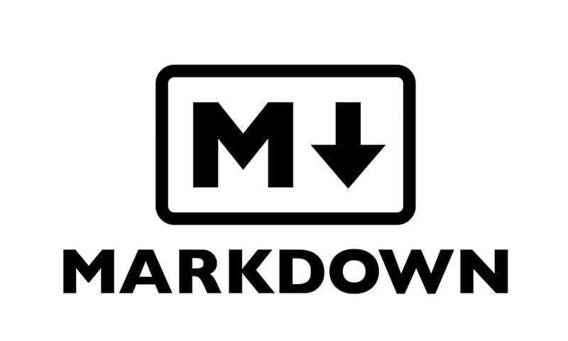

# [_GUIDES_][guides] > **MARKDOWN** _(Cheat-sheet)_

## <p align = center>[Git & GitHub][git] | [Windows][win] | [Linux][linux] | [Networks][nets] </br> [Programming][progLang] | [Databases][db] | [Docker & Kubernetes][docker] | [Embedded systems][embSys] | [CMake][CMake] </p>

<!--
* [_GUIDES_][guides]
* [Git & GitHub][git]
* [Windows][win]
* [Linux][linux] (Unix)
* [Networks][nets]
* [Programming Languages][progLang]
* [Databases][db]
* [Docker & Kubernetes][docker]
* [Embedded systems][embSys]
* [CMake][CMake]
-->

[guides]:   ../../../../../README.md
[git]:      ../../../Git_And_GitHub.md
[win]:      ../../../../002_Windows_/Windows.md
[linux]:    ../../../../003_Linux_(Unix)_/Linux_(Unix).md
[nets]:     ../../../../004_Networks_/Networks.md
[progLang]: ../../../../005_Programming_languages_/Programming.md
[db]:       ../../../../006_Databases_/Databases.md
[docker]:   ../../../../007_Docker_and_Kubernetes_/Docker_and_Kubernates.md
[embSys]:   ../../../../008_Embedded_systems_/Embedded_systems.md
[CMake]:    ../../../../009_CMake_/CMake_Tutorial.md

---
<!-- ---------------------------------- * Navigation * ---------------------------------- -->

## <p align = center><b>MARKDOWN</b></p>

### CONTENTS

* Headers
* Emphasis
* Lists
* Images
* Links
* Blockquotes
* Inline code
* GitHub Flavored Markdown
* Syntax highlighting _(See: [List of language aliases][aliases])_
* Task Lists
* Tables
* SHA references
* Issue references within a repository
* Username `@mentions`
* Strikethrough
* Emoji

---

## Syntax guide

Markdown is a way to style text on the web. You control the display of the document; formatting words as bold or italic, adding images, and creating lists are just a few of the things we can do with Markdown. Mostly, Markdown is just regular text with a few non-alphabetic characters thrown in, like # or *.

You can use Markdown most places around GitHub:

* [Gists][gist]
* Comments in Issues and Pull Requests
* Files with the `.md` or `.markdown` extension

For more information, see "[Writing on GitHub][writing]" in the GitHub Help.

Here’s an overview of Markdown syntax that you can use anywhere on GitHub.com or in your own text files.

---

## Headers

### Example

```pandoc
# This is an <h1> tag
## This is an <h2> tag
### This is an <h3> tag
#### This is an <h4> tag
##### This is an <h5> tag
###### This is an <h6> tag
```

#### _`Would become (result)`_

# This is an `<h1>` tag

## This is an `<h2>` tag

### This is an `<h3>` tag

#### This is an `<h4>` tag

##### This is an `<h5>` tag

###### This is an `<h6>` tag

---

## Emphasis

You can use an asterisk or an underscore (both apply).
Use one character for _Italic_, double character - **Bold**

Example:

```pandoc
*This text will be italic*
_This will also be italic_

**This text will be bold**
__This will also be bold__

_You **can** combine them_
```

_`Would become (result)`_

_This text will be italic_

_This will also be italic_

**This text will be bold**

**This will also be bold**

_You **can** combine them_

---

## Lists

Example:

```pandoc
// Unordered List
* Item 1     // There must be an indent between the asterisk and the first character
* Item 2
  * Item 2a  // Before the asterisk must be indented by 3 spaces
  * Item 2b

// Ordered List
1. Item 1     // After the number must be a dot
2. Item 2
3. Item 2
  1. Item 2a
  2. Item 2b
```

_`Would become (result)`_

Unordered List:

* _Item 1_
* _Item 2_
  * _Item 2a_
  * _Item 2b_

Ordered List:

1. _Item 1_
2. _Item 2_
3. _Item 3_
   1. _Item 3a_
   2. _Item 3b_

---

## Images

Syntax:

**!\[** <_Alt Text_> **]\(** <_url_> **)**

or

**!\[** <_Alt Text_> **]\[** <_link number_> **]**

**\[**<_link number_>**]:** \<_url_>

```md
# __Vagrant__

<!-- Use attribute style -->


<!-- Use attribute width -->


<!-- Use style css -->


<style type = "text/css"
>
    img[alt = "Vagrant"] {
        width: 150px;
    }
    .image_width-150px {
        width: 150px;
    }
</style>
```

Example:

```pandoc
// Variant 1:


// Variant 2:
![MarkDown Logo][5]
    // ... some text ...
[5]: ../img/MarkDownLogo.png
```

_`Would become (result)`_


---

## Links

### Automatic linking URLs

Any URL (like [https://github.com][github]) will be automatically converted into a clickable link. There is nothing to do.
</br>

### Manually linking URLs

**Syntax:**

**\[** <_Alt Text_> **]\(** <_url_> **)**

or

**\[** <_Alt Text_> **]\[** <_link number_> **]**
</br>

**\[**<_link number_>**]:** \<_url_>
</br>

Example:

```pandoc
// Variant 1 (Ordinary url): 
https://github.com

// Variant 2 (Text as link): 
[GitHub](https://github.com)

// Variant 3 (Text as link with internal link): 
[GitHub][13]
    // ... some text ...
[13]: https://github.com
```

_`Would become (result)`_

_Automatic linking:_

[https://github.com][github]

_Manually linking:_

[GitHub](https://github.com)

[GitHub][github]'s leverage automatic Markdown rendering

[GitHub][github]’s apply unique Markdown extensions

[github]: https://github.com

---

## Blockquotes

Example:

```pandoc
As Kanye West said:
> We're living the future so
> the present is our past.
```

_`Would become (result)`_

As Kanye West said:
> We're living the future so
> the present is our past.

---

## Inline code

Example:

```pandoc
I think you should use an `<addr>` element here instead.
```

_`Would become (result)`_

I think you should use an `<addr>` element here instead.

---

## GitHub Flavored Markdown

GitHub.com uses its own version of the Markdown syntax that provides an additional set of useful features, many of which make it easier to work with content on GitHub.com.

> **_NOTE:_**</br>that some features of _GitHub Flavored Markdown_ are only available in the descriptions and comments of Issues and Pull Requests. These include @mentions as well as references to SHA-1 hashes, Issues, and Pull Requests. Task Lists are also available in Gist comments and in Gist Markdown files.

---

## Syntax highlighting

Here’s an example of how you can use syntax highlighting with [GitHub Flavored Markdown][formatting]:

### See [List of language aliases][aliases] that provide syntax highlighting in the next conctruction

```pandoc
``` <Alias for Markdown>

      ... code ...

'``
```

Example:

```javascript
function fancyAlert(arg)
{
  if(arg) {
    $.facebox({div:'#foo'})
  }
}
```

### You can also simply indent your code by four spaces

```javascript
function fancyAlert(arg)
{
    if(arg)
    {
        $.facebox(
            {div:'#foo'}
        )
    }
}
```

### Here’s an example of Python code `without` syntax highlighting

```
def foo():
    if not bar:
        return True
```

### Here’s `with` syntax highlighting

```python
def foo():
    if not bar:
        return True
```

---

## Task Lists

Example:

```pandoc
- [x] @mentions, #refs, [links](), **formatting**, and <del>tags</del> supported
- [x] list syntax required (any unordered or ordered list supported)
- [x] this is a complete item
- [ ] this is an incomplete item
```

If you include a task list in the first comment of an Issue, you will get a handy progress indicator in your issue list. It also works in Pull Requests!

_`Would become (result)`_

* [x] @mentions, #refs, [links](), **formatting**, and <del>tags</del> supported
* [x] list syntax required (any unordered or ordered list supported)
* [x] this is a complete item
* [ ] this is an incomplete item

---

## Tables

You can create tables by assembling a list of words and dividing them with hyphens `-` (for the first row), and then separating each column with a pipe `|`:

Example:

```pandoc
First Header | Second Header
------------ | -------------
Content from cell 1 | Content from cell 2
Content in the first column | Content in the second column
```

_`Would become (result)`_

First Header | Second Header
------------ | -------------
Content from cell 1 | Content from cell 2
Content in the first column | Content in the second column

---

## SHA references

Any reference to a commit's [SHA-1 hash][sha1] will be automatically converted into a link to that commit on GitHub.

Example:

```bash
16c999e8c71134401a78d4d46435517b2271d6ac
mojombo@16c999e8c71134401a78d4d46435517b2271d6ac
mojombo/github-flavored-markdown@16c999e8c71134401a78d4d46435517b2271d6ac
```

_`Would become (result)`_

16c999e8c71134401a78d4d46435517b2271d6ac
mojombo@16c999e8c71134401a78d4d46435517b2271d6ac
mojombo/github-flavored-markdown@16c999e8c71134401a78d4d46435517b2271d6ac

---

## Issue references within a repository

Any number that refers to an Issue or Pull Request will be automatically converted into a link.

Example:

```bash
# 1
github-flavored-markdown#1
yoricsv/github-flavored-markdown#1
```

_`Would become (result)`_

# 1
github-flavored-markdown#1
yoricsv/github-flavored-markdown#1

---

## Username @mentions

Typing an ``@`` symbol, followed by a username, will notify that person to come and view the comment. This is called an `@mention`, because you're _mentioning_ the individual. You can also @mention teams within an organization.

---

## Strikethrough

Any word wrapped with two tildes will appear **crossed out**

Example:

```pandoc
~~this is some text~~
```

_`Would become (result)`_

~~this is some text~~

---

## Emoji

GitHub supports [emoji][emoji]

To see a list of every image we support, check out the [Emoji Cheat Sheet][emojiCheat].

Example:

ico | shortcode | ico | shortcode
--- | --- | --- | ---
:grinning: | `:grinning:` | :smiley: | `:smiley:`
:smile: | `:smile:` | :grin: | `:grin:`
:laughing: | `:laughing:` | :sweat_smile: | `:sweat_smile:`
:rofl: | `:rofl:` | :joy: | `:joy:`
:slightly_smiling_face: | `:slightly_smiling_face:` | :wink: | `:wink:`
:stuck_out_tongue_winking_eye: | `:stuck_out_tongue_winking_eye:` | :zany_face: | `:zany_face:`
:collision: | `:collision:` | :bomb: | `:bomb:`
:zzz: | `:zzz:` | :smiley: | `:smiley:`
:+1: | `:+1:` | :-1: | `:-1:`
:hourglass: | `:hourglass:` | :zap: | `:zap:`
:mute: | `:mute:` | :loud_sound: | `:loud_sound:`
:chart: | `:chart:` | :memo: | `:memo:`
:file_folder: | `:file_folder:` | :chart_with_upwards_trend: | `:chart_with_upwards_trend:`
:lock: | `:lock:` | :unlock: | `:unlock:`
:key: | `:key:` | :hammer: | `:hammer:`
:link: | `:link:` | :toolbox: | `:toolbox:`
:gear: | `:gear:` | :wrench: | `:wrench:`
:adhesive_bandage: | `:adhesive_bandage:` | :smoking: | `:smoking:`
:warning: | `:warning:` | :no_entry: | `:no_entry:`
:radioactive: | `:radioactive:` | :biohazard: | `:biohazard:`
:heavy_plus_sign: | `:heavy_plus_sign:` | :heavy_minus_sign: | `:heavy_minus_sign:`
:heavy_multiplication_x: | `:heavy_multiplication_x:` | :heavy_division_sign: | `:heavy_division_sign:`
:bangbang: | `:bangbang:` | :question: | `:question:`
:heavy_check_mark: | `:heavy_check_mark:` | :x: | `:x:`
:triangular_flag_on_post: | `:triangular_flag_on_post:` | :electron: | `:electron:`
:atom: | `:atom:` | :octocat: | `:octocat:`
:trollface: | `:trollface:` | :recycle: | `:recycle:`

<!--
* [Gists][gist]
* [Writing on GitHub][writing]
* [GitHub][github]
* [GitHub Flavored Markdown][formatting]
* [List of language aliases][aliases]
* [SHA-1 hash][sha1]
* [emoji][emoji]
* [Emoji Cheat Sheet][emojiCheat]
-->

[gist]:       https://gist.github.com/
[writing]:    https://help.github.com/categories/writing-on-github/
[formatting]: https://help.github.com/articles/basic-writing-and-formatting-syntax/
[aliases]:    MarkDown_syntax_higlight_(short).md
[sha1]:       http://en.wikipedia.org/wiki/SHA-1
[emoji]:      https://help.github.com/articles/basic-writing-and-formatting-syntax/#using-emoji
[emojiCheat]: https://github.com/ikatyang/emoji-cheat-sheet/blob/master/README.md
