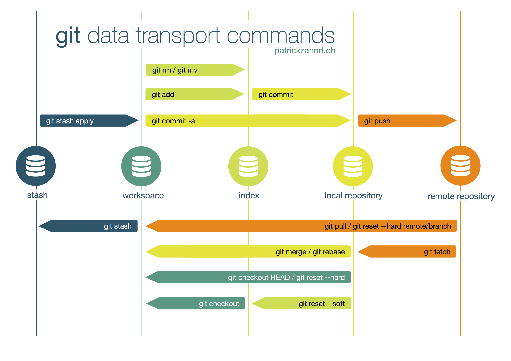

# [GUIDES](../../../../../README.md) -> __Git Commands *(Cheat-sheet)*__

<!-- ## <p align=center>[Git & GitHub][navGit] | [Windows][navWin] | [Linux][navNix] | [Networks][navNet] <br/> [Programming][navPLn] | [Databases][navDBs] | [Docker & Kubernetes][navDkr] | [Embedded systems][navEmS] | [CMake][navCMk] </p> -->

## __List of Guides__

| Guide Name                    |   |  Guide Name                   |   | Guide Name                    |
|-------------------------------|---|-------------------------------|---|-------------------------------|
| [Windows][navWin]             | * | [Linux][navNix]               | * | [Networks][navNet]            |
| [Databases][navDBs]           | * | [Programming][navPLn]         | * | [Git & GitHub][navGit]        |
| [CMake][navCMk]               | * | [Docker & Kubernetes][navDkr] | * | [Embedded systems][navEmS]    |

<!--
- [Windows][navWin]
- [Linux][navNix]
- [Networks][navNet]
- [Databases][navDBs]
- [Programming][navPLn]
- [Git & GitHub][navGit]
- [CMake][navCMk]
- [Docker & Kubernetes][navDkr]
- [Embedded systems][navEmS]
-->

[navWin]:   ../../../../002_Windows_/Windows.md
[navNix]:   ../../../../003_Linux_(Unix)_/Linux_(Unix).md
[navNet]:   ../../../../004_Networks_/Networks.md
[navDBs]:   ../../../../006_Databases_/Databases.md
[navPLn]:   ../../../../005_Programming_languages_/Programming.md
[navGit]:   ../../../Git_And_GitHub.md
[navCMk]:   ../../../../009_CMake_/CMake_Tutorial.md
[navDkr]:   ../../../../007_Docker_and_Kubernetes_/Docker_and_Kubernates.md
[navEmS]:   ../../../../008_Embedded_systems_/Embedded_systems.md

---
<!-- ---------------------------------- * Navigation * ---------------------------------- -->

- [GUIDES -\> __Git Commands *(Cheat-sheet)*__](#guides---git-commands-cheat-sheet)
  - [__List of Guides__](#list-of-guides)
  - [__The most Commonly used commands *(Cheat Sheet)*__](#the-most-commonly-used-commands-cheat-sheet)
  - [Git Setup](#git-setup)
    - [Create a __new Git repository__ from an existing directory](#create-a-new-git-repository-from-an-existing-directory)
    - [__Clone a repository__ *(local or remote via HTTP/SSH)*](#clone-a-repository-local-or-remote-via-httpssh)
    - [Clone a repository __into a specified folder__ on your local machine](#clone-a-repository-into-a-specified-folder-on-your-local-machine)
  - [Git Configuration](#git-configuration)
    - [__Display__ an information about __configuration__ including user name and email](#display-an-information-about-configuration-including-user-name-and-email)
    - [Attach an __author name__ to all commits that will appear in the version history](#attach-an-author-name-to-all-commits-that-will-appear-in-the-version-history)
    - [Attach an __email address__ to all commits by the current user](#attach-an-email-address-to-all-commits-by-the-current-user)
    - [Apply Git’s automatic __command line coloring__ which helps you keep track and revise repository changes](#apply-gits-automatic-command-line-coloring-which-helps-you-keep-track-and-revise-repository-changes)
    - [Create a __shortcut__ (__alias__) for a Git command](#create-a-shortcut-alias-for-a-git-command)
    - [Set a __default text editor__](#set-a-default-text-editor)
    - [Open Git’s __global configuration file__](#open-gits-global-configuration-file)
  - [Ignoring patterns](#ignoring-patterns)
    - [__Save a file__ with desired patterns as .gitignore with either direct string matches or wildcard globs](#save-a-file-with-desired-patterns-as-gitignore-with-either-direct-string-matches-or-wildcard-globs)
    - [System __wide ignore pattern__ for all local repositories](#system-wide-ignore-pattern-for-all-local-repositories)
  - [Managing Files](#managing-files)
    - [Show the __state of the current directory__ *(list staged, unstaged, and untracked files)*](#show-the-state-of-the-current-directory-list-staged-unstaged-and-untracked-files)
    - [List of the __commit history__ of the current branch](#list-of-the-commit-history-of-the-current-branch)
    - [List of the __file / folder history__ including of the changes (diffs)](#list-of-the-file--folder-history-including-of-the-changes-diffs)
    - [List of __all commits from all branches__](#list-of-all-commits-from-all-branches)
    - [__Compare two branches__ by showing which commits from the first branch are missing from the second branch](#compare-two-branches-by-showing-which-commits-from-the-first-branch-are-missing-from-the-second-branch)
    - [Examine the difference between the __working directory and the index__](#examine-the-difference-between-the-working-directory-and-the-index)
    - [Explore the difference between the __last commit and the index__](#explore-the-difference-between-the-last-commit-and-the-index)
    - [Explore the difference __what is staged but not yet__ committed\_\_](#explore-the-difference-what-is-staged-but-not-yet-committed__)
    - [See the difference between the __last commit and the working directory__](#see-the-difference-between-the-last-commit-and-the-working-directory)
    - [See the difference between the __two commits__](#see-the-difference-between-the-two-commits)
    - [See the difference between the __two branches__](#see-the-difference-between-the-two-branches)
    - [See the __date of last changes__ and the __author__ of the file](#see-the-date-of-last-changes-and-the-author-of-the-file)
    - [Display the __content and metadata__ of an object *(blob, tree, tag or commit, SHA)*](#display-the-content-and-metadata-of-an-object-blob-tree-tag-or-commit-sha)
    - [Display the __commit__ and/or __file changes__](#display-the-commit-andor-file-changes)
  - [Tracking path changes](#tracking-path-changes)
    - [__Delete the file__ from project and stage the removal for commit](#delete-the-file-from-project-and-stage-the-removal-for-commit)
    - [__Change an existing file path__ and stage the move](#change-an-existing-file-path-and-stage-the-move)
    - [__Show__ all commit logs with __indication of any paths that moved__](#show-all-commit-logs-with-indication-of-any-paths-that-moved)
  - [Git Branches](#git-branches)
    - [List of __all branches__ in the repository](#list-of-all-branches-in-the-repository)
    - [List of __all remote branches__](#list-of-all-remote-branches)
    - [List of __all local and remote branches__](#list-of-all-local-and-remote-branches)
    - [__Create a new branch__ under a specified name](#create-a-new-branch-under-a-specified-name)
    - [__Switch to a branch__ under a specified name *(if it doesn’t exist, a new one will be created)*](#switch-to-a-branch-under-a-specified-name-if-it-doesnt-exist-a-new-one-will-be-created)
    - [__Delete__ a local branch](#delete-a-local-branch)
    - [__Rename__ a branch you are __currently working in__](#rename-a-branch-you-are-currently-working-in)
    - [__Merge__ the specified branch with the current branch](#merge-the-specified-branch-with-the-current-branch)
    - [__Merge__ the specified branch\_a to the current branch\_b](#merge-the-specified-branch_a-to-the-current-branch_b)
  - [Making Changes](#making-changes)
    - [__Stage changes__ for the next commit](#stage-changes-for-the-next-commit)
    - [__Stage everything__ in the directory for an initial commit](#stage-everything-in-the-directory-for-an-initial-commit)
    - [__Commit staged snapshots__ in the version history with a descriptive message included in the command](#commit-staged-snapshots-in-the-version-history-with-a-descriptive-message-included-in-the-command)
    - [__Commit all tracked__ files with a descriptive message](#commit-all-tracked-files-with-a-descriptive-message)
    - [__Add the Tag__ to the current commit](#add-the-tag-to-the-current-commit)
  - [Undoing Changes](#undoing-changes)
    - [__Undo changes__ in a file or directory and create a new commit with the git revert command](#undo-changes-in-a-file-or-directory-and-create-a-new-commit-with-the-git-revert-command)
    - [Unstage a file without overwriting changes](#unstage-a-file-without-overwriting-changes)
    - [__Clear staging area__ up to the last commit](#clear-staging-area-up-to-the-last-commit)
    - [__Clear staging area__, rewrite working tree from specified commit](#clear-staging-area-rewrite-working-tree-from-specified-commit)
    - [Undo any changes introduced __after the specified commit__](#undo-any-changes-introduced-after-the-specified-commit)
    - [__Show untracked files__ which will be removed when you run `git clean` *(do a dry run)*](#show-untracked-files-which-will-be-removed-when-you-run-git-clean-do-a-dry-run)
    - [__Remove__ untracked files](#remove-untracked-files)
  - [Rewriting History](#rewriting-history)
    - [__Replace the last commit__ with a combination of the staged changes and the last commit combined](#replace-the-last-commit-with-a-combination-of-the-staged-changes-and-the-last-commit-combined)
    - [__Rebase the current branch__ with the specified base *(it can be a branch name, tag, reference to a HEAD, or a commit ID)*](#rebase-the-current-branch-with-the-specified-base-it-can-be-a-branch-name-tag-reference-to-a-head-or-a-commit-id)
    - [List __changes made to the HEAD__ of the local repository](#list-changes-made-to-the-head-of-the-local-repository)
  - [Temporary commits](#temporary-commits)
    - [__Save modified and staged changes__](#save-modified-and-staged-changes)
    - [__List stack-order__ of stashed files changes](#list-stack-order-of-stashed-files-changes)
    - [__Write working from top__ of the stash stack](#write-working-from-top-of-the-stash-stack)
    - [__Discard the changes__ from top of the stash stack](#discard-the-changes-from-top-of-the-stash-stack)
  - [Remote Repositories](#remote-repositories)
    - [Create a new __connection to a remote repository__ *(give it a name to serve as a shortcut to the URL)*](#create-a-new-connection-to-a-remote-repository-give-it-a-name-to-serve-as-a-shortcut-to-the-url)
    - [__Fetch a branch__ from a remote repository *(without merging)*](#fetch-a-branch-from-a-remote-repository-without-merging)
    - [__Fetch a repository__ and merge it with the local copy](#fetch-a-repository-and-merge-it-with-the-local-copy)
    - [__Fetch a repository__ and rebase it with the local copy](#fetch-a-repository-and-rebase-it-with-the-local-copy)
    - [__Push a branch__ to a remote repository with all its commits and objects](#push-a-branch-to-a-remote-repository-with-all-its-commits-and-objects)
  - [Git Cheat Sheet PDF](#git-cheat-sheet-pdf)

## __The most Commonly used commands *(Cheat Sheet)*__

---

> __NOTE:__
>
> In case you __don't quite know__ something, use the help
>
> ```git
> git command --help
> ```



---

## Git Setup

### Create a __new Git repository__ from an existing directory

```git
git init [directory]
```

### __Clone a repository__ *(local or remote via HTTP/SSH)*

```git
git clone [repo / URL]
```

### Clone a repository __into a specified folder__ on your local machine

```git
git clone [repo / URL] [folder]
```

---

## Git Configuration

### __Display__ an information about __configuration__ including user name and email

```git
git config -l
```

### Attach an __author name__ to all commits that will appear in the version history

```git
git config --global user.name "[your_name]"
```

### Attach an __email address__ to all commits by the current user

```git
git config --global user.email "[email_address]"
```

### Apply Git’s automatic __command line coloring__ which helps you keep track and revise repository changes

```git
git config --global color.ui auto
```

### Create a __shortcut__ (__alias__) for a Git command

```git
git config --global alias.[alias_name] [git_command]
```

> __*NOTE:__* Git requires you to type out the entire command to perform actions. Setting shortcuts for commonly used commands can speed up and simplify development. For example, you can use the alias `st` for the status command by typing the command: __`git config --global alias.st status`__

### Set a __default text editor__

```git
git config --system core.editor [text_editor]
```

### Open Git’s __global configuration file__

```git
git config --global --edit
```

---

## Ignoring patterns

Preventing unintentional staging or committing of files

### __Save a file__ with desired patterns as .gitignore with either direct string matches or wildcard globs

```git
logs/
*.notes
pattern*/
```

### System __wide ignore pattern__ for all local repositories

```git
git config --global core.excludesfile [file]
```

---

## Managing Files

### Show the __state of the current directory__ *(list staged, unstaged, and untracked files)*

```git
git status
```

### List of the __commit history__ of the current branch

```git
git log
```

### List of the __file / folder history__ including of the changes (diffs)

```git
git log -p [file / directory]
```

### List of __all commits from all branches__

```git
git log --all
```

### __Compare two branches__ by showing which commits from the first branch are missing from the second branch

```git
git log [branch1]..[branch2]
```

### Examine the difference between the __working directory and the index__

```git
git diff
```

### Explore the difference between the __last commit and the index__

```git
get diff --cached
```

### Explore the difference __what is staged but not yet__ committed__

```git
get diff --staged
```

### See the difference between the __last commit and the working directory__

```git
get diff HEAD
```

### See the difference between the __two commits__

```git
get diff commit1 commit2
```

### See the difference between the __two branches__

```git
get diff branch1 branch2
```

### See the __date of last changes__ and the __author__ of the file

```git
get blame [file]
```

### Display the __content and metadata__ of an object *(blob, tree, tag or commit, SHA)*

```git
git show [object]
```

### Display the __commit__ and/or __file changes__

```git
git show [commit] : [file]
```

---

## Tracking path changes

Versioning file remove and path changes

### __Delete the file__ from project and stage the removal for commit

```git
git rm [file]
```

### __Change an existing file path__ and stage the move

```git
git mv [existing_path][new_path]
```

### __Show__ all commit logs with __indication of any paths that moved__

```git
git log --stat -M
```

---

## Git Branches

### List of __all branches__ in the repository

```git
git branch
```

### List of __all remote branches__

```git
git branch -aa
```

### List of __all local and remote branches__

```git
git branch -av
```

### __Create a new branch__ under a specified name

```git
git branch [new_branch]
```

### __Switch to a branch__ under a specified name *(if it doesn’t exist, a new one will be created)*

```git
git checkout [branch]
```

> __NOTE:__
>
> For a more detailed tutorial on working with Git branches, you can refer to our article on [How to Create a New Branch][gitNBrnch] or [How to Switch Branches in Git][gitSwitch].

[gitNBrnch]:    https://phoenixnap.com/kb/git-create-new-branch
[gitSwitch]:    https://phoenixnap.com/kb/git-switch-branch

### [__Delete__][gitDelete] a local branch

```git
git branch -d [branch]
```

[gitDelete]:    https://phoenixnap.com/kb/delete-remote-and-local-git-branch

### [__Rename__][gitRename] a branch you are __currently working in__

```git
git branch -m [new_branch_name]
```

[gitRename]:    https://phoenixnap.com/kb/how-to-rename-git-branch-local-remote

### __Merge__ the specified branch with the current branch

```git
git merge [branch]
```

### __Merge__ the specified branch_a to the current branch_b

```git
git checkout [branch_b]
git merge [branch_a]
```

---

## Making Changes

### __Stage changes__ for the next commit

```git
git add [file / directory]
```

### __Stage everything__ in the directory for an initial commit

```git
git add .
```

### __Commit staged snapshots__ in the version history with a descriptive message included in the command

```git
git commit -m "[descriptive_message]"
```

### __Commit all tracked__ files with a descriptive message

```git
git commit -am "[descriptive_message]"
```

### __Add the Tag__ to the current commit

```git
git tag [tag]"
```

---

## Undoing Changes

### __Undo changes__ in a file or directory and create a new commit with the [git revert][gitRevert] command

```git
git revert [file/directory]
```

[gitRevert]:    https://phoenixnap.com/kb/git-revert-last-commit

### [Unstage a file][gitUnstag] without overwriting changes

```git
git reset [file]
```

[gitUnstag]:    https://phoenixnap.com/kb/git-unstage-files

### __Clear staging area__ up to the last commit

```git
git reset --hard
```

### __Clear staging area__, rewrite working tree from specified commit

```git
git reset --hard [commit]
```

### Undo any changes introduced __after the specified commit__

```git
git reset [commit]
```

### __Show untracked files__ which will be removed when you run `git clean` *(do a dry run)*

```git
git clean -n
```

### __Remove__ untracked files

```git
git clean -f
```

---

## Rewriting History

### __Replace the last commit__ with a combination of the staged changes and the last commit combined

```git
git commit --amend
```

### __Rebase the current branch__ with the specified base *(it can be a branch name, tag, reference to a HEAD, or a commit ID)*

```git
git rebase [branch]
```

### List __changes made to the HEAD__ of the local repository

```git
git reflog
```

---

## Temporary commits

*Temporarily store modified and tracked files in order to change branches.*

### __Save modified and staged changes__

```git
git stash
```

### __List stack-order__ of stashed files changes

```git
git stash list
```

### __Write working from top__ of the stash stack

```git
git stash pop
```

### __Discard the changes__ from top of the stash stack

```git
git stash drop
```

---

## Remote Repositories

### Create a new __connection to a remote repository__ *(give it a name to serve as a shortcut to the URL)*

```git
git remote add [name] [URL]
```

### __Fetch a branch__ from a remote repository *(without merging)*

```git
git fetch [remote_repo] [branch]
```

### __Fetch a repository__ and merge it with the local copy

```git
git pull [remote_repo]
```

### __Fetch a repository__ and rebase it with the local copy

```git
git pull --rebase
```

### __Push a branch__ to a remote repository with all its commits and objects

```git
git push [remote_repo] [branch]
```

> __NOTE:__
>
> When a particular remote is no longer needed, you can [remove a git remote from a repository][gitRemove].

[gitRemove]:    https://phoenixnap.com/kb/git-remove-remote

---

## [Git Cheat Sheet PDF][gitPDFCmd]

For future use, you can refer to the one-page Git Commands Reference. Click the [Download][gitPDFCmd] Cheat Sheet button to save the Git Commands PDF.

[gitPDFCmd]:    ../files/git-command.pdf
