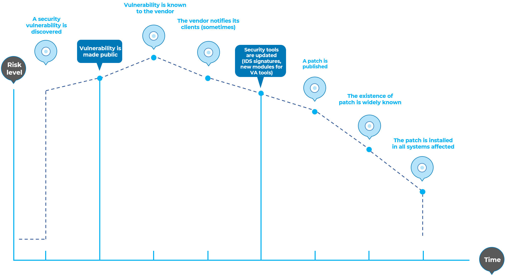

---

layout: col-document
title: WSTG - Latest
tags: WSTG

---


# Введение

## Проект OWASP по тестированию

Проект OWASP по тестированию разрабатывался много лет. Цель проекта — помочь понять *что*, *почему*, *когда*, *где* и *как* тестировать web-приложения. Проект предоставил полноценную методику тестирования, а не просто чек-лист или перечень проблем, которые надо решать. Читатели могут использовать эту методику в качестве шаблона для создания собственных программ тестирования или для оценки процессов других людей или организаций. Руководство по тестированию подробно описывает как общую методику тестирования, так и отдельные методы, необходимые для её реализации на практике.

Написание данного Руководства оказалось трудной задачей. Было непросто достичь консенсуса и создать контент, который позволял бы применять концепции, описанные в Руководстве, а также позволял им работать в своей среде и культуре. Также было непросто изменить фокус тестирования с пентеста, на интегрированное в жизненный цикл разработки.

Тем не менее, группа очень довольна результатами проекта. Многие отраслевые эксперты и специалисты по безопасности, некоторые из которых отвечают за безопасность программного обеспечения в крупнейших компаниях мира, доверяют методике. Она помогает тестировать web-приложения при создании надёжного и безопасного программного обеспечения. Методика не просто выявляет слабые места, хотя это, безусловно, является побочным продуктом многих руководств и чек-листов OWASP. Приходилось принимать трудные решения о целесообразности определённых методов и технологий тестирования. Группа прекрасно понимает, что не все согласятся со всеми предложенными решениями. Таким образом OWASP может занять лидирующие позиции и со временем изменить культуру посредством повышения осведомлённости и обучения, за счёт консенсуса и опыта.

Остальная часть данного Руководства организована следующим образом: введение охватывает предварительные условия и область тестирования web-приложений. В нём также рассматриваются общие принципы и методы, отчётность и экономическое обоснование для тестирования безопасности. В главе 3 представлена методика тестирования OWASP и объясняются её методы и задачи для различных этапов жизненного цикла разработки приложений. В главе 4 рассказывается о том, как проверить наличие конкретных уязвимостей (например, SQL-инъекций) путём анализа кода и тестирования на проникновение.

### Измерение безопасности: экономика небезопасного программного обеспечения

Основное правило разработки программного обеспечения сформулировано в цитате из книги [Tom DeMarco](https://en.wikiquote.org/wiki/Tom_DeMarco) ["Controlling Software Projects: Management, Measurement, and Estimates"](https://isbnsearch.org/isbn/9780131717114):

> Невозможно управлять тем, что не измеряется.

Тестирование безопасности — не исключение. К сожалению, измерение безопасности, как известно, — довольно сложный процесс.

Аспект, который хотелось бы подчеркнуть, заключается в том, что измерения безопасности связаны как с конкретными техническими вопросами (например, насколько распространена та или иная уязвимость), так и с тем, как они влияют на экономику программного обеспечения. Большинство технических специалистов немного разбираются в общей проблематике или имеют более глубокое представление об уязвимостях. К сожалению, немногие из них способны перевести эти технические знания в денежное выражение и количественно оценить потенциальную стоимость уязвимостей для бизнеса владельца приложения. До тех пор, пока этого не произойдёт, ИТ-директора не смогут определить точную отдачу от инвестиций в безопасность и впоследствии выделить адекватные бюджеты на безопасность программного обеспечения.

Хотя оценка стоимости небезопасного программного обеспечения может показаться сложной задачей, в этом направлении проделан значительный объём работы. В 2018 году Консорциум по качеству информации и программного обеспечения (CISQ) [заключил, что](https://www.it-cisq.org/the-cost-of-poor-quality-software-in-the-us-a-2018-report/The-Cost-of-Poor-Quality-Software-in-the-US-2018-Report.pdf):

> ...стоимость некачественного программного обеспечения в США в 2018 году составила примерно $2,84 трлн...

Методика, описанная в этом документе, поощряет измерение безопасности на протяжении всего процесса разработки. Затем можно соотнести стоимость небезопасного программного обеспечения с воздействием, которое оно оказывает на бизнес, и учесть его при разработке соответствующих бизнес-процессов и выделении ресурсов для управления рисками. Помните, что измерение и тестирование для web-приложений ещё более важно, чем для другого программного обеспечения, поскольку web-приложения доступны миллионам пользователей через Интернет.

### Что такое тестирование?

Многое должно быть протестировано в процессе жизненного цикла разработки web-приложения, но что на самом деле означает тестирование? Оксфордский словарь английского языка определяет «тест» как:

> **тест** (сущ.): процедура, предназначенная для определения качества, производительности или надёжности чего-либо, особенно до того, как это станет широко использоваться.

Для целей этого документа тестирование — процесс оценки состояния системы или приложения по набору критериев. В области информационной безопасности часто тестируют приложения по набору субъективных критериев, которые не являются ни чётко определенными, ни полными. В результате многие неспециалисты считают тестирование безопасности чёрной магией. Цель этого документа — изменить это представление и дать тем, кто ещё не обладает глубокими познаниями в области безопасности, возможность внести свой вклад в тестирование.

### Зачем тестировать?

Этот документ призван помочь организациям понять, что включает в себя программа тестирования, и помочь определить шаги, которые необходимо предпринять для разработки и использования современной программы тестирования web-приложений. Руководство даёт общее представление об элементах, необходимых для создания комплексной программы безопасности web-приложений. Его можно использовать как справочник и как методологию, помогающую найти расхождения между собственной и лучшими мировыми практиками. Это руководство позволяет организациям сравнить себя с аналогичными компаниями в отрасли, понять объём ресурсов, необходимых для тестирования и сопровождения программного обеспечения, или подготовиться к аудиту. В этой главе не рассматриваются технические аспекты тестирования приложений, поскольку цель состоит в том, чтобы предоставить типичную организационную структуру безопасности. Технические детали тестирования приложений в рамках теста на проникновение или рецензирования исходного кода будут рассмотрены в других частях этого документа.

### Когда тестировать?

Большинство сегодня не тестируют программное обеспечение, пока оно ещё не разработано и не находится на этапе развёртывания (т.е. код создан и развёрнут в рабочее web-приложение). Как правило, это очень неэффективная и дорогостоящая практика. Одним из лучших методов предотвращения ошибок безопасности в промышленной среде является улучшение жизненного цикла разработки программного обеспечения (SDLC) путём включения мер защиты на каждом из его этапов. SDLC — это модель, налагаемая на разработку программных артефактов. Если SDLC ещё не используется в вашей среде, то её время пришло! На следующем рисунке показана общая модель SDLC, а также (приблизительно) возрастающая стоимость исправления ошибок безопасности в такой модели.

\
*Рисунок 2-1: Общая модель SDLC*

Компаниям следует проанализировать свой SDLC, чтобы убедиться, что безопасность является неотъемлемой частью процесса разработки. SDLC должен включать тестирование безопасности, чтобы подтвердить, что меры защиты адекватны, а меры контроля эффективны на протяжении всего процесса разработки.

### Что тестировать?

Имеет смысл представлять разработку программного обеспечения как сочетание людей, процессов и технологий. Если это те факторы, которые «создают» программное обеспечение, то логично, что именно эти факторы и необходимо тестировать. Сегодня большинство обычно тестируют только технологии или само программное обеспечение.

Эффективная программа тестирования должна включать компоненты, которые проверяют:

- **персонал** — чтобы обеспечить надлежащий уровень образования и осведомлённости;
- **процессы** — чтобы гарантировать наличие адекватных политик и стандартов, а персонал знает, как следовать этим политикам и стандартам;
- **технологии** — чтобы убедиться, что процесс будет эффективен при его реализации.

Если не применять целостный подход, тестирование только технической реализации приложения не позволит выявить возможные уязвимости при управлении или эксплуатации. Путем тестирования персонала, политик и процессов организация может выявить проблемы, которые позже могут проявиться в дефектах технологии, тем самым устраняя ошибки на ранней стадии и выявляя первопричины дефектов. Сходным образом тестирование только технических проблем, которые могут присутствовать в системе, приведёт к неполной и неточной оценке состояния безопасности.

Денис Вердон, руководитель отдела информационной безопасности в [Fidelity National Financial](https://www.fnf.com), указал на прекрасную аналогию этому заблуждению на конференции OWASP AppSec 2004 в Нью-Йорке:

> Если бы автомобили конструировались как приложения... испытания на безопасность включали бы только лобовое столкновение. Автомобили бы не подвергались тестированию на максимальный крен или на устойчивость при экстренных манёврах, эффективность торможения, боковой удар и сопротивление угону.

### Как ссылаться на сценарии тестирования в WSTG

Каждый сценарий имеет идентификатор в формате `WSTG-<категория>-<номер>`, где: категория — строка из 4-х символов в верхнем регистре, которая идентифицирует тип теста или недостаток, а номер — числовое значение от 01 до 99. Например,`WSTG-INFO-02` это второй тест в разделе Сбор информации.

Идентификаторы могут меняться в разных версиях, поэтому предпочтительно, чтобы другие документы, отчёты или инструменты использовали этот формат: `WSTG-<версия>-<категория>-<номер>`, где: версия — метка версии без пунктуации. Например: `WSTG-v42-INFO-02` следует понимать именно как второй тест из раздела Сбор информации в версии 4.2.

Если идентификаторы используются без элемента `<версия>`, следует считать, что они относятся к последней версии Руководства. Очевидно, что по мере роста и изменения Руководства это станет проблематичным, вот почему авторы или разработчики должны включать метку версии.

#### Ссылки

Ссылки на сценарии Руководства по тестированию должны даваться на метки с номерами версий, а не на описательные `stable` или `latest`, которые со временем, конечно, изменятся. Замысел проектной группы состоит в том, чтобы ссылки с версиями не менялись. Например: `https://owasp.org/www-project-web-security-testing-guide/v42/4-Web_Application_Security_Testing/01-Information_Gathering/02-Fingerprint_Web_Server`. Примечание: метка `v42` относится к версии 4.2.

### Отзывы и комментарии

Как и во всех проектах OWASP, мы приветствуем комментарии и отзывы. Нам особенно приятно знать, что наша работа востребована, эффективна и точна.

## Принципы тестирования

Существует несколько распространённых заблуждений при разработке методологии тестирования для поиска ошибок безопасности в программном обеспечении. В этой главе рассматриваются общие принципы, которые специалисты должны учитывать при проведении тестов безопасности программного обеспечения.

### Панацеи не существует

Хотя и заманчиво думать, что сканер безопасности или WAF обеспечат меры защиты от атак или выявят большинство проблем, на самом деле не существует панацеи от проблемы небезопасного программного обеспечения. Инструменты для анализа безопасности приложений, хотя и полезны в качестве первого шага для поиска «низко висящих плодов», но, как правило, они ещё незрелы и неэффективны для углублённого исследования или обеспечения адекватного тестового покрытия. Помните, что безопасность — это процесс, а не продукт.

### Думайте стратегически, а не тактически

Специалисты по безопасности осознали ошибочность модели «исправляй и проникай», которая была широко распространена в информационной безопасности в 1990-х годах. Эта модель предполагает исправление обнаруженной ошибки, но без надлежащего исследования её первопричины. Она обычно связана с окном уязвимости, также называемым окном воздействия, показанным на рисунке ниже. Эволюция уязвимостей в распространённом программном обеспечении показала неэффективность этой модели. Дополнительные сведения об окнах воздействия есть в [Schneier on Security](https://www.schneier.com/crypto-gram/archives/2000/0915.html).

Исследования уязвимостей, например, [Отчёт Symantec об угрозах безопасности в интернет](https://www.symantec.com/security-center/threat-report) показали, что с учётом сокращения времени реакции злоумышленников окно уязвимости даёт слишком мало времени для установки исправлений, поскольку срок от обнаружения уязвимости до разработки и выпуска автоматизированной атаки на неё с каждым годом сокращается.

В модели «исправляй и проникай» есть несколько неверных допущений. Многие пользователи считают, что исправления мешают работе имеющихся приложений. Также неверно предполагать, что все пользователи знают о выпущенных исправлениях. Следовательно, не все они будут применять их либо потому, что считают, что исправления могут негативно повлиять на работу приложений, либо потому, что им неизвестно о существовании исправления.

\
*Рисунок 2-2: Окно уязвимости*

Важно встроить безопасность в жизненный цикл разработки программного обеспечения (SDLC), чтобы предотвратить повторное возникновение проблем. Разработчики могут встраивать безопасность в SDLC, разрабатывая стандарты, политики и рекомендации, которые соответствуют методологии разработки и работают в ней. Следует использовать моделирование угроз и другие методы, чтобы помочь выделить адекватные ресурсы тем частям системы, которые подвергаются наибольшему риску.

### SDLC — наше всё

SDLC — процесс, хорошо известный разработчикам. Встраивая меры защиты в каждый этап SDLC, он обеспечивает целостный подход к безопасности приложений, который использует процедуры, уже существующие в организации. Имейте в виду, что, хотя названия различных этапов могут меняться в зависимости от модели SDLC, используемой организацией, каждый концептуальный этап SDLC будет использоваться для разработки приложения (т.е. определение, проектирование, разработка, развёртывание, эксплуатация). На каждом этапе свои меры защиты, которые должны стать частью существующего процесса, чтобы обеспечить экономически эффективную и комплексную программу безопасности.

Существует несколько методик безопасного SDLC, которые дают как описательные, так и предписывающие рекомендации. Принимать ли за основу первые или вторые, зависит от зрелости процесса SDLC. По сути, предписывающие рекомендации показывают, как *должен работать* безопасный SDLC, а описательные — как он *фактически используется*. Оба имеют право на жизнь. Например, если вы не знаете, с чего начать, предписывающая методика может предоставить набор потенциальных мер защиты, которые могут быть применены в SDLC. Затем описательные рекомендации помогут ускорить процесс принятия решений, показывая то, что хорошо сработало в других организациях. К описательному безопасному SDLC относится [BSIMM](https://www.bsimm.com/); к предписывающим — [OWASP Software Assurance Maturity Model](https://www.owaspsamm.org/) и [ISO/IEC 27034](https://www.iso27001security.com/html/27034.html).

### Тестируйте раньше и чаще

Когда ошибка обнаруживается на ранней стадии SDLC, её можно устранить быстрее и с меньшими затратами. В этом отношении ошибка безопасности ничем не отличается от функциональной или ошибки, связанной с производительностью. Ключевым шагом на пути к тому, чтобы сделать это возможным, является информирование групп разработчиков и тестировщиков о распространенных проблемах безопасности и способах их обнаружения и предотвращения. Хотя новые библиотеки, инструменты или языки могут помочь разрабатывать программы с меньшим количеством ошибок безопасности, постоянно возникают новые угрозы, о которых разработчики должны знать. Обучение тестированию безопасности также помогает разработчикам приобрести соответствующий опыт для тестирования приложения с точки зрения злоумышленника. Это позволит каждому рассматривать вопросы безопасности как часть своих обязанностей.

### Автоматизация тестирования

В современных методологиях разработки, таких как Agile, DevOps/DevSecOps или быстрая разработка приложений (RAD), следует уделить внимание включению тестов безопасности в производственные процессы непрерывной интеграции/развёртывания (CI/CD), чтобы поддерживать базовый уровень безопасности и выявлять простейшие недостатки. Это можно сделать с помощью динамического (DAST) и статического тестирования безопасности (SAST), а также анализа состава программного обеспечения (SCA) или инструментов отслеживания зависимостей во время стандартных автоматизированных производственных процессов выпуска или на регулярной основе.

### Учитывайте область применения

Важно знать, какой уровень безопасности потребуется для данного проекта. Активам, подлежащим защите, должна быть присвоена категория, указывающая, как с ними следует обращаться (например, конфиденциально, секретно, совершенно секретно). Следует обсудить её с юристами, чтобы убедиться в том, что те или иные требования безопасности будут соблюдены. В США требования могут исходить из федеральных нормативных актов, таких как [Gramm-Leach-Bliley Act](https://www.ftc.gov/business-guidance/privacy-security/gramm-leach-bliley-act), или из законов штата, таких как [California SB-1386](https://leginfo.legislature.ca.gov/faces/billTextClient.xhtml?bill_id=200120020SB1386). Для организаций в странах ЕС, могут применяться как правила конкретной страны, так и директивы ЕС. Например, [Directive 96/46/EC4](https://ec.europa.eu/info/policies/justice-and-fundamental-rights_en) и [Regulation (EU) 2016/679 (General Data Protection Regulation)](https://gdpr-info.eu/) требуют соблюдать должную осторожность при обращении с персональными данными в приложениях. От организаций не из ЕС, при определенных обстоятельствах также может потребоваться соблюдение General Data Protection Regulation.

### Развивайте творческое мышление

Успешное тестирование приложения на наличие уязвимостей требует нестандартного мышления. Позитивные варианты использования проверяют обычное поведение приложения, когда пользователь использует его ожидаемым образом. Хорошее тестирование безопасности требует выхода за рамки ожидаемого, чтобы думать так, как думает нарушитель, пытающийся взломать приложение. Творческое мышление может помочь определить, какие неожиданные данные могут привести к небезопасному сбою приложения. Это также поможет найти предположения, сделанные web-разработчиками, которые не всегда верны, и то, как эти предположения можно опровергнуть. Одна из причин того, что автоматизированные инструменты плохо справляются с тестированием на наличие уязвимостей, заключается в том, что они не мыслят творчески. Креативность необходимо применять в каждом конкретном случае, поскольку большинство web-приложений, несмотря на использование общих фреймворков, разрабатываются по-своему.

### Разбирайтесь в предмете

Одной из первых важных инициатив в любой хорошей программе безопасности должно быть требование актуальной документации приложения. Архитектура, схемы потоков данных, сценарии использования и т.д. должны быть зафиксированы в официальных документах и доступны для просмотра. Техническая спецификация и документы приложения должны включать информацию, в которой перечислены не только предусмотренные, но и запрещённые варианты использования. Наконец, хорошо бы иметь хотя бы базовую инфраструктуру средств защиты, позволяющую отслеживать атаки на приложения и сеть организации (например, систему обнаружения вторжений).

### Пользуйтесь правильными инструментами

Хотя мы уже заявляли, что универсального инструмента «панацея» не существует, инструменты играют решающую роль в общей программе безопасности. Существует целый ряд открытых и коммерческих инструментов, которые могут автоматизировать многие рутинные задачи. Эти инструменты могут упростить и ускорить процессы, помогая специалистам по безопасности в выполнении их задач. Однако важно понимать, что именно эти инструменты могут, а что не могут делать, чтобы они использовались правильно и по назначению.

### Дьявол в деталях

Крайне важно не останавливаться на поверхностной оценке безопасности приложения. Она даёт ложное чувство уверенности, которое может быть столь же опасным, как и полное её отсутствие. Необходимо тщательно изучить результаты и отсеять все ложные срабатывания, которые могут остаться в отчёте. Одно ложное сообщение может подорвать доверие ко всем остальным (верным). Следует внимательно следить за тем, чтобы все компоненты бизнес-логики приложения были протестированы и каждый сценарий использования был изучен на предмет возможных уязвимостей.

### Анализируйте исходный код

Хотя результаты тестирования на проникновение методом «чёрного ящика» могут быть впечатляющими и полезными для демонстрации того, как уязвимости проявляются в среде промышленной эксплуатации, они не являются самым эффективным или действенным способом защиты приложения. При динамическом тестировании сложно протестировать всю кодовую базу, особенно если много вложенных условных операторов. Если исходный код приложения доступен, его следует передать специалистам по безопасности для анализа. Можно найти уязвимости в исходном коде, которые будут упущены при тестировании методом «чёрного ящика».

### Развивайте мониторинг

Важной частью хорошей программы безопасности является способность определять, улучшается ли ситуация. Необходимо отслеживать результаты тестирования и разрабатывать показатели (метрики), которые позволят выявить тенденции в области безопасности приложений.

Правильные метрики покажут:

- требуется ли дополнительное образование и обучение;
- какой из механизмов защиты не совсем понятен команде разработчиков;
- уменьшается ли общее количество обнаруженных дефектов, связанных с безопасностью.

Согласованные между собой метрики, которые могут быть сгенерированы автоматически из доступного исходного кода, также помогут в оценке эффективности механизмов, введённых для уменьшения дефектов безопасности при разработке программного обеспечения. Разработать метрики непросто, поэтому лучше начинать не с чистого листа, а со стандарта, подобного предоставленному [IEEE](https://ieeexplore.ieee.org/document/237006).

### Документируйте результаты тестирования

Чтобы завершить процесс тестирования, важно составить отчёт: какие действия по тестированию были предприняты, кем и когда они были проведены, приложив подробные результаты тестирования. Целесообразно согласовать приемлемый формат отчета, который будет полезен для всех заинтересованных сторон, включая разработчиков, руководителей проектов, владельцев бизнеса, подразделений ИТ, аудита и комплаенс.

Отчёт должен чётко указывать владельцу бизнеса, где находятся значимые риски, и делать это таким образом, чтобы заручиться его поддержкой для последующих действий по смягчению последствий. Отчёт должен быть понятен и разработчику, указывая конкретную функцию, на которую влияет уязвимость, и давать рекомендации по её устранению на понятном ему языке. Отчёт также должен позволять другому тестировщику воспроизвести результаты. Написание отчёта не должно быть обременительным для самих тестировщиков, т.к. они, как правило, не славятся навыками творческого письма. Излишне сложная процедура может привести к тому, что результаты тестирования не будут задокументированы как полагается. Использование шаблона отчёта о тестировании безопасности поможет сэкономить время и обеспечить точное и последовательное документирование результатов в формате, уместном для всех заинтересованных лиц.

## Методы тестирования

В этом разделе представлен общий обзор различных методов, которые можно использовать при построении программы тестирования. В нём нет конкретных методик, поскольку они содержатся в главе 3. Этот раздел нужен, чтобы дать представление о методике, представленной в следующей главе, и подчеркнуть преимущества или недостатки некоторых методов, которые следует учитывать. В частности, мы рассмотрим:

- Ручные проверки
- Моделирование угроз
- Анализ исходного кода
- Тестирование на проникновение

## Ручные проверки

### Обзор

Ручные проверки — это проверка человеком, который обычно оценивает влияние персонала, политик и процессов на безопасность. Ручные проверки могут также включать проверку технических решений, таких как архитектурные схемы. Обычно они проводятся путём анализа документации или проведения бесед с разработчиками или владельцами системы.

Хотя идея ручных проверок проста, это один из самых эффективных и доступных методов. Спрашивая кого-либо, как что работает и почему это было реализовано именно так, тестировщик сможет быстро оценить, есть ли тут проблемы с безопасностью. Ручные проверки — один из немногих способов протестировать сам процесс жизненного цикла разработки программного обеспечения и убедиться в наличии адекватной политики или набора навыков.

Как и во многих других жизненных ситуациях, при проведении проверок вручную рекомендуется применять принцип «доверяй, но проверяй». Не всё, что тестировщику показывают или рассказывают, будет точным. Ручные проверки особенно хороши для оценки того, понимают ли собеседники процесс обеспечения защиты, ознакомлены ли они с политикой и обладают ли они соответствующими навыками для разработки и реализации защищённых приложений.

Другие действия, в том числе ручная проверка документации, политик безопасной разработки, требований безопасности и архитектурных схем, должны выполняться с помощью ручных проверок.

### Преимущества

- Не требует вспомогательных инструментов
- Может применяться в различных ситуациях
- Гибко
- Способствует командной работе
- На ранних этапах SDLC

### Недостатки

- Может занимать много времени
- Вспомогательные материалы не всегда доступны
- Чтобы быть эффективным требует участия высококвалифицированного персонала

## Моделирование угроз

### Обзор

Моделирование угроз стало популярным методом, помогающим разработчикам систем задуматься об угрозах безопасности, с которыми могут столкнуться их системы и приложения. Таким образом, моделирование угроз можно рассматривать как оценку рисков для приложений. Это позволяет архитектору разрабатывать стратегии предотвращения потенциальных уязвимостей и помогает сосредоточить свои неизбежно ограниченные ресурсы и внимание на тех частях системы, которые больше всего в этом нуждаются. Рекомендуется, чтобы все приложения имели разработанную и задокументированную модель угроз. Модели угроз должны создаваться как можно раньше в SDLC и должны пересматриваться по мере развития приложения и продвижения разработки.

Чтобы разработать модель угроз, мы рекомендуем использовать простой подход, который изложен в стандарте [NIST 800-30](https://csrc.nist.gov/publications/detail/sp/800-30/rev-1/final) по оценке рисков. Этот подход состоит из следующих этапов:

- Декомпозиция приложения: используйте процесс ручной проверки, чтобы понять, как работает приложение, его ресурсы, функциональность и взаимодействия.
- Инвентаризация и классификация активов: классифицируйте активы на материальные и нематериальные, ранжируйте их в соответствии с важностью для бизнеса.
- Изучение потенциальных уязвимостей: технических, операционных или организационных.
- Изучение потенциальных угроз: создайте реалистичное представление о потенциальных векторах атак с точки зрения злоумышленника, используя сценарии угроз или дерево атак.
- Разработка стратегий смягчения последствий: предусмотрите меры по смягчению последствий от каждой из угроз, которые считаются реалистичными.

Выходные данные самой модели угроз могут быть разными, но как правило, они представляют собой набор списков и диаграмм. Различные проекты с открытым исходным кодом и коммерческие продукты поддерживают методологии моделирования угроз приложений, которые можно использовать в качестве основы для тестирования приложений на наличие потенциальных недостатков безопасности в дизайне приложения. Не существует правильного или неправильного способа разработки моделей угроз и проведения оценки информационных рисков для приложений.

### Преимущества

- Взгляд на систему со стороны злоумышленника
- Гибко
- На ранних этапах SDLC.

### Недостатки

- Хорошая модель угроз ещё не означает, что приложение защищено.

## Анализ исходного кода

### Обзор

Анализ исходного кода — это процесс ручной проверки исходного кода web-приложения на наличие проблем. Многие серьёзные уязвимости в системе защиты невозможно обнаружить с помощью какой-либо другой формы анализа или тестирования. Как говорится: «Если вы хотите знать, что происходит на самом деле, обращайтесь прямо к источнику». Почти все эксперты по безопасности согласны с тем, что замены анализу кода нет. Вся информация для выявления дефектов безопасности содержится где-то в коде. В отличие от тестирования закрытого программного обеспечения, такого как операционные системы, при тестировании web-приложений (особенно если они были разработаны собственными силами) исходный код должен быть доступен для целей тестирования.

Многие непреднамеренные, но существенные дефекты безопасности чрезвычайно трудно обнаружить с помощью других форм анализа или тестирования, таких как тестирование на проникновение. Это делает анализ исходного кода предпочтительным методом для технического тестирования. С помощью исходного кода тестировщик может точно определить, что происходит (или должно происходить), и избавиться от догадок, связанных с тестированием методом «чёрного ящика».

Примеры проблем, которые особенно легко обнаружить при анализе исходного кода, включают проблемы параллелизма, некорректную бизнес-логику, проблемы с контролем доступа, криптографические уязвимости, а также бэкдоры, трояны, «пасхалки», временные и логические бомбы и другие формы вредоносного кода. Эти проблемы часто проявляются как наиболее опасные уязвимости в web-приложениях. Анализ исходного кода также может быть чрезвычайно эффективным для выявления проблем с реализацией, таких как места, где не проводится контроль входных данных или где может проявиться небезопасная работа при сбоях. Производственный процесс также необходимо проанализировать, поскольку развёртываемый исходный код может отличаться от того, который анализировался. В [речи Кена Томпсона на награждении премией Тьюринга](https://ia600903.us.archive.org/11/items/pdfy-Qf4sZZSmHKQlHFfw/p761-thompson.pdf) описывается одно из возможных проявлений этой проблемы.

### Преимущества

- Полнота и эффективность
- Точность
- Скорость (для компетентных рецензентов)

### Недостатки

- Требуются высококвалифицированные разработчики, компетентные в вопросах безопасности
- Можно пропустить проблемы в скомпилированных библиотеках
- Нелегко обнаружить ошибки, возникающие во время выполнения
- Фактически развёрнутый исходный код может отличаться от того, что анализировался.

Дополнительные сведения об анализе исходного кода в [OWASP code review project](https://wiki.owasp.org/index.php/Category:OWASP_Code_Review_Project).

## Тестирование на проникновение

### Обзор

Тестирование на проникновение было распространённым методом, используемым для проверки сетевой безопасности на протяжении десятилетий. Оно также широко известно как тестирование методом «чёрного ящика» или этичный хакинг. Тестирование на проникновение, по сути, является удалённым тестированием приложения для поиска уязвимостей, не зная его внутреннего устройства. Как правило, команда тестирования может получить доступ к приложению в качестве пользователей. Тестировщик действует как злоумышленник и пытается найти и проэксплуатировать уязвимости. Во многих случаях тестировщику даётся одна или несколько действующих учётных записей в системе.

Хотя тестирование на проникновение доказало свою эффективность в обеспечении сетевой безопасности, этот метод автоматически не переносится на безопасность приложений. Когда тестирование на проникновение выполняется в сетях и операционных системах, большая часть работы заключается в поиске и последующем использовании известных уязвимостей в конкретных технологиях. Поскольку web-приложения разрабатываются почти всегда по индивидуальному проекту, тестирование на проникновение web-приложений больше похоже на исследовательскую работу. Существует несколько автоматизированных инструментов тестирования, но, учитывая индивидуальный характер web-приложений, их эффективность может оказаться низкой.

Многие используют тестирование web-приложений на проникновение в качестве основного метода тестирования безопасности. Хотя он, безусловно, заслуживает свое место в программе тестирования, мы не считаем, что его следует рассматривать как основной или единственный метод тестирования. Как писал Гэри Макгроу в [Software Penetration Testing](https://www.garymcgraw.com/wp-content/uploads/2015/11/bsi6-pentest.pdf), «На практике тест на проникновение может выявить только небольшую репрезентативную выборку из всех возможных угроз безопасности в системе». Однако целенаправленное тестирование (т.е. проверка известных уязвимостей, обнаруженных на предыдущих тестах) может быть полезным для определения того, действительно ли конкретные уязвимости исправлены в развёрнутом исходном коде.

### Преимущества

- Можно провести быстро (и, следовательно, дёшево)
- Требует меньшего набора навыков, чем анализ исходного кода
- Проверяет код, который на самом деле развёрнут

### Недостатки

- Слишком поздно в SDLC
- Тестируются только внешние взаимодействия

## Нужен сбалансированный подход

С таким количеством методов и подходов к тестированию безопасности web-приложений может быть трудно понять, какие методы и когда использовать. Опыт показывает, что нет правильного или неправильного ответа на этот вопрос. На самом деле, все методы должны использоваться для тестирования всех областей, которые необходимо проверить.

Хотя очевидно, что не существует единой методики, которая могла бы полностью охватить все тесты безопасности и гарантировать, что все проблемы были решены, многие компании используют только один подход. Исторически этим подходом было тестирование на проникновение. Оно, хотя и полезно, не может решить всех проблем, которые возникают при тестировании. Этого просто недостаточно и слишком поздно в SDLC.

Правильный подход должен быть сбалансированным и включать различные приёмы, от ручных проверок и автотестов, до модульного и комплексного тестирования. Сбалансированный подход должен охватывать тестирование на всех этапах SDLC. Он использует наиболее подходящие из имеющихся методов в зависимости от текущего этапа SDLC.

Конечно, возможны ситуации, когда возможен только один метод. Например, в случае если web-приложения, уже создано, но у тестирующей стороны нет доступа к исходному коду, то провести тест на проникновение явно лучше, чем не тестировать вовсе. Однако следует подвергать сомнению такие допущения, и изучать возможность более полного тестирования.

Сбалансированный подход может меняться в зависимости от разных факторов, таких как зрелость процесса тестирования и корпоративная культура. Рекомендуется, чтобы подход выглядел примерно так, как показано на рисунках 2-3 и 2-4. На рисунке показано типичное распределение по методам, наложенное на этапы SDLC. В соответствии с исследованиями и опытом важно, чтобы компании уделяли больше внимания более ранним этапам разработки.

\
*Рисунок 2-3: Доля тестирования на этапах SDLC*

На следующем рисунке показано типичное распределение, наложенное на методы тестирования.

\
*Рисунок 2-4: Распределение по методам тестирования*

### Примечание о сканерах web-приложений

Многие организации начали использовать автоматизированные сканеры web-приложений. Хотя они, несомненно, должны иметь место в программе тестирования, необходимо помнить о том, почему автоматизация тестирования методом «чёрного ящика» никогда не станет самодостаточной. Однако это не должно препятствовать использованию сканеров web-приложений. Скорее, цель состоит в том, чтобы достичь понимания ограничений и сформировать правильный подход к тестированию.

Полезно знать эффективность и ограничения автоматизированных инструментов обнаружения уязвимостей. С этой целью создан [OWASP Benchmark Project](https://owasp.org/www-project-benchmark/) — набор тестов, предназначенный для оценки скорости, охвата и точности инструментов автоматического обнаружения уязвимостей в программном обеспечении. Сравнительный анализ может помочь проверить возможности этих автоматизированных инструментов и наглядно продемонстрировать их эффективность.

Следующие примеры показывают, почему автоматизированное тестирование методом «чёрного ящика» может оказаться неэффективным.

### Пример 1: «Волшебные» параметры

Представьте себе простое web-приложение, которое принимает «волшебную» пару имя-значение. Для простоты запрос GET может быть: `http://www.host/application?magic=value`

Чтобы ещё больше упростить пример, значениями в этом случае могут быть только ASCII-символы от a до z (в верхнем или нижнем регистре) и целые числа от 0 до 9.

Разработчики этого приложения создали административный бэкдор во время тестирования, но скрыли его, чтобы случайный наблюдатель не смог его обнаружить. Передав значение sf8g7sfjdsurtsdieerwqredsgnfg8d (30 символов), пользователь войдёт в систему и ему будут предоставлены полномочия администратора с полным контролем над приложением. HTTP-запрос будет таким: `http://www.host/application?magic=sf8g7sfjdsurtsdieerwqredsgnfg8d`

Учитывая, что обычно параметры состоят из двух или трёх символов, угадать комбинацию из 28 символов маловероятно. Сканер web-приложений должен будет перебрать всё ключевое пространство из 30 символов или угадать. Это до 30\^28 перестановок или квинтиллионы HTTP-запросов. Это электрон в цифровом стоге сена!

Код для этого примера проверки «волшебного» параметра может выглядеть следующим образом:

```java
public void doPost( HttpServletRequest request, HttpServletResponse response) {
  String magic = "sf8g7sfjdsurtsdieerwqredsgnfg8d";
  boolean admin = magic.equals( request.getParameter("magic"));
  if (admin) doAdmin( request, response);
  else … // обычное поведение
}
```

Заглянув в код, можно увидеть, что уязвимость практически сразу бросается в глаза как потенциальная проблема.

### Пример 2: Проблемы с криптографией

Криптография широко используется в web-приложениях. Представьте, что разработчик решил написать простой криптографический алгоритм для автоматического входа пользователя с сайта A на сайт B. Поразмыслив, разработчик решает, что если пользователь вошёл в систему на сайте A, то он сгенерирует ключ, используя хэш-функцию MD5, которая состоит из: `Hash { username : date }`

Когда пользователь переходит на сайт B, он отправляет ключ в строке запроса на сайт B при HTTP-перенаправлении. Сайт B независимо вычисляет хэш и сравнивает его с хэшем, переданным в запросе. Если они совпадают, сайт B аутентифицирует пользователя и разрешает ему войти.

Такие проблемы можно найти по мере выяснения схемы работы. Любой, кто разберётся в ней (или скачает с Bugtraq), сможет войти в систему как законный пользователь. Проверка вручную, например, посредством анализа или рецензирования кода, быстро выявила бы эту проблему. Сканер web-приложений методом «чёрного ящика» её не обнаружит, т.к. увидит 128-битный хэш, который для каждого пользователем свой и по природе хэш-функций меняется непредсказуемым образом.

### Примечание об инструментах статического анализа кода

Многие организации начали использовать статические сканеры исходного кода. Хотя они, несомненно, заслужили своё место в комплексной программе тестирования, необходимо подчеркнуть вопросы, поясняющие, почему этот подход малоэффективен при самостоятельном использовании. Статический анализ кода сам по себе не может выявить проблемы, связанные с недостатками архитектуры, поскольку он не может оценить контекст, в котором создаётся код. Инструменты анализа исходного кода полезны для выявления проблем, вызванных ошибками при программировании, однако для интерпретации его результатов требуются значительная ручная работа.

## Определение требований к тестированию безопасности

Для успеха программы тестирования, необходимо знать, каковы её задачи. Задачи определяются требованиями безопасности. В этом разделе подробно обсуждается, как документировать требования к тестированию, выводя их из применимых стандартов и регламентов, из позитивных требований (определяющих, что приложение должно делать) и негативных (определяющих, что оно делать не должно). В нём также обсуждается, как требования влияют на тестирование безопасности в процессе SDLC и как данные тестирования могут использоваться для управления рисками безопасности программного обеспечения.

### Задачи тестирования

Одна из задач тестирования безопасности — убедиться в том, что меры защиты работают должным образом. Это документируется в `требованиях к безопасности`, которые описывают функциональное назначение мер защиты. На концептуальном уровне это означает подтверждение конфиденциальности, целостности и доступности информации, а также функциональность мер. Другая задача состоит в том, чтобы подтвердить, что меры защиты реализованы с приемлемым количеством уязвимостей или без них. Речь о распространённых угрозах, таких как [OWASP Top Ten](https://owasp.org/www-project-top-ten/), а также тех, которые были выявлены ранее в процессе SDLC, с помощью таких методов как моделирование угроз, анализ исходного кода и тестирование на проникновение.

### Документация требований безопасности

Первым шагом в документировании требований безопасности является понимание `бизнес-требований`. Документ с бизнес-требованиями может дать первоначальную высокоуровневую информацию об ожидаемой функциональности приложения. Например, основной целью приложения может быть предоставление финансовых услуг клиентам или предоставление возможности покупки товаров из онлайн-каталога. Раздел безопасности в бизнес-требованиях должен подчёркивать необходимость защиты данных клиента, а также соблюдения применимых документов по безопасности, таких как правила, стандарты и политики.

Составление чек-листа применимых правил, стандартов и политик служит отправной точкой для анализа соответствия требованиям безопасности для web-приложений. Например, узнать о применимых нормативных требованиях можно из информации об отрасли или стране, в которых будет работать приложение. Некоторые из этих руководств и правил могут быть переведены в конкретные технические требования к мерам защиты. Например, в случае финансовых приложений для соответствия [Cybersecurity Assessment Tool & Documentation](https://www.ffiec.gov/cyberassessmenttool.htm) Federal Financial Institutions Examination Council (FFIEC) требует, чтобы финансовые организации реализовали приложения, снижающие риски слабой аутентификации с помощью эшелонированных мер защиты и многофакторной аутентификации.

Применимые отраслевые стандарты безопасности также должны быть отражены в общем чек-листе. Например, в случае приложений, обрабатывающих данные банковских карт, соблюдение требований  [PCI Security Standards Council](https://www.pcisecuritystandards.org/pci_security/) Data Security Standard (DSS) запрещает хранение PIN-кодов и данных CVV2 и требует, чтобы продавец защищал данные магнитной полосы при хранении и передаче с помощью шифрования и при отображении путём маскирования. Эти требования можно проверить с помощью анализа исходного кода.

Отдельный раздел чек-листа должен быть посвящён соблюдение общих требований стандартов и политик информационной безопасности. С точки зрения функциональных требований, требования к мерам защиты должны сопоставляться с конкретным разделом стандартов информационной безопасности. Например: «сложность пароля из десяти буквенно-цифровых символов должна обеспечиваться механизмом аутентификации, используемым в приложении». Когда требования безопасности сопоставляются с регламентами, тест может подтвердить подверженность рискам. Если будет обнаружено нарушение, это приведёт к риску, который документируется и который бизнес должен проконтролировать или устранить. Поскольку эти требования подлежат обязательному исполнению, они должны быть тщательно задокументированы и подтверждены тестами безопасности.

### Контроль требований безопасности

С точки зрения функциональности контроль требований безопасности является основной задачей тестирования. С точки зрения управления рисками контроль требований безопасности является задачей оценки информационной безопасности. На концептуальном уровне основной целью оценки информационной безопасности является выявление пробелов в мерах защиты, таких как отсутствие базовых механизмов аутентификации, авторизации или шифрования. При дальнейшем рассмотрении задачей оценки безопасности является анализ рисков, таких как выявление потенциальных недостатков в мерах защиты, которые обеспечивают конфиденциальность, целостность и доступность данных. Например, когда приложение имеет дело с персональными (PII) или чувствительными данными, требование безопасности, подлежащее контролю, заключается в соблюдении политики информационной безопасности компании, требующей шифрования таких данных при передаче и хранении. Предполагается, что для защиты данных используется шифрование. Алгоритмы шифрования и длины ключей должны соответствовать стандартам шифрования организации. Это может потребовать использования только определённых алгоритмов и длин ключей. Например, требование безопасности, которое можно проверить, заключается в подтверждении того, что используются только разрешённые шифры (например, SHA-256, RSA, AES) с разрешённой минимальной длиной ключа (например, более 128 бит для симметричного и более 2048 для асимметричного шифрования).

С точки зрения оценки защищённости требования могут контролироваться на разных этапах SDLC с использованием различных артефактов и методологий тестирования. Например, моделирование угроз сосредоточено на выявлении проблем безопасности во время проектирования; анализ исходного кода — во время разработки; а тестирование на проникновение — во время тестирования.

Проблемы с безопасностью, выявленные на ранних этапах SDLC, регистрируются в плане тестирования, чтобы их можно было проверить позже с помощью тестов. Комбинируя результаты различных методов тестирования, можно получить лучшие тестовые примеры и повысить уверенность в соблюдении требований. Например, отличить реальные уязвимости от неэксплуатируемых можно, если комбинировать результаты тестов на проникновение с анализом исходного кода. Рассматривая, например, тест безопасности на уязвимость SQL-инъекции, методом «чёрного ящика» можно сначала провести сканирование приложения для обнаружения уязвимости. Первым свидетельством потенциальной SQL-инъекции, которое можно проверить, является условие ошибки в запросе. Дальнейшая проверка может включать ручной перебор векторов атаки, изменяя грамматику SQL-запроса, для эксплуатации раскрытия информации. Может потребоваться большой объём работы методом проб и ошибок, прежде чем вредоносный запрос будет найден. А если у тестировщика есть исходный код, он может непосредственно из исходного кода узнать, как создать вектор атаки на SQL, который успешно эксплуатирует уязвимость (например, выполнив вредоносный запрос, возвращающий конфиденциальные данные неавторизованному пользователю). Это может ускорить подтверждение наличия уязвимости.

### Таксономии угроз и контрмер

`Классификация угроз и контрмер`, учитывающая первопричины угроз, является основным фактором для подтверждения того, что меры защиты помогают ослаблять воздействие угроз. В случае web-приложений подверженность наиболее распространённым угрозам, таким как  OWASP Top 10, может стать хорошей отправной точкой для определения общих требований к безопасности. [OWASP Testing Guide Checklist](https://github.com/OWASP/wstg/tree/master/checklists) — полезный в качестве руководства для тестировщиков ресурс по конкретным угрозам и тестам для них.

Основное внимание при классификации угроз и контрмер уделяется определению требований безопасности с точки зрения угроз и первопричин. Угрозы можно классифицировать с помощью [STRIDE](https://en.wikipedia.org/wiki/STRIDE_(security)) — сокращения, обозначающего Spoofing (подмену), Tampering (фальсификацию), Repudiation (отречение), Information disclosure (раскрытие информации), Denial of service (отказ в обслуживании) и Elevation of privilege (повышение привилегий). Первопричина может быть классифицирована как недостаток в архитектуре, ошибка в коде или небезопасная конфигурация. Например, первопричиной слабой аутентификации может быть отсутствие взаимной аутентификации, когда данные пересекают границу доверия между клиентским и серверным уровнями приложения. Для требования безопасности, купирующего эту угрозу, при анализе проекта архитектуры можно задокументировать и контрмеры (например, взаимная аутентификация), в наличии которых можно убедиться позже с помощью тестов безопасности.

Классификация угроз и мер защиты от них также может применяться при документировании требований для стандартов безопасной разработки. Пример распространённой ошибки при разработке механизма аутентификации состоит в применении хэш-функции для шифрования пароля без использования случайного значения (соли). С точки зрения безопасной разработки — это уязвимость, которая влияет на шифрование, используемое для аутентификации, с первопричиной уязвимости в ошибке кода. Поскольку первопричиной является небезопасный код, требование можно задокументировать в стандартах безопасной разработки и проверить путём анализа исходного кода на этапе разработки SDLC.

### Тестирование безопасности и анализ рисков

Требования безопасности должны учитывать серьёзность уязвимостей в `стратегии снижения рисков`. Предполагая, что организация поддерживает репозиторий уязвимостей, обнаруженных в приложениях (т.е. базу знаний об уязвимостях), проблемы безопасности можно зарегистрировать (тип, описание, решение, первопричина, приложение, в которых обнаружена). Такую базу знаний об уязвимостях также можно использовать для определения метрик при анализе эффективности тестов безопасности во всём SDLC.

Например, рассмотрим проблему проверки входных данных, такую как SQL-инъекция, которая была выявлена с помощью анализа исходного кода и описана с указанием первопричины — ошибка в коде и типа уязвимости — контроль входных данных. Подверженность такой уязвимости можно оценить с помощью теста на проникновение, исследуя входные параметры с помощью нескольких векторов атак SQL-инъекции. Этот тест может подтвердить, что специальные символы фильтруются до попадания в базу данных, тем самым предотвращая уязвимость. Сочетая результаты анализа кода и тестирования на проникновение, можно определить вероятность и подверженность уязвимости и рассчитать для неё рейтинг риска. Указывая оценки риска уязвимости в результатах (например, в отчёте о тестировании), можно принять решение о стратегии смягчения последствий. Например, уязвимости с высоким и средним уровнем риска могут быть приоритетными для исправления, в то время как уязвимости с низким уровнем риска могут быть исправлены в будущих релизах.

Рассматривая сценарии угроз, связанные с эксплуатацией распространённых уязвимостей, можно определить потенциальные риски, на которые необходимо проверить безопасность приложений. Например, угрозы OWASP Top10 могут быть сопоставлены с такими атаками, как фишинг, нарушение конфиденциальности, кража учётных данных, компрометация системы, изменение или уничтожение данных, финансовые потери и потеря репутации. Такие проблемы должны быть задокументированы как часть сценариев угроз. Размышляя в терминах угроз и уязвимостей, можно разработать набор тестов, имитирующих такие сценарии атак. В идеале база знаний об уязвимостях может использоваться для создания тестовых примеров, основанных на рисках безопасности, для проверки наиболее вероятных сценариев угроз. Например, если риск утечки учётных данных считается высоким, сценарии негативного тестирования должны проверять смягчение последствий, связанных с эксплуатацией уязвимостей в механизмах аутентификации, криптографии, контроля входных данных и контроля доступа.

### Определение функциональных и нефункциональных требований к тестированию

#### Функциональные требования к безопасности

Применимые стандарты, политики и регламенты устанавливают как потребность в типе мер защиты, так и функциональность самих мер. Эти требования также называются «позитивными требованиями», поскольку в них указывается ожидаемая функциональность, которая может быть подтверждена с помощью тестов безопасности. Примеры позитивных требований: «приложение заблокирует пользователя после шести неудачных попыток входа в систему» или «пароли должны состоять как минимум из двенадцати буквенно-цифровых символов». Контроль позитивных требований состоит в подтверждении ожидаемой функциональности и может быть протестирован путём воспроизведения условий тестирования и запуска теста в соответствии с заранее определёнными входными данными. Результат теста отображается как условие его прохождения (успех или неудача).

Чтобы убедиться в соблюдении требований безопасности с помощью тестов, требования должны быть ориентированы на функции. Они должны выделять ожидаемую функциональность (что) и подразумевать её реализацию (как). Примерами требований к концептуальной архитектуре безопасности для аутентификации могут быть следующие:

- Защищайте учётные данные пользователей или общие секреты при передаче и хранении.
- Маскируйте отображаемые конфиденциальные данные (например, пароли, учётные записи).
- Блокируйте учётную запись пользователя после определённого количества неудачных попыток входа в систему.
- Не показывайте пользователю конкретную причину его ошибки при неудачном входе в систему.
- Разрешайте использовать только буквенно-цифровые пароли, содержащие специальные символы и имеющие длину не менее двенадцати символов, чтобы ограничить поверхность атаки.
- Разрешайте менять пароль только аутентифицированным пользователям, посредством проверки старого пароля, ввода нового, чтобы предотвратить подбор пароля через его замену.
- Форма сброса пароля должна проверять имя пользователя и зарегистрированный адрес его электронной почты до отправки временного пароля по email. Выдаваемый временный пароль должен быть одноразовым. Пользователю отправляется ссылка на web-страницу сброса пароля. Web-страница сброса пароля должна проверять временный пароль пользователя, его новый пароль.

#### Учёт рисков в требованиях к безопасности

Тесты безопасности должны учитывать риски. Необходимо проверять приложение на предмет неожиданного поведения или негативных требований.

Примеры негативных требований:

- Приложение не должно допускать изменения или уничтожения данных.
- Приложение не должно быть скомпрометировано или использовано злоумышленником для несанкционированных финансовых транзакций.

Негативные требования сложнее протестировать, потому что нет ожидаемого поведения, которое нужно искать. Поиск ожидаемого поведения, соответствующего вышеуказанным требованиям, может потребовать от аналитика угроз определения непредусмотренных входных условий, причин и последствий. Следовательно, тестирование безопасности должно основываться на анализе рисков и моделировании угроз. Ключевым моментом является документирование сценариев угроз и функциональности контрмер как фактора смягчения угрозы.

Например, для механизмов аутентификации с точки зрения угроз и контрмер могут быть зафиксированы следующие требования безопасности:

- Шифруйте данные аутентификации при хранении и передаче, чтобы снизить риск раскрытия информации и атак на протокол аутентификации.
- Шифруйте пароли, используя необратимое шифрование, например, дайджест (хэш) и случайное значение (соль) для предотвращения атак перебора по словарю.
- Блокируйте учётные записи после достижения порога попыток входа в систему; требуйте сложные пароли, чтобы снизить риск атак методом перебора пароля.
- Показывайте только общие сведения об ошибках при проверке учётных данных, чтобы снизить риски утечки или перебора учётных записей.
- Взаимно аутентифицируйте клиент и сервер для предотвращения угроз отказуемости и «манипулятор посередине» (MiTM).

Инструменты моделирования угроз, такие как деревья угроз и библиотеки атак, могут быть полезны для определения негативных тестовых сценариев. В дереве угроз предполагается корневая атака (например, злоумышленник может читать сообщения других пользователей) и указываются недостатки мер защиты (например, отсутствие контроля входных данных для SQL-инъекции) и необходимые контрмеры (например, реализовать форматно-логический контроль данных и параметризованные запросы), которые могут быть проверены на эффективность при смягчении последствий таких атак.

### Определение требований к тестированию безопасности на основе сценариев целевого и нецелевого использования

Необходимым условием для описания функциональности приложения является понимание того, что и как должно делать приложение. Это можно сделать, описав сценарии использования. Сценарии использования в графической форме показывают взаимодействия между действующими лицами (акторами) и их отношения. Они помогают определить функциональные роли в приложении, их взаимоотношения, предполагаемую последовательность действий для каждого сценария, альтернативные действия, особые требования, предварительные и пост-условия.

Подобно сценариям использования, сценарии нецелевого использования или злоупотребления описывают примеры непреднамеренного или даже злонамеренного использования приложения. Эти примеры позволяют описать сценарии того, как злоумышленник может использовать приложение не по назначению и злоупотреблять им. Выполняя отдельные шаги в сценарии использования и размышляя о том, как его можно использовать злонамеренно, можно обнаружить потенциальные недостатки или аспекты приложения, которые определены недостаточно чётко. Ключевым моментом является описание всех возможных или, по крайней мере, наиболее значимых сценариев целевого и нецелевого использования.

Сценарии нецелевого использования позволяют анализировать приложение с точки зрения злоумышленника и способствуют выявлению потенциальных уязвимостей и контрмер, которые необходимо реализовать для смягчения последствий, вызванных потенциальным воздействием от таких уязвимостей. Учитывая все сценарии использования и злоупотреблений, важно проанализировать их, чтобы определить, какие из них являются наиболее критичными и должны быть задокументированы в требованиях к безопасности. Выявление наиболее критичных сценариев нецелевого использования и злоупотреблений приведёт к документированию требований безопасности и необходимых мер защиты, при которых должны быть снижены риски.

Для определения требований безопасности [целевого и нецелевого использования](https://iacis.org/iis/2006/Damodaran.pdf) важно определить функциональные и негативные сценарии и представить их в графической форме. Следующий пример представляет собой пошаговую методологию для случая определения требований к безопасности аутентификации.

#### Шаг 1: Опишите функциональный сценарий

Пользователь аутентифицируется, вводя имя и пароль. Приложение предоставляет доступ на основе контроля учётных данных и выдаёт типичные ошибки при сбое проверки.

#### Шаг 2: Опишите негативный сценарий

Злоумышленник взламывает аутентификацию с помощью атаки перебора по словарю наиболее распространённых паролей или сочетаниям имя пользователя-пароль. Текст ошибки даёт злоумышленнику конкретную информацию, какие имена пользователей являются действующими. Затем он пытается с помощью перебора найти пароль. Атака методом перебора при длине пароля в четыре символа может быть успешной с небольшим количеством попыток (10\^4).

#### Шаг 3. Опишите функциональные и негативные сценарии с примерами правильного и неправильного использования

В приведённом ниже примере схематично показано определение требований безопасности через примеры использования и злоупотребления. Функциональный сценарий состоит из действий пользователя (ввод имени пользователя и пароля) и действий приложения (аутентификация пользователя и вывод сообщения об ошибке в случае неудачи при проверке). Пример злонамеренного использования состоит из действий нарушителя, т.е. попытки взломать механизм аутентификации через подбор пароля с помощью атаки по словарю и угадывания допустимых имён пользователей из сообщений об ошибках. Наглядно противопоставляя угрозы действиям пользователя (несанкционированным), можно определить контрмеры как действия приложения, которые предотвращают эти угрозы.

\
*Рисунок 2-5: Примеры использования и злоупотребления*

#### Шаг 4. Выясните требования безопасности

В этом примере определены следующие требования безопасности для аутентификации:

  1. Требования к паролям должны быть приведены в соответствие с действующими стандартами для обеспечения достаточной сложности.
  2. Учётные записи должны быть заблокированы после пяти неудачных попыток входа в систему.
  3. Сообщения об ошибках входа не должны конкретизировать причину.

Данные требования должны быть задокументированы и протестированы.

## Включение тестов безопасности в процессы разработки и тестирования

### Тестирование безопасности в процессе разработки

Тестирование безопасности на этапе разработки SDLC представляет разработчикам первую возможность убедиться, что компоненты, которые они разработали, прошли проверку на безопасность, прежде чем они будут объединены с другими или включены в приложение. Компоненты приложения могут состоять из таких артефактов, как функции, методы и классы, а также API, библиотеки и исполняемые файлы. При тестировании безопасности разработчики могут полагаться на результаты анализа исходного кода для статической проверки того, что разработанный исходный код не содержит потенциальных уязвимостей и соответствует стандартам безопасного кода. Кроме того, модульные тесты безопасности могут динамически (т.е. во время выполнения) проверять, что компоненты функционируют должным образом. Прежде чем включать изменения в сборку приложения, должны быть рассмотрены и проверены результаты статического и динамического анализа кода.

Анализ исходного кода перед включением в сборку приложения обычно является обязанностью ведущих разработчиков, которые часто являются экспертами в области безопасности приложений, поэтому их роль заключается в том, чтобы провести анализ безопасности кода. Они должны принять решение о том, следует ли разрешить к выпуску код в сборке приложения, или потребовать дальнейших изменений и тестирования. Данный производственный процесс анализа кода на безопасность может быть реализован с помощью формальной приёмки и соответствующей отметки в инструменте управления производственным процессом. Например, если предположить, что для функциональных ошибок используется типичный процесс управления дефектами, то и ошибки безопасности, которые были исправлены разработчиком, можно регистрировать в системе управления дефектами или изменениями. Далее сборщик может просмотреть результаты тестирования, указанные разработчиками в этом инструменте, и дать разрешение на регистрацию изменений кода в сборке приложения.

### Тестирование безопасности в процессе тестирования

После того, как разработчики протестируют компоненты и изменения кода и зарегистрируют их в сборке приложения, наиболее вероятным следующим этапом в SDLC является проведение тестов приложения как единого целого. Этот уровень тестирования обычно называют интеграционным или комплексным. Когда тесты безопасности входят в состав интеграционных, их можно использовать для проверки как функциональных возможностей безопасности приложения в целом, так и подверженности уязвимостям на уровне приложения. Подобные тесты приложения включают как тестирование методом «белого ящика», например анализ исходного кода, так и тестирование методом «чёрного ящика», например, пентест. Тесты также могут включать метод «серого ящика», когда предполагается, что тестировщик имеет некоторые знания о приложении. Например, обладая некоторыми знаниями об управлении сессиями, тестировщик может лучше понять, правильно ли защищены функции выхода из системы и тайм-аута при бездействии.

Объектом для интеграционных тестов безопасности является целостная система, которая уязвима для атак. На этом этапе тестировщики могут определить, можно ли эксплуатировать уязвимости. К ним относятся распространённые уязвимости web-приложений, а также дефекты безопасности, выявленные ранее в SDLC с помощью других методов, таких как моделирование угроз, анализ и рецензирование кода.

Если тесты безопасности входят в состав интеграционных, то их обычно проводят инженеры по тестированию, а не разработчики. Тестировщики обладают знаниями об уязвимостях web-приложений, методах тестирования, а также могут подтвердить соблюдение требований безопасности на этом этапе. Для проведения тестов безопасности необходимо, чтобы сценарии их тестирования были задокументированы в руководствах и процедурах тестирования безопасности.

Инженер по тестированию, который проверяет безопасность приложения в среде интеграционно-функционального тестирования, может разрешить продолжить тестирование приложения в среде приёмо-сдаточных испытаний. На этом этапе SDLC (т.е. приёмке) функциональное тестирование приложения обычно входит в обязанности тестировщиков, в то время как за тестирование безопасности обычно отвечают этичные хакеры или эксперты по безопасности приложений. Некоторые организации полагаются на свою собственную команду для проведения таких тестов (red team), когда не требуется оценка третьей стороны (например, в целях аудита).

Поскольку эти тесты иногда могут быть последней линией обороны для устранения уязвимостей перед выпуском приложения в среду эксплуатации, важно, чтобы проблемы решались в соответствии с рекомендациями группы тестирования. Рекомендации могут включать изменение кода, архитектуры или конфигурации. На этом уровне аудиторы и эксперты по безопасности обсуждают выявленные проблемы и анализируют потенциальные риски в соответствии с процедурами управления информационными рисками. Такие процедуры могут потребовать от команды разработки устранения всех уязвимостей с высоким риском до развёртывания приложения, если только такие риски не будут признаны и приняты.

### Тесты безопасности, проводимые разработчиками

#### Тестирование безопасности на этапе разработки: модульные тесты

С точки зрения разработчика, основной целью тестов безопасности является подтверждение того, что код разрабатывается в соответствии с требованиями стандартов безопасного кода. Функциональность разработанных артефактов (функции, методы, классы, API и библиотеки) должна быть проверена до включения в сборку приложения.

Требования безопасности, которым должны следовать разработчики, должны быть задокументированы в стандартах безопасной разработки и подтверждены статическим и динамическим тестированием приложений. Если модульное тестирование проводится после анализа исходного кода, то модульные тесты могут подтвердить, что изменения, вызванные анализом кода, реализованы должным образом. Как рецензирование, так и самостоятельный анализ исходного кода разработчиком с помощью соответствующих инструментов могут помочь выявить дефекты безопасности в коде по мере его разработки. Используя модульные тесты и динамический анализ (например, при отладке), разработчики могут проверить работоспособность защиты компонентов, а также убедиться, что разрабатываемые меры снижают риски безопасности, ранее выявленные с помощью моделирования угроз и анализа кода.

Хорошей практикой для разработчиков является создание тестовых сценариев в виде универсального набора тестов безопасности, который является частью существующей методики модульного тестирования. Сценарии для тестирования безопасности можно взять из определённых ранее сценариев целевого использования и злоупотреблений для функций, методов и классов. В универсальный набор могут входить примеры для тестирования как позитивных, так и негативных требований к мерам защиты, такие как:

- Идентификация, аутентификация и контроль доступа
- Форматно-логический контроль и кодирование данных
- Шифрование
- Управление пользователями и сессиями
- Обработка ошибок и исключений
- Аудит и ведение журнала

Разработчики, вооружённые инструментами анализа исходного кода, интегрированным в их IDE, стандартами безопасной разработки и методикой модульного тестирования безопасности, могут самостоятельно тестировать и подтверждать безопасность разрабатываемых ими компонентов. Для выявления потенциальных дефектов безопасности, которые имеют первопричины в исходном коде, запускаются тестовые сценарии: помимо контроля входных и выходных параметров компонентов, включают аутентификацию и авторизацию, проводимые компонентом, защиту данных внутри компонента, безопасную обработку исключений и ошибок, а также аудит и ведение журнала. Среды модульного тестирования, такие как JUnit, NUnit, CUnit и др. можно адаптировать для анализа требований к тестированию безопасности. В случае функциональных тестов, модульные тесты могут проверять функциональность мер защиты на уровне компонентов, таких как функции, методы или классы. Например, тестовый сценарий может оценивать контроль входных и выходных данных (при нормализации переменных) и проверку диапазонов для переменных, подтверждая ожидаемую функциональность компонента.

Сценарии угроз, выявленные при анализе сценариев целевого использования и злоупотреблений, можно применить при документировании процедур тестирования компонентов приложений. Например, для компонентов аутентификации модульные тесты безопасности могут подтвердить функциональность блокировки учётной записи, а также тот факт, что пользовательскими входными параметрами нельзя злоупотребить для обхода блокировки учётной записи (например, путём установки счётчика блокировки в отрицательное значение).

На уровне компонентов модульные тесты могут проверять как положительные, так и отрицательные утверждения, такие как ошибки и обработка исключений. Исключения следует перехватывать, не оставляя систему в небезопасном состоянии, например, в ситуации возможного отказа в обслуживании, вызванного забытым освобождением ресурсов (например, не закрыв в последнем блоке операторов дескрипторы соединения), а также потенциальной эскалации привилегий (например, если более высокие привилегии, полученные до создания исключения, не возвращаются на исходный уровень перед выходом из функции). Безопасная обработка ошибок может устранять потенциальное раскрытие информации, вызванное слишком информативными сообщениями об ошибках и трассировкой стека.

Сценарии тестирования безопасности на уровне модульных тестов могут разрабатываться экспертами по безопасности приложений, которые отвечают за подтверждение исправления дефектов безопасности в исходном коде. Как правило, при сборке приложения также проверяется, что сторонние библиотеки и исполняемые файлы прошли проверку безопасности на наличие потенциальных уязвимостей, прежде чем они будут включены в сборку приложения.

Сценарии угроз для распространённых уязвимостей, первопричиной которых является небезопасный код, также можно задокументировать в руководстве разработчика по тестированию безопасности. Когда выходит исправление для дефекта кода, выявленного с помощью анализа кода, с помощью сценария тестирования безопасности можно проверить, соответствует ли реализация изменения кода требованиям безопасной разработки, прописанным в стандартах.

Анализ кода и модульные тесты могут подтвердить, что изменение кода предотвращает уязвимость, выявленного ранее дефекта в коде. Результаты автоматизированного анализа кода также могут использоваться в качестве шлюзов в системе контроля версий, например, артефакты приложений с дефектами высокой или средней степени критичности не могут быть включены в сборку.

### Функциональное тестирование безопасности

#### Тестирование безопасности на этапах интеграции и приёма в эксплуатацию: интеграционно-функциональные и приёмо-сдаточные испытания

Основная цель сквозных системных тестов состоит в том, чтобы подтвердить концепцию «эшелонированной защиты», т.е., что реализация мер обеспечивает защиту на каждом уровне. Например, отсутствие контроля входных данных при вызове компонента, интегрированного с приложением, часто является фактором, который можно проверить с помощью интеграционного тестирования.

Среда интеграционно-функционального тестирования также является первой, в которой тестировщики могут моделировать реальные сценарии атак, которые потенциально могут быть проведены злонамеренным внешним или внутренним пользователем приложения. Тестирование безопасности на этом уровне может подтвердить, являются ли уязвимости реальными и могут ли ими воспользоваться злоумышленники. Например, потенциальная уязвимость, обнаруженная в коде, может быть оценена как высокий риск из-за её доступности потенциальным злоумышленникам, а также из-за потенциального воздействия (например, доступ к конфиденциальной информации).

Реальные сценарии атак можно протестировать как с помощью методов ручного тестирования, так и с помощью инструментов тестирования на проникновение. Тесты безопасности этого типа также называют этичным хакингом. С точки зрения тестирования безопасности, это тесты, основанные на рисках. Их целью является версия сборки приложения, развёртываемая в среде эксплуатации.

Включение тестирования безопасности на данном этапе имеет решающее значение для выявления уязвимостей, связанных с интеграцией компонентов, а также для подтверждения наличия таких уязвимостей. Тестирование безопасности приложений требует специального набора навыков, включая знания как программного обеспечения, так и безопасности, которые нетипичны для инженеров по безопасности. В результате организациям часто приходится обучать своих разработчиков методам этичного хакинга, а также процедурам и инструментам оценки безопасности. Реалистичным сценарием является создание таких ресурсов собственными силами и документирование в руководствах и процедурах тестирования безопасности, учитывающих знания разработчика в этой области. Например, памятки или чек-листы сценариев тестирования безопасности могут содержать простые тестовые примеры и векторы атак, которые могут применяться для проверки подверженности распространённым уязвимостям, таким как спуфинг, раскрытие информации, переполнение буфера, строки форматирования, SQL-, XSS- и XML-инъекции, проблемы нормализации, отказ в обслуживании, а также управляемый код и компоненты ActiveX (например, в .NET). Первую серию этих тестов можно провести вручную, обладая начальными знаниями в области безопасности приложений.

Первой задачей тестов безопасности может стать подтверждение соблюдения минимального набора требований безопасности. Эти тестовые примеры могут состоять из ручного перевода приложения в состояние ошибки или исключения, и анализа информации о поведении приложения. Например, уязвимости SQL-инъекций можно протестировать вручную, вводя векторы атак в поля формы и проверяя, выдаются ли пользователю исключения. Наличие ошибки в SQL-запросе может быть проявлением уязвимости, которую можно эксплуатировать.

Более глубокий тест безопасности может потребовать от тестировщика знания специализированных методов и инструментов тестирования. Помимо анализа кода и тестирования на проникновение, эти методы включают, например: инъекцию кода и ошибок в бинарный код, анализ распространения ошибок и охват ими кода, фаззинг и реверс-инжиниринг. В руководстве по тестированию безопасности должны быть указаны процедуры и рекомендованы инструменты, которые могут применяться при проведении продвинутых тестов безопасности.

Следующим уровнем тестирования после интеграционно-функциональных тестов являются тесты в среде приёмо-сдаточных испытаний (ПСИ). Проведение тестов в «почти-эксплуатационной» среде имеет уникальные преимущества. Среда ПСИ (UAT) является наиболее репрезентативной для конфигурации релиза, за исключением данных (вместо реальных данных используются тестовые). Особенностью тестирования безопасности в ПСИ является тестирование на наличие недостатков в безопасности настроек. В некоторых случаях эти уязвимости могут представлять высокий риск. Например, сервер, на котором размещено web-приложение, может быть настроен с избыточными привилегиями, недействительным сертификатом SSL и небезопасной конфигурацией, отключены основные службы, а корневой web-каталог не очищен от тестовых web-страниц.

## Анализ данных по тестированию безопасности и отчётность

### Цели для метрик и измерений при тестировании безопасности

Определение целей для метрик и измерений при тестировании безопасности является необходимым условием использования этих данных для анализа рисков и процессов управления. Например, такой показатель, как «общее количество уязвимостей, обнаруженных с помощью тестов безопасности», может дать количественную оценку состояния защищённости приложения. Эти измерения также помогают ставить задачи для тестирования безопасности, например, уменьшить количество уязвимостей до приемлемого минимума перед развёртыванием приложений в эксплуатационной среде.

Другой достижимой целью может быть сравнение состояния безопасности с базовым уровнем для оценки улучшений в процессах обеспечения защиты приложений. Например, базовый уровень метрик может отсчитываться от состояния, которое было определено только с помощью тестов на проникновение. Данные, полученные от анализа кода приложения, должны показать улучшение (например, меньше уязвимостей) по сравнению с базовым уровнем.

При традиционном тестировании количество дефектов, таких как ошибки, обнаруженные в приложении, может служить показателем качества. Аналогичным образом тестирование безопасности может оценить степень защищённости приложений. При тестировании качества и безопасности могут использоваться те же классификации для определения первопричин и трудозатрат по устранению дефектов. В качестве первопричины дефект безопасности может быть вызван ошибкой проектирования или ошибкой в коде. Оценка трудозатрат, необходимых для устранения дефектов безопасности и качества, может измеряться во времени, затраченном разработчиком на исправление, необходимым инструментам и ресурсам, а также по стоимости реализации исправления.

Отличительной чертой данных по тестированию безопасности по сравнению с данными по тестированию качества является категоризация с точки зрения угроз, подверженности уязвимостям и потенциального воздействия, создаваемого уязвимостью, для определения риска. Тестирование безопасности приложений состоит из управления техническими рисками, чтобы убедиться, что меры защиты приложений обеспечивают приемлемый уровень риска. По этой причине данные тестирования должны поддерживать стратегию управления рисками в контрольных точках процесса SDLC. Например, уязвимости, обнаруженные с помощью анализа кода, представляют собой начальный уровень риска. Уровень риска (например, высокий, средний, низкий) для уязвимости может быть рассчитан посредством определения факторов воздействия и вероятности, а также путём подтверждения уязвимости с помощью тестов на проникновение. Показатели риска, связанные с уязвимостями, обнаруженными с помощью тестов безопасности, позволяют бизнесу принимать решения по управлению рисками на разных уровнях организации (операционные, а также технические риски). Например, решать, могут ли риски быть приняты, предотвращены или переданы на сторону.

При оценке состояния защищённости приложения важно принимать во внимание определённые факторы, такие как размер разрабатываемого приложения. Статистически доказано, что размер приложения связан с количеством уязвимостей, обнаруженных во время тестирования. Поскольку тестирование уменьшает их количество, логично, чтобы приложения большего размера тестировались чаще.

Если тестирование безопасности проводится на нескольких этапах SDLC, тестовые данные могут подтвердить способность тестов обнаруживать уязвимости по мере их появления. Тестовые данные также могут подтвердить эффективность устранения уязвимостей посредством реализации контрмер в различных контрольных точках SDLC. Измерения данного типа также называются показателями сдерживания. Они отражают способность обеспечивать защиту на каждом этапе процесса разработки. Метрики сдерживания также являются важным фактором снижения затрат на устранение уязвимостей. Дешевле устранять уязвимости на том же этапе SDLC, на котором они обнаружены, чем исправлять их позже.

Показатели тестирования безопасности могут подтверждать выводы, сделанные при анализе рисков безопасности, затрат и управления дефектами, если они связаны с осязаемыми и своевременными целями, например:

- Сокращение общего количества уязвимостей на 30%.
- Исправление уязвимостей к определённому сроку (например, до выпуска бета-релиза).

Данные тестирования безопасности могут быть как абсолютными, например, количество уязвимостей, обнаруженных в ходе анализа кода вручную, так и относительными, например, соотношение количества уязвимостей, обнаруженных при анализе кода, по сравнению с тестами на проникновение. Чтобы ответить на вопрос о качестве процесса обеспечения защиты, важно определить базовый уровень, т.е. что считать удовлетворительным или хорошим.

Данные тестов безопасности также могут способствовать решению конкретных задач анализа защищённости. Этими задачами могут быть: соблюдение регламентов и стандартов информационной безопасности, управление процессами безопасности, их совершенствование и выявление первопричин проблем, а также анализ выгод и затрат в области безопасности.

При регистрации данных о тестировании безопасности необходимо фиксировать метрики для сравнения результатов анализа. Областью анализа является интерпретация тестовых данных для получения представления о защищённости создаваемого приложения, а также об эффективности процесса.

Примеры показателей, подтверждаемых данными тестов безопасности, могут быть следующими:

- Сокращено ли количество уязвимостей до приемлемого уровня для релиза?
- Каково качество и защищённость этого приложения по сравнению с аналогичными?
- Все ли требования к тестированию безопасности выполняются?
- Каковы основные первопричины дефектов безопасности?
- Насколько дефектов стало больше или меньше по сравнению с ошибками?
- Какие методы наиболее эффективны для поиска уязвимостей?
- Какая команда более продуктивна в устранении дефектов и уязвимостей?
- Какой процент от общего числа уязвимостей относится к категории высокого риска?
- Какие инструменты наиболее эффективны для обнаружения уязвимостей?
- Какие методы тестирования безопасности наиболее эффективны при поиске дефектов (например, метод «белого ящика» или «чёрного ящика»)?
- Сколько дефектов безопасности обнаруживается при анализе исходного кода?
- Сколько дефектов безопасности обнаруживается при анализе безопасности архитектуры?

Для того чтобы сделать обоснованное суждение, используя данные тестирования, важно понимать процесс тестирования, а также хорошо владеть инструментами. Следует классифицировать инструменты, чтобы решить, какие из них для чего использовать. При определении назначения инструментов их можно охарактеризовать как хорошо обнаруживающие распространённые уязвимости в тех или иных артефактах.

Важно отметить, что тест (особенно автоматизированный) может только подтвердить факт наличия известных ранее проблем, но не доказать факт их отсутствия. Тот факт, что тест не выявил проблем, не означает, что программное обеспечение или приложение являются защищёнными.

Даже самые совершенные средства автоматизации не заменят опытного тестировщика. Просто полагаясь на успешные результаты автоматизированного тестирования, специалисты будут испытывать ложное чувство защищённости. Как правило, чем лучше опытные тестировщики владеют методикой тестирования безопасности и инструментами, тем лучше будут результаты тестирования и анализ защищённости. Важно, чтобы те, кто принимает решения о приобретении инструментов тестирования, также учитывали возможность инвестирования в наём более квалифицированного и опытного персонала, а также в обучение тестированию безопасности.

### Требования к отчётности

Состояние защищённости приложения может быть охарактеризовано с точки зрения последствий, таких как количество уязвимостей и оценка их воздействия, а также с точки зрения первопричин или источников, таких как ошибки в коде, архитектурные просчёты и небезопасные конфигурации.

Уязвимости можно классифицировать по разным критериям. Наиболее часто используемой метрикой значимости уязвимостей является [Common Vulnerability Scoring System](https://www.first.org/cvss/) (CVSS), — стандарт, поддерживаемый Forum of Incident Response and Security Teams (FIRST).

При составлении отчёта о тестировании безопасности рекомендуется включать в него следующую информацию:

- классификация данной уязвимости по типу;
- угроза безопасности, которая вызывает данную проблему;
- первопричина данной проблемы безопасности, например дефект или недостаток;
- метод тестирования, применённый для выявления данной проблемы;
- исправление или мера защиты от данной уязвимости; а также
- оценка значимости для данной уязвимости (например, высокая, средняя, низкая или метрики CVSS).

Описывая, что представляет собой угроза безопасности, можно будет понять, эффективна ли мера защиты, и если нет, то почему.

Указание первопричины проблемы может помочь точно определить, что необходимо исправить. Например, в случае тестирования методом «белого ящика» первопричиной уязвимости приложения будет исходный код.

После сообщения о проблемах также важно предоставить разработчику рекомендации о том, как воспроизвести тест, чтобы найти уязвимость. Сюда может входить использование метода «белого ящика» (например, анализ кода с помощью статического анализатора), чтобы определить, является ли код уязвимым. Если уязвимость можно обнаружить с помощью теста на проникновение методом «чёрного ящика», в отчёт о тестировании включается информация о том, как проверить влияние уязвимости на графический интерфейс (например, клиентского приложения).

Информация о том, как исправить уязвимость, должна быть достаточно подробной, чтобы разработчик мог реализовать это исправление. В ней должны содержаться примеры безопасного кода, изменения конфигурации и соответствующие ссылки.

Наконец, свой вклад в оценку риска вносит определение его значимости, которое помогает расставить приоритеты работ по устранению последствий. Как правило, присвоение уязвимости рейтинга риска включает в себя внешний анализ рисков на основе таких факторов, как последствия и подверженность.

### Экономическое обоснование

Чтобы метрики тестирования безопасности были эффективны, они должны приносить пользу тем, кто в них заинтересован. В число заинтересованных сторон могут входить руководители проектов, разработчики, директора по информационной безопасности и по информационным технологиям, аудиторы.  Ценность может заключаться в экономическом обосновании, о котором каждый участник проекта судит с точки зрения своей роли и ответственности.

Разработчики изучают данные тестов безопасности, чтобы показать, что код приложения безопасен и эффективен. Это позволяет им обосновывать необходимость использования инструментов анализа исходного кода, соблюдения стандартов безопасной разработки и посещения тренингов по безопасности приложений.

Руководители проектов ищут данные, которые позволят им успешно управлять работами и ресурсами по тестированию безопасности и использовать их в соответствии с планом проекта. Для них данные тестирования могут показать, что проекты идут по графику и успевают к намеченным срокам сдачи, а их безопасность улучшается в ходе тестов.

Данные тестов также помогают обосновать необходимость тестирования безопасности, если инициатива исходит от эксперта по безопасности приложений. Например, он может предоставить доказательства того, что тестирование безопасности по ходу SDLC не только не увеличит срок сдачи проекта, а даже снизит нагрузку на устранение уязвимостей на более поздних этапах.

Для аудиторов метрики тестирования безопасности указывают на уровень доверия к защищённости приложений и уверенность в том, что соблюдение стандартов безопасности в организации обеспечивается посредством процессов анализа защищённости.

Наконец, директора по информационным технологиям (CIO) и по информационной безопасности (CISO), которые несут ответственность за бюджет, выделяемый на ресурсы безопасности, на основе данных тестирования обычно пытаются провести анализ выгод и затрат. Это позволяет им принимать более обоснованные решения о том, в какие проекты и инструменты безопасности следует инвестировать. Одним из показателей, поддерживающих такой анализ, является возврат от инвестиций (ROI) в безопасность. Чтобы определить его на основе тестов безопасности, важно количественно оценить разницу между риском, связанным с выявлением уязвимостей, и влиянием тестов безопасности на снижение риска. А затем учесть эту разницу в стоимости тестирования безопасности и используемых инструментов тестирования.

## Ссылки

- Национальный институт стандартов США (NIST) 2002 [исследование стоимости небезопасного программного обеспечения для экономики США из-за недостаточно качественного тестирования программного обеспечения](https://www.nist.gov/director/planning/upload/report02-3.pdf)
