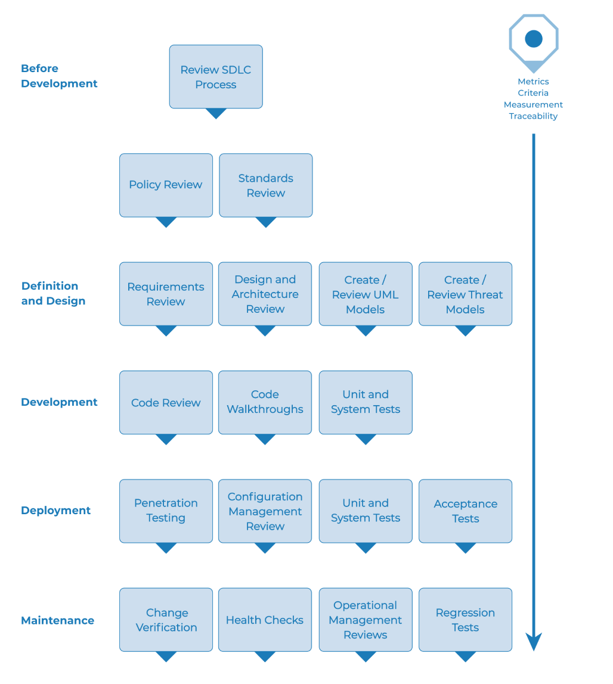

---

layout: col-document
title: WSTG - Latest
tags: WSTG

---


# Методика тестирования безопасности web-приложений

## Обзор

В этом разделе описывается типичная методика тестирования, которая может быть разработана в организации. Её можно рассматривать как справочник, состоящий из методов и задач, которые уместны на различных этапах жизненного цикла разработки (SDLC). Компании и проектные команды могут использовать эту модель для разработки собственной методики тестирования, а также охвата тестированием приложений своих поставщиков. Методику не следует рассматривать как предписывающую что делать, а, скорее, как гибкий подход, который может быть расширен и изменён в соответствии с процессом разработки и культурой организации.

Этот раздел призван помочь организациям разработать стратегию комплексного процесса тестирования и не предназначен для консультантов или подрядчиков, которые, как правило, занимаются более тактическими, специфическими областями тестирования.

Крайне важно понять, почему создание методики сквозного тестирования имеет решающее значение для оценки и улучшения защищённости приложений. В статье «Написание безопасного кода» Ховард и ЛеБлан отмечают, что выпуск бюллетеня по безопасности обходится Microsoft не менее чем в 100 тысяч долларов, а их клиентам в совокупности обходится гораздо больше, чем применение исправлений безопасности. Они также отмечают, что на [web-сайте правительства США по борьбе с киберпреступностью](https://www.justice.gov/criminal-ccips) подробно описываются недавние уголовные дела и убытки организаций. Типичные убытки намного превышают 100 тысяч долларов.

С такой экономикой неудивительно, что поставщики программного обеспечения смещают фокус с тестирования безопасности исключительно  методом «чёрного ящика», которое может быть выполнено только для уже развёрнутых приложений, на более ранние этапы, таких как определение, проектирование и разработка.

Многие специалисты по безопасности до сих пор воспринимают тестирование безопасности только как тестирование на проникновение. Как обсуждалось в предыдущей главе, хотя тестирование на проникновение и играет определённую роль, оно, как правило, неэффективно для поиска ошибок и чрезмерно зависит от навыков тестировщика. Его следует рассматривать только как один из методов или для повышения осведомлённости о проблемах в среде эксплуатации. Чтобы повысить безопасность приложений, необходимо повысить её качество. Это означает тестирование безопасности на этапах определения, проектирования, разработки, развёртывания и сопровождения, а не использование дорогостоящей стратегии ожидания завершения сборки кода.

Как обсуждалось во введении к этому документу, существует множество методологий разработки, таких как Rational Unified Process, разработка eXtreme и Agile, а также традиционные методологии водопада. Цель этого руководства не в том, чтобы предложить какую-либо конкретную методологию разработки и предоставить конкретные рекомендации, которые придерживаются какой-либо конкретной методологии. Вместо этого мы представляем общую модель разработки, и читатель должен следовать ей в соответствии с процессами своей компании.

Эта методика тестирования состоит из действий, которые должны выполняться:

- До начала разработки
- В процессе определения и проектирования
- В процессе разработки
- В процессе развёртывания
- В процессах сопровождения и эксплуатации.

## Этап 1. До начала разработки

### Этап 1.1. Определите свой SDLC

Прежде чем приступить к разработке приложения, необходимо определить такой SDLC, в котором безопасность обеспечивается на каждом его этапе.

### Этап 1.2. Ознакомьтесь с политиками и стандартами

Убедитесь в наличии соответствующих политик, стандартов и документации. Документация чрезвычайно важна, поскольку она даёт командам разработчиков руководящие принципы и процедуры, которым они могут следовать. Люди поступают правильно только в том случае, если они знают, что это правильно (и как этого достичь).

Если приложение должно разрабатываться на Java, важно, чтобы был доступен стандарт безопасного кода на Java. Если приложение должно использовать криптографию, важно, чтобы был стандарт по криптографии. Ни политики, ни стандарты не смогут охватить все ситуации, с которыми может столкнуться команда разработчиков, но если задокументировать хотя бы самые распространённые и предсказуемые из них, то в процессе разработки придётся принимать меньше решений.

### Этап 1.3. Разработайте критерии измерения и метрики и обеспечьте их прослеживаемость

Перед началом разработки спланируйте программу измерений. Определите критерии, которые необходимо измерять; они позволят увидеть дефекты как в процессе, так и в продукте. Важно определить метрики до начала разработки, так как может возникнуть необходимость изменить процесс для сбора данных.

## Этап 2. В процессе определения и проектирования

### Этап 2.1. Ознакомьтесь с требованиями безопасности

Требования безопасности определяют, как приложение функционирует с точки зрения безопасности. Важно, чтобы требования безопасности были протестированы. Тестирование в данном случае означает проверку предположений, сделанных в требованиях, и на предмет наличия пробелов в определениях самих требований.

Например, если в требовании безопасности говорится, что пользователи должны быть зарегистрированы, прежде чем они смогут получить доступ к разделу технических документов web-сайта, означает ли это, что пользователь должен быть зарегистрирован в системе или пользователь должен пройти аутентификацию? Убедитесь, что требования являются как можно более однозначными.

При поиске пробелов в требованиях обратите внимание на такие механизмы защиты, как:

- Управление пользователями
- Аутентификация
- Авторизация
- Конфиденциальность данных
- Целостность
- Подотчётность
- Управление сессиями
- Защита канала передачи информации
- Сегментация системы и разделение полномочий
- Соответствие законодательству и стандартам (включая персональные данные, государственные и отраслевые стандарты)

### Этап 2.2. Рассмотрите архитектуру приложений

Приложения должны иметь документированный дизайн и архитектуру. Эта документация может включать модели, текстовые документы и другие подобные артефакты. Важно проанализировать эти артефакты, чтобы убедиться, что дизайн и архитектура обеспечивают надлежащий уровень безопасности, как определено в требованиях.

Выявление недостатков безопасности на этапе проектирования — это не только один из наиболее экономичных способов для выявления недостатков, но и один из наиболее эффективных для внесения изменений. Например, если в архитектуре указано, что требуется принятие решений об авторизации в нескольких местах, может оказаться уместным рассмотреть единый компонент авторизации. Если приложение выполняет контроль данных в нескольких местах, может оказаться уместным создать единую точку контроля (т.к. это гораздо дешевле).

Если обнаруживаются недостатки, они должны быть доведены до архитектора приложений для поиска альтернативных решений.

### Этап 2.3. Разработайте и проанализируйте UML-модели

После завершения проектирования архитектуры разработайте модели на унифицированном языке моделирования (UML), которые описывают, как работает приложение. Иногда они уже могут быть в наличии. Используя эти модели, уточните у архитекторов как именно работает приложение. Если обнаружите недостатки, доведите их до архитектора для поиска альтернативных решений.

### Этап 2.4. Разработайте и проанализируйте модели угроз

Вооружившись результатами анализа архитектуры, а также UML-моделями, объясняющими, как именно работает приложение, проведите моделирование угроз. Опишите реалистичные сценарии угроз. Проанализируйте дизайн и архитектуру, чтобы убедиться, что эти угрозы были снижены, приняты бизнесом или переданы третьей стороне, например страховой компании. Если выявленные угрозы не имеют стратегий снижения тяжести последствий, пересмотрите архитектуру с архитектором приложений, чтобы изменить дизайн.

## Этап 3. В процессе разработки

Теоретически разработка — это реализация архитектуры. Однако в реальном мире многие архитектурные решения принимаются во время разработки кода. Часто это незначительные решения, которые были либо слишком несущественными, чтобы их описывать в дизайне, либо это вопросы, по которым в регламентах и стандартах отсутствуют какие-либо ограничения или рекомендации. Если архитектура оказалась неадекватной, разработчику придётся принимать множество решений самостоятельно. Если регламентов и стандартов недостаточно, разработчик столкнётся с ещё большим количеством решений.

### Этап 3.1. Проведите «ознакомительную экскурсию» по коду

Специалисты по безопасности должны провести разбор кода с разработчиками, а в некоторых случаях и с архитекторами приложений. Разбор — это «ознакомительная экскурсия» по коду, во время которой разработчики рассказывают о логике работы реализованного кода. Это позволяет команде по анализу исходного кода получить общее представление о коде, а разработчикам — объяснить, почему те или иные компоненты были разработаны именно таким образом.

Цель состоит не в том, чтобы провести детальный анализ кода, а в том, чтобы на концептуальном уровне понять логику, компоновку и структуру кода, из которого состоит приложение.

### Этап 3.2. Проведите анализ исходного кода

Вооружившись хорошим пониманием того, как устроен код и почему те или иные компоненты были разработаны именно таким образом, тестировщик сможет проверить имеющийся код на наличие дефектов безопасности.

При статическом анализе код проверяется по чек-листам, включая:

- Бизнес-требования к доступности, конфиденциальности и целостности;
- Руководство OWASP или чек-листы Top 10 для технических рисков (в зависимости от глубины анализа);
- Специфические требования, связанные с используемым языком или фреймворком, такие как Scarlet Paper для PHP или [чек-лист Microsoft по безопасной разработке на ASP.NET](https://msdn.microsoft.com/en-us/library/ff648269.aspx);
- Отраслевые требования, такие как Sarbanes-Oxley 404, COPPA, ISO/IEC 27002, APRA, HIPAA, руководства Visa для торгово-сервисных предприятий или другие регламенты.

С точки зрения отдачи от вложенных ресурсов (в основном времени), статический анализ кода даёт гораздо более качественный результат, чем любой другой метод тестирования безопасности, и меньше всего зависят от навыков проверяющего. Тем не менее, это не панацея, и результаты анализа необходимо рассматривать в контексте всего спектра методов тестирования.

Для получения более подробной информации о чек-листах OWASP, пожалуйста, обратитесь к актуальной версии [OWASP Top 10](https://owasp.org/www-project-top-ten/).

## Этап. 4. В процессе развёртывания

### Этап 4.1. Протестируйте приложение на проникновение

Протестировав требования, рассмотрев архитектуру и проанализировав код, можно предположить, что все проблемы устранены. Надеемся, что так и есть, но тестирование на проникновение после развёртывания приложения обеспечивает дополнительную гарантию, что ничего не упущено.

### Этап 4.2. Протестируйте безопасность настроек

Тест на проникновение должен включать проверку того, каким образом была развёрнута и защищена инфраструктура. Важно проанализировать все аспекты конфигурации, какими бы незначительными они не были, чтобы убедиться, что ни один из них не оставлен с настройками по умолчанию, которые могут быть уязвимы для эксплуатации.

## Этап 5. В процессах сопровождения и эксплуатации

### Этап 5.1. Проводите анализ эксплуатации приложения

Должен быть внедрён процесс, описывающий, как эксплуатировать приложение и его инфраструктуру.

### Этап 5.2. Проводите регулярный анализ защищённости

Следует ежемесячно или ежеквартально проводить анализ защищённости как приложения, так и инфраструктуры, чтобы убедиться в отсутствии новых угроз безопасности и в том, что уровень защищённости не деградирует.

### Этап 5.3. Обеспечьте верификацию изменений

После того, как изменение протестировано в тестовой среде, и до его развёртывания в среде эксплуатации, крайне важно его проверить, чтобы убедиться, что оно не ухудшило текущий уровень защищённости. Верификация должна быть неотъемлемой частью процесса управления изменениями.

## Типичный процесс тестирования в SDLC

На рисунке ниже показан типичный процесс тестирования в SDLC.

\
 *Рисунок 3-1: Типичный процесс тестирования в SDLC*
