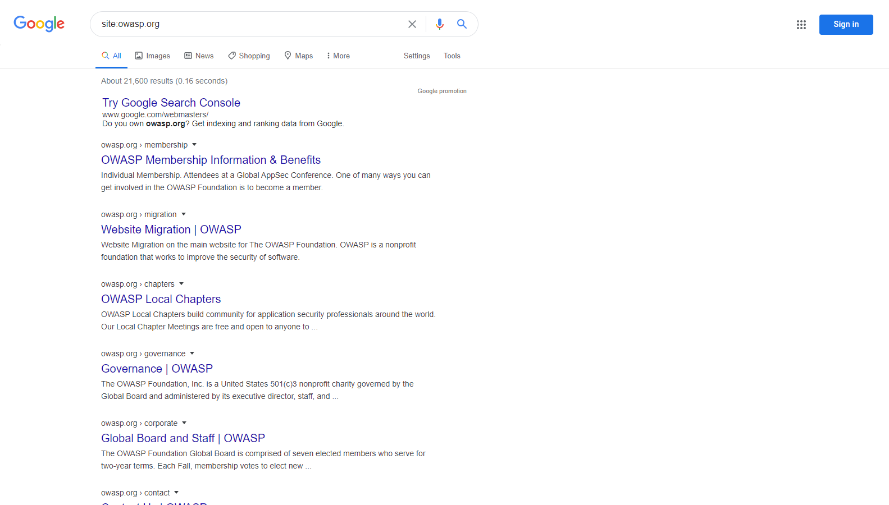

---

layout: col-document
title: WSTG - Latest
tags: WSTG

---


# Разведка в поисковых системах и обнаружение утечек информации

|ID          |
|------------|
|WSTG-INFO-01|

## Обзор

Чтобы поисковые системы выдавали результат, компьютерные программы (или `роботы`) регулярно извлекают (или как ещё говорят [сканируют](https://en.wikipedia.org/wiki/Web_crawler)) данные с миллиардов страниц в Интернете. Эти программы находят web-контент и функции, переходя по ссылкам с других страниц или просматривая карты сайтов. Если у web-сайта есть специальный файл `robots.txt` с перечнем страниц, которые не должны сканироваться поисковыми системами, то перечисленные там страницы будут проигнорированы. Это основные принципы, — Google предлагает более подробный рассказ о том [как работает поисковая система](https://support.google.com/webmasters/answer/70897?hl=en).

Тестировщики могут использовать поисковые системы для рекогносцировки сайтов и web-приложений. Существуют прямые и косвенные методы обнаружения и разведки в поисковых системах: прямые методы связаны с поиском по индексам и связанного с ними контента из кэшей, а косвенные — с получением конфиденциальной информации о дизайне и конфигурации путём поиска на форумах, группах новостей и сайтах с конкурсными торгами.

Как только робот поисковой системы завершил сканирование, он начинает индексировать контент на основе тегов и связанных атрибутов, таких как `<TITLE>`, чтобы выдавать релевантные результаты поиска. Если файл `robots.txt` давно не обновлялся и не использовались HTML-метатеги, предписывающие роботам не индексировать контент, то индексы могут содержать контент, не предназначенный для сканирования. Для его удаления владельцы сайтов могут использовать ранее упомянутый файл `robots.txt`, HTML-метатеги (например, `noindex`), механизмы аутентификации и инструменты, предоставляемые поисковыми системами.

## Задача тестирования

- Определить, какая конфиденциальная информация об архитектуре и конфигурации приложения, системы или организации раскрывается прямо (на сайте организации) или косвенно (через сторонние сервисы).

## Как тестировать

Используйте поисковую систему для обнаружения потенциально конфиденциальной информации. Она может включать:

- сетевые схемы и конфигурации;
- архивные сообщения и электронные письма администраторов или других ключевых сотрудников;
- описание процедуры входа в систему и формата имени пользователя;
- имена пользователей, пароли и закрытые ключи;
- файлы конфигурации к сторонним или облачным службам;
- развёрнутое описание ошибок;
- непубличные приложения (разработка, тестирование, в т.ч. приёмо-сдаточное (UAT) и промежуточные версии сайтов).

### Поисковые системы

Не ограничивайте тестирование только одним поставщиком поиска. Результаты разных систем могут отличаться, в зависимости от того, когда поисковая система в последний раз сканировала контент, и от алгоритма, который она использует для ранжирования выдачи страниц. Рассмотрите возможность использования следующих поисковых систем (в алфавитном порядке):

- [Baidu](https://www.baidu.com/) — [самая популярная](https://en.wikipedia.org/wiki/Web_search_engine#Market_share) поисковая система в Китае.
- [Bing](https://www.bing.com/) — поисковая система, принадлежащая и управляемая Microsoft, вторая [по популярности](https://en.wikipedia.org/wiki/Web_search_engine#Market_share) в мире. Поддерживает [расширенный поиск по ключевым словам](http://help.bing.microsoft.com/#apex/18/en-US/10001/-1).
- [binsearch.info](https://binsearch.info/) — поисковая система для бинарных групп новостей Usenet.
- [Common Crawl](https://commoncrawl.org/) — «открытое хранилище данных web-сканирования, к которому любой желающий может получить доступ и проанализировать его».
- [DuckDuckGo](https://duckduckgo.com/) — поисковая система, ориентированная на конфиденциальность, которая собирает результаты из множества различных [источников](https://help.duckduckgo.com/results/sources/). Поддерживает [синтаксис поиска](https://help.duckduckgo.com/duckduckgo-help-pages/results/syntax/).
- [Google](https://www.google.com/) — [самая популярная](https://en.wikipedia.org/wiki/Web_search_engine#Market_share) поисковая система в мире. Использует систему ранжирования, пытаясь выдавать наиболее релевантные результаты. Поддерживает [операторы поиска](https://support.google.com/websearch/answer/2466433).
- [Internet Archive Wayback Machine](https://archive.org/web/) — «создаёт цифровую библиотеку интернет-сайтов и других культурных артефактов в цифровой форме».
- [Startpage](https://www.startpage.com/) — поисковая система, которая использует результаты Google без сбора персональных данных посредством трекеров и журналов. Поддерживает [операторы поиска](https://support.startpage.com/hc/en-us/articles/4521473758228-How-to-use-search-operators-Advanced-Search-).
- [Shodan](https://www.shodan.io/) — сервис для поиска подключенных к Интернету устройств и сервисов. Варианты использования включают ограниченный бесплатный тарифный план, а также платные планы подписки.

И DuckDuckGo, и Startpage обещают пользователям больше конфиденциальности за счёт того, что они не применяют трекеры и не ведут журналы. Это может уменьшить утечки информации о тестере.

### Операторы поиска

Оператор поиска — это специальное ключевое слово или синтаксис, расширяющий возможности обычных поисковых запросов, что может помочь получить более точные результаты. Обычно они имеют вид  `operator:query`. Вот некоторые часто поддерживаемые операторы поиска:

- `site:` ограничивает поиск указанным доменом.
- `inurl:` выдаёт только те результаты, которые включают запрашиваемое ключевое слово в URL.
- `intitle:` выдаёт только те результаты, которые включают запрашиваемое ключевое слово в названии страницы.
- `intext:` или `inbody:` ищут ключевое слово только в теле страниц.
- `filetype:` ограничивают поиск только указанным типом файла, например, png или php.

Например, чтобы найти web-контент на owasp.org, проиндексированный типичной поисковой системой, требуется следующий синтаксис:

```text
site:owasp.org
```

\
*Рисунок 4.1.1-1: Пример результатов поиска в Google с помощью оператора site*

### Просмотр кэшированного контента

Для поиска контента, который был проиндексирован ранее, используйте оператор `cache:`. Это полезно для просмотра контента, который мог измениться с момента его сканирования или стать недоступным. Не все поисковые системы позволяют искать по кэшированному контенту; наиболее полезным источником на момент написания является Google.

Для просмотра owasp.org в том виде, в котором он был проиндексирован, используйте следующий синтаксис:

```text
cache:owasp.org
```

\
*Рисунок 4.1.1-2: Пример результата поиска в Google с помощью оператора cache*

### Google Hacking или Dorking

Поиск с помощью операторов в сочетании с творческим подходом могут быть очень эффективным средством разведки. Команды можно объединять в цепочки для обнаружения определённых типов конфиденциальных файлов и данных. Этот метод, названный [Google hacking](https://en.wikipedia.org/wiki/Google_hacking) или Dorking, также можно использовать и в других поисковых системах, если они поддерживают операторы поиска.

Базы данных дорков, например [Google Hacking Database](https://www.exploit-db.com/google-hacking-database) — полезный ресурс, который может помочь узнать конкретную информацию. В этой базе данных дорки делятся на следующие категории:

- Уязвимые точки входа
- Файлы, содержащие имена пользователей
- Конфиденциальные каталоги
- Определение web-сервера
- Уязвимые файлы
- Уязвимые сервера
- Сообщения об ошибках
- Файлы, содержащие пикантную информацию
- Файлы, содержащие пароли
- Конфиденциальная информация о покупках в Интернете

## Меры защиты

Прежде чем публиковать в Интернете информацию об архитектуре и конфигурации тщательно оцените категорию её конфиденциальности.

Периодически пересматривайте категории конфиденциальности опубликованной информации о дизайне и конфигурации.
