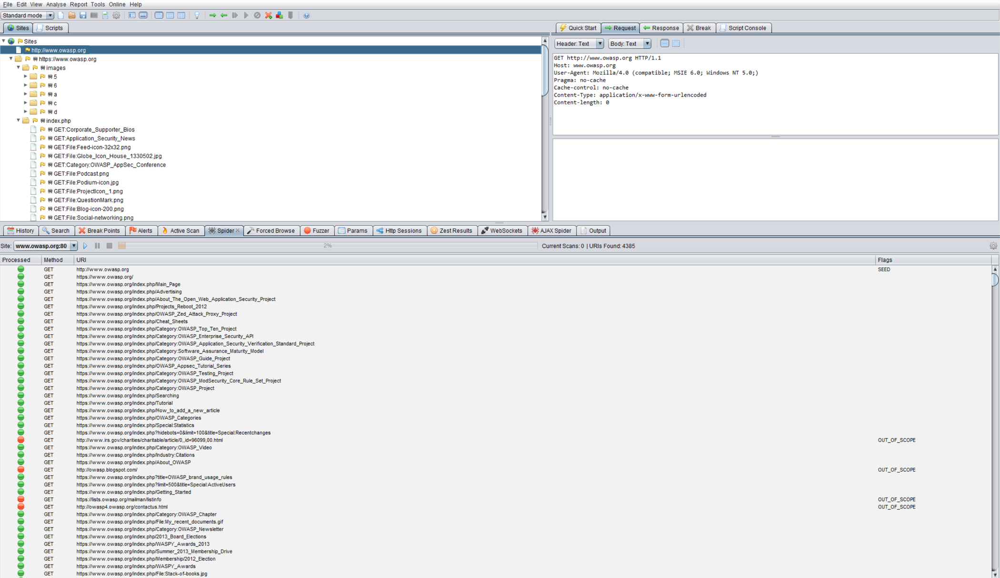

---

layout: col-document
title: WSTG - Latest
tags: WSTG

---


# Пути выполнения приложения

|ID          |
|------------|
|WSTG-INFO-07|

## Обзор

Прежде чем приступать к тестированию безопасности, первостепенное значение имеет понимание структуры приложения. Вряд ли получится его тщательно протестировать, не зная топологии связей.

## Задача тестирования

- Составить карту связей целевого приложения и определить основные информационные потоки.

## Как тестировать

При тестировании методом чёрного ящика чрезвычайно сложно протестировать всю кодовую базу. Не только потому, что тестировщик не имеет представления обо всех путях кода в приложении, но даже если бы у него была такая возможность, проверка всех ветвей заняла бы очень много времени. Один из способов справиться с этим — документировать, какие пути кода были обнаружены и протестированы.

Существует несколько подходов к тестированию и измерению покрытия кода:

- **Пути** — тестируется каждый из путей приложения, включая их комбинаторный перебор и анализ граничных условий для каждой точки принятия решений. Хотя этот подход и даёт хороший охват, количество проверяемых путей растёт экспоненциально с каждой ветвью принятия решения.
- **Потоки данных (или анализ заражения)** — тестируется присвоение значений переменным посредством внешнего взаимодействия (обычно пользователями). Основное внимание уделяется отображению потоков, преобразованиям и использованию данных в приложении.
- **Гонка** — тестируется несколько параллельно запущенных экземпляров приложения, манипулирующих одними и теми же данными.

Выбор подхода и степени его использования, следует согласовать с владельцем приложения. Можно действовать и проще, уточнив, какие функции или разделы кода его особенно интересуют и как получить доступ к этим сегментам кода.

Чтобы продемонстрировать владельцу приложения покрытие кода тестами, можно начать с электронной таблицы, где документируются все ссылки, обнаруженные в результате сканирования приложения (вручную или автоматически). Затем можно более тщательно изучить точки принятия решений и выяснить, сколько значимых путей кода обнаружено. Они также должны быть задокументированы в электронной таблице с URL-адресами, текстовым описанием и снимками экрана.

### Автоматическое сканирование

Автоматический сканер (паук, spider) — это инструмент, используемый для обнаружения новых ресурсов (URL-адресов) на заданном web-сайте. Он начинает со списка URL для посещения, называемого посевом (seed), который зависит от того, как запускается паук. Хотя существует множество инструментов, в примере ниже используется [Zed Attack Proxy (ZAP)](https://github.com/zaproxy/zaproxy):

\
*Рисунок 4.1.7-1: Экран Zed Attack Proxy*

[ZAP](https://github.com/zaproxy/zaproxy) предлагает различные варианты автоматического сканирования, которые можно использовать в зависимости от потребностей:

- [Spider](https://www.zaproxy.org/docs/desktop/start/features/spider/)
- [AJAX Spider](https://www.zaproxy.org/docs/desktop/addons/ajax-spider/)
- [OpenAPI Support](https://www.zaproxy.org/docs/desktop/addons/openapi-support/)

## Инструменты

- [Zed Attack Proxy (ZAP)](https://github.com/zaproxy/zaproxy)
- [Список приложений для работы с электронными таблицами](https://en.wikipedia.org/wiki/List_of_spreadsheet_software)
- [Список приложений для построения диаграмм связей](https://en.wikipedia.org/wiki/List_of_concept-_and_mind-mapping_software)

## Ссылки

- [Покрытие кода](https://ru.wikipedia.org/wiki/%D0%9F%D0%BE%D0%BA%D1%80%D1%8B%D1%82%D0%B8%D0%B5_%D0%BA%D0%BE%D0%B4%D0%B0)
