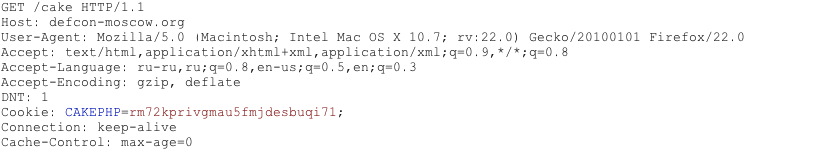
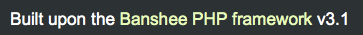
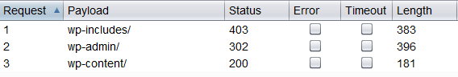

---

layout: col-document
title: WSTG - Latest
tags: WSTG

---


# Определение фреймворка web-приложения

|ID          |
|------------|
|WSTG-INFO-08|

## Обзор

Ничто не ново под солнцем, почти каждое web-приложение, о разработке которого можно задуматься, уже разработано. Учитывая огромное количество проектов бесплатного программного обеспечения с открытым исходным кодом, которые активно разрабатываются и развёртываются по всему миру, весьма вероятно, что тест безопасности приложений столкнётся с целью, которая полностью или частично зависит от этих хорошо известных приложений или фреймворков (таких как WordPress, phpBB, Mediawiki и т.д.). Знание компонентов web-приложений помогает в процессе тестирования, а также существенно снижает усилия, необходимые для тестирования. Эти web-приложения имеют хорошо известные HTML-заголовки, файлы cookie и структуры каталогов, которые можно использовать для идентификации приложения. Большинство web-фреймворков имеют несколько маркеров в известных местах, которые помогают злоумышленнику или тестировщику распознать их. Все автоматические инструменты так и поступают: ищут маркер в заранее определённом месте, а затем сравнивают его с базой данных известных сигнатур. Для большей точности обычно используют несколько маркеров.

## Задача тестирования

- Определить компоненты, используемые web-приложениями.

## Как тестировать

### Метод чёрного ящика

Есть несколько распространённых мест, которые следует рассматривать при определении фреймворка или компонентов:

- HTTP-заголовки
- Cookies
- Исходный код HTML
- Специфичные файлы и папки
- Расширения файлов
- Сообщения об ошибках

#### HTTP-заголовки

Самый простой способ идентификации web-фреймворка — просмотр значения `X-Powered-By` в HTTP-заголовке ответа. Для определения можно использовать множество инструментов, самый простой из них — netcat.

Рассмотрим следующий HTTP-запрос и ответ:

```http
$ nc 127.0.0.1 80
HEAD / HTTP/1.0

HTTP/1.1 200 OK
Server: nginx/1.0.14
[...]
X-Powered-By: Mono
```

Исходя из значения `X-Powered-By`, мы понимаем, что фреймворком web-приложение, вероятно, является `Mono`. Однако, хотя этот подход прост и быстр, эта методика не работает в 100% случаев. Можно легко отключить заголовок `X-Powered-By` при правильной настройке. Есть также несколько методов, которые позволяют web-сайту обфусцировать HTTP-заголовки (см. пример в разделе [Как исправить](#как-исправить)). В приведённом выше примере мы также можем отметить, что для обслуживания контента используется определённая версия `nginx`.

Таким образом, в том же примере тестировщик может либо пропустить заголовок `X-Powered-By`, либо получить ответ, подобный следующему:

```http
HTTP/1.1 200 OK
Server: nginx/1.0.14
Date: Sat, 07 Sep 2013 08:19:15 GMT
Content-Type: text/html;charset=ISO-8859-1
Connection: close
Vary: Accept-Encoding
X-Powered-By: Blood, sweat and tears
```

Иногда сразу несколько HTTP-заголовков указывают на определённый фреймворк. В следующем примере по информации из HTTP-запроса можно видеть, что заголовок `X-Powered-By` содержит версию PHP. Однако заголовок `X-Generator` указывает на то, что на самом деле используется фреймворк `Swiftlet`, что помогает пентестеру расширить набор векторов атак. Тщательно проверяйте каждый HTTP-заголовок на наличие таких утечек.

```http
HTTP/1.1 200 OK
Server: nginx/1.4.1
Date: Sat, 07 Sep 2013 09:22:52 GMT
Content-Type: text/html
Connection: keep-alive
Vary: Accept-Encoding
X-Powered-By: PHP/5.4.16-1~dotdeb.1
Expires: Thu, 19 Nov 1981 08:52:00 GMT
Cache-Control: no-store, no-cache, must-revalidate, post-check=0, pre-check=0
Pragma: no-cache
X-Generator: Swiftlet
```

#### Cookies

Ещё один похожий и несколько более надёжный способ определить текущий web-фреймворк — это файлы cookie.

Рассмотрим следующий HTTP-запрос:

\
*Рисунок 4.1.8-7: HTTP-запрос Cakephp*

Установлен файл cookie `CAKEPHP`, дающий информацию об используемом фреймворке. Список распространённых имён файлов cookie представлен в разделе [Cookies](#cookies). Как и в предыдущем случае есть ограничения в использовании этого механизма идентификации, т.к. можно изменить имя файлов cookie. Например, для выбранного фреймворка `CakePHP` это можно сделать с помощью следующей конфигурации (выдержка из `core.php`):

```php
/**
* The name of CakePHP's session cookie.
*
* Note the guidelines for Session names states: "The session name references
* the session id in cookies and URLs. It should contain only alphanumeric
* characters."
* @link http://php.net/session_name
*/
Configure::write('Session.cookie', 'CAKEPHP');
```

Однако здесь эти изменения менее вероятны, чем в заголовке `X-Powered-By` поэтому такой подход к идентификации можно считать более надёжным.

#### Исходный код HTML

Этот метод основан на поиске определённых шаблонов в исходном коде HTML-страницы. Часто можно найти информацию, которая помогает распознать конкретный компонент. Одним из распространённых маркеров являются комментарии HTML, которые напрямую ведут к раскрытию фреймворка. Чаще можно найти определённые пути, т.е. ссылки на папки CSS или JS, специфичные для фреймворка. Наконец, некоторые переменные скрипта также могут указывать на тот или иной фреймворк.

На скриншоте ниже можно легко узнать используемый фреймворк и его версию по указанным маркерам. Комментарий, специфичные пути и переменные скрипта — всё это может помочь злоумышленнику быстро определить фреймворк ZK.

\
*Рисунок 4.1.8-2: Пример исходного кода HTML для фреймворка ZK*

Часто такая информация размещается в разделе HTTP-ответов `<head>`, в тегах `<meta>`, или в конце страницы. Тем не менее, следует анализировать все ответы целиком, поскольку это может быть полезно для других целей, таких как проверка других полезных комментариев и скрытых полей. Иногда web-разработчики не очень заботятся о сокрытии информации об используемых фреймворках или компонентах. Все ещё можно наткнуться на что-то подобное внизу страницы:

\
*Рисунок 4.1.8-3: Нижняя часть страницы Banshee*

### Специфичные файлы и папки

Есть ещё один подход, который очень помогает злоумышленнику или тестировщику с высокой точностью идентифицировать приложения или компоненты. Каждый web-компонент имеет собственную структуру файлов и папок на сервере. Было отмечено, что можно увидеть специфичный путь из исходного кода HTML-страницы. Иногда он не указан там явно, но тем не менее есть на сервере.

Для их обнаружения используется метод, известный как принудительный просмотр или dirbusting (англ.: перебор каталогов). Дирбастинг — это перебор с известными именами папок и файлов и отслеживание HTTP-ответов для инвентаризации содержимого целевого сервера. Эта информация может использоваться как для поиска файлов по умолчанию и атаки на них, так и для идентификации web-приложения. Дирбастинг может быть выполнен несколькими способами, в приведённом ниже примере показана успешная атака цели на WordPress с помощью заданного списка и функциональности Intruder в Burp Suite.

\
*Рисунок 4.1.8-4: Дирбастинг в Burp*

Мы видим, что для некоторых специфичных для WordPress папок (например, `/wp-includes/`, `/wp-admin/` и `/wp-content/`) получены HTTP-ответы 403 (Forbidden), 302 (Found, перенаправление на `wp-login.php`), и 200 (OK) соответственно. Это верный показатель того, что цель работает на WordPress. Таким же образом можно дирбастить другие папки плагинов приложений и их версии. На скриншоте ниже можно увидеть типичный файл CHANGELOG плагина Drupal, который предоставляет информацию об используемом приложении и раскрывает уязвимую версию плагина.

\
*Рисунок 4.1.8-5: Раскрытие информации о плагине Botcha в Drupal*

Совет: прежде чем приступить к дирбастингу, проверьте файл `robots.txt`. Иногда там также можно найти папки для некоторых приложений и другую чувствительную информацию. Пример такого файла `robots.txt` представлен на скриншоте ниже.

\
*Рисунок 4.1.8-6: Раскрытие информации в robots.txt*

Наименования специфичных файлов и папок характеризуют конкретные приложения. Если исходный код идентифицированного приложения или компонента открыт, может быть полезно временно установить его себе до тестов на проникновение, чтобы получше узнать, какая инфраструктура или функциональность в них представлена, и какие файлы могут быть на сервере. Однако уже есть несколько хороших списков файлов — один из примеров — [списки предсказуемых файлов/папок FuzzDB](https://github.com/fuzzdb-project/fuzzdb).

#### Расширения файлов

URL-адреса могут содержать расширения файлов, которые также могут помочь идентифицировать web-платформу или технологию.

Например, в вики у OWASP используется PHP:

```text
https://wiki.owasp.org/index.php?title=Fingerprint_Web_Application_Framework&action=edit&section=4
```

Вот некоторые распространённые расширения web-файлов и связанные с ними технологии:

- `.php` — PHP
- `.aspx` — Microsoft ASP.NET
- `.jsp` — Java Server Pages

#### Сообщения об ошибках

Как видно на следующем снимке экрана, приведённый путь к файловой системе указывает на использование WordPress (`wp-content`). Также тестировщики должны знать, что WordPress работает на PHP (`functions.php`).

\
*Рисунок 4.1.8-7: Ошибка парсинга в WordPress*

## Распространённые идентификаторы

### Cookies

| Фреймворк    | Наименование файла Cookie                       |
|--------------|-----------------------------------|
| Zope         | zope3                             |
| CakePHP      | cakephp                           |
| Kohana       | kohanasession                     |
| Laravel      | laravel_session                   |
| phpBB        | phpbb3_                           |
| WordPress    | wp-settings                       |
| 1C-Bitrix    | BITRIX_                           |
| AMPcms       | AMP                               |
| Django CMS   | django                            |
| DotNetNuke   | DotNetNukeAnonymous               |
| e107         | e107_tz                           |
| EPiServer    | EPiTrace, EPiServer               |
| Graffiti CMS | graffitibot                       |
| Hotaru CMS   | hotaru_mobile                     |
| ImpressCMS   | ICMSession                        |
| Indico       | MAKACSESSION                      |
| InstantCMS   | InstantCMS[дата_записи]               |
| Kentico CMS  | CMSPreferredCulture               |
| MODx         | SN4[12 символов]                       |
| TYPO3        | fe_typo_user                      |
| Dynamicweb   | Dynamicweb                        |
| LEPTON       | lep[некоторое_число]+sessionid |
| Wix          | Domain=.wix.com                   |
| VIVVO        | VivvoSessionId                    |

### Исходный код HTML

| Приложение | Ключевые слова                                                                        |
|-------------|--------------------------------------------------------------------------------|
| WordPress   | `<meta name="generator" content="WordPress 3.9.2" />`                          |
| phpBB       | `<body id="phpbb"`                                                             |
| Mediawiki   | `<meta name="generator" content="MediaWiki 1.21.9" />`                         |
| Joomla      | `<meta name="generator" content="Joomla! - Open Source Content Management" />` |
| Drupal      | `<meta name="Generator" content="Drupal 7 (http://drupal.org)" />`             |
| DotNetNuke  | `DNN Platform - [http://www.dnnsoftware.com](http://www.dnnsoftware.com)`      |

#### Общие маркеры

- `%framework_name%`
- `powered by`
- `built upon`
- `running`

#### Специальные маркеры

| Фреймворк         | Ключевые слова                        |
|-------------------|--------------------------------|
| Adobe ColdFusion  | `<!-- START headerTags.cfm` |
| Microsoft ASP.NET | `__VIEWSTATE`                  |
| ZK                | `<!-- ZK`                   |
| Business Catalyst | `<!-- BC_OBNW -->`       |
| Indexhibit        | `ndxz-studio`                  |

## Меры защиты

Конечно можно предпринять усилия по использованию других имен файлов cookie (изменив настройки), скрыть или изменить пути к файлам/каталогам (переписав исходный код), удалить известные заголовки и т.д., но эти усилия сводятся к «безопасности через неясность». Владельцы/администраторы систем должны понимать, что всё это замедляет работу только самых неискушённых злоумышленников. Время/усилия лучше потратить на повышение осведомлённости заинтересованных сторон и работу по сопровождению решения.

## Инструменты

Ниже представлен список общих и хорошо известных инструментов. Существует также множество других утилит, а также инструменты для определения фреймворка.

### WhatWeb

Сайт: [https://github.com/urbanadventurer/WhatWeb](https://github.com/urbanadventurer/WhatWeb)

В настоящее время это один из лучших инструментов для идентификации. Поставляется по умолчанию в дистрибутиве [Kali Linux](https://www.kali.org/). Язык: Ruby, функция Match. Поиск осуществляется по:

- Текстовым строкам (с учётом регистра)
- Регулярным выражениям
- Запросам к Google Hack Database (по ограниченному набору ключевых слов)
- Хэшам MD5
- Распознаваемым URL-адресам
- Шаблонам HTML-тегов
- Пользовательскому коду Ruby для пассивных и активных операций.

Пример вывода представлен на скриншоте ниже:

\
*Рисунок 4.1.8-8: Пример вывода Whatweb*

### Wappalyzer

Сайт: [https://www.wappalyzer.com/](https://www.wappalyzer.com/)

Wappalyzer доступен в нескольких моделях использования, наиболее популярными из которых, видимо, являются расширения Firefox/Chrome. Он полагается только на сопоставление регулярных выражений и не требует ничего, кроме загрузки страницы в браузер. Выдаёт результаты в виде иконок. Хотя иногда бывают ложные срабатывания, очень удобно получить представление о том, какие технологии использовались для создания целевого web-сайта сразу после просмотра его страницы.

Пример вывода на скриншоте ниже.

\
*Рисунок 4.1.8-9: Пример вывода Wappalyzer для сайта OWASP*

## Ссылки

### Технические руководства

- [Saumil Shah: "An Introduction to HTTP fingerprinting"](https://web.archive.org/web/20190526182734/https://net-square.com/httprint_paper.html)
- [Anant Shrivastava : "Web Application Finger Printing"](https://anantshri.info/articles/web_app_finger_printing.html)
