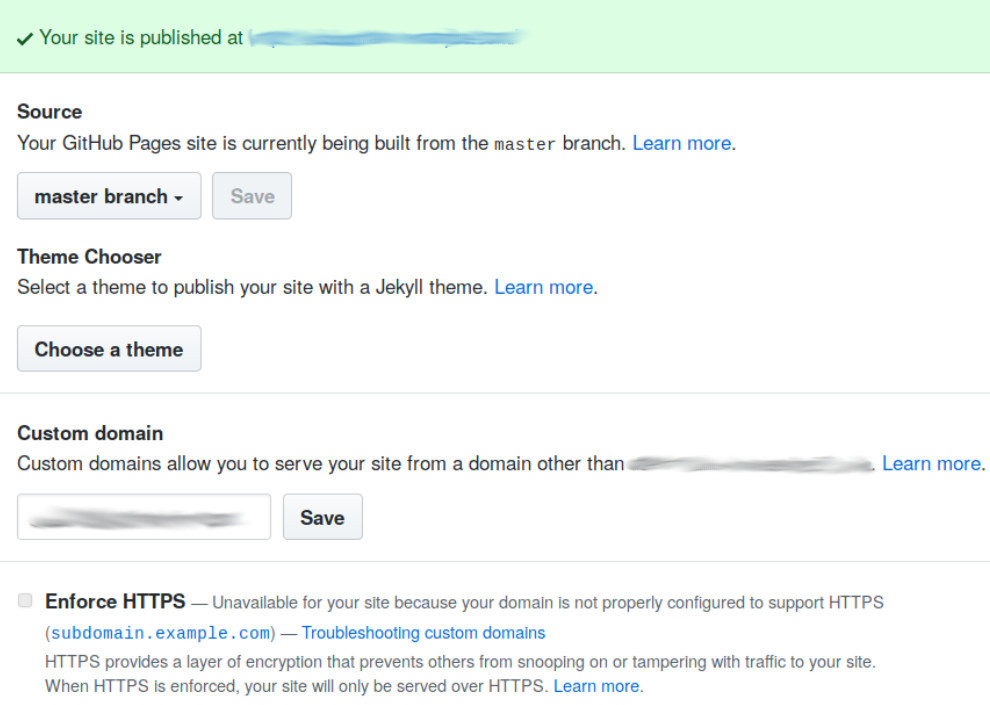

---

layout: col-document
title: WSTG - Latest
tags: WSTG

---


# Тестирование на захват поддомена

|ID          |
|------------|
|WSTG-CONF-10|

## Обзор

Успешная эксплуатация такого рода уязвимости позволяет злоумышленнику захватить поддомен жертвы и получить контроль над ним. Эта атака основана на следующем:

1. Запись поддомена внешнего DNS-сервера жертвы указывает на несуществующий или неактивный ресурс/внешнюю службу/точку входа. Распространение продуктов XaaS (всё как услуга) и общедоступных облачных сервисов представляет множество потенциальных целей для рассмотрения.
2. Поставщик услуг хостинга, размещающий ресурс/внешнюю службу/точку входа, должным образом не выполняет проверку права собственности на поддомен.

В случае успешного захвата поддомена возможны самые разные атаки (предоставление вредоносного контента, фишинг, кража сессионных cookie пользователя, учётных данных и т.д.). Эта уязвимость может быть использована для широкого ряда ресурсных записей DNS, включая: `A`, `CNAME`, `MX`, `NS`, `TXT` и т.д. С точки зрения серьёзности атаки наибольшее влияние оказывает захват поддомена, указанного в `NS` (хотя он и менее вероятен), поскольку успешная атака может привести к полному контролю над всей зоной DNS и доменом жертвы.

### GitHub

1. Жертва (victim.com) использует GitHub для разработки и настроила запись DNS (`coderepo.victim.com`) для доступа к нему.
2. Жертва решает перенести свой репозиторий кода с GitHub на коммерческую платформу, но не удаляет `coderepo.victim.com` со своего DNS-сервера.
3. Злоумышленник узнаёт, что `coderepo.victim.com` размещён на GitHub, и, используя GitHub Pages, делегирует права на `coderepo.victim.com` своей учётной записи на GitHub.

### Просроченный домен

1. Жертва (victim.com) владеет другим доменом (victimotherdomain.com) и использует запись CNAME (www) для ссылки на другой домен (`www.victim.com` --> `victimotherdomain.com`)
2. В какой-то момент срок делегирования victimotherdomain.com истекает, и он становится доступным для регистрации. Поскольку запись CNAME не удаляется из DNS-зоны victim.com, любой, кто зарегистрирует права на домен `victimotherdomain.com`, имеет полный контроль над `www.victim.com` до тех пор, пока присутствует эта запись DNS.

## Задачи тестирования

- Проинвентаризировать все возможные домены (бывшие и действующие).
- Выявить забытые или некорректно настроенные домены.

## Как тестировать

### Тестирование методом «чёрного ящика»

Первым шагом является инвентаризация DNS-серверов и ресурсных записей жертвы. Существует несколько способов выполнить эту задачу, например, поиск DNS в словарях распространённых поддоменов, перебор DNS, или использование поисковых систем и других источников открытых данных (OSINT).

С помощью команды dig тестировщик ищет следующие ответные сообщения DNS-сервера, требующие дальнейшего изучения:

- `NXDOMAIN`
- `SERVFAIL`
- `REFUSED`
- `no servers could be reached.`

#### Тестирование захвата субдомена DNS, указанного в записях A и CNAME

Выполните базовый поиск DNS в домене жертвы (`victim.com`), используя `dnsrecon`:

```bash
$ ./dnsrecon.py -d victim.com
[*] Performing General Enumeration of Domain: victim.com
...
[-] DNSSEC is not configured for victim.com
[*]      A subdomain.victim.com 192.30.252.153
[*]      CNAME subdomain1.victim.com fictioussubdomain.victim.com
...
```

Определите, какие ресурсные записи DNS неактуальны и указывают на неактивные/неиспользуемые службы. Для записи `CNAME` используйте команду dig:

```bash
$ dig CNAME fictioussubdomain.victim.com
; <<>> DiG 9.10.3-P4-Ubuntu <<>> ns victim.com
;; global options: +cmd
;; Got answer:
;; ->>HEADER<<- opcode: QUERY, status: NXDOMAIN, id: 42950
;; flags: qr rd ra; QUERY: 1, ANSWER: 2, AUTHORITY: 0, ADDITIONAL: 1
```

Следующие ответы DNS требуют дальнейшего изучения: `NXDOMAIN`.

Чтобы проверить запись `A`, тестировщик выполняет поиск в whois и идентифицирует GitHub как поставщика услуг:

```bash
$ whois 192.30.252.153 | grep "OrgName"
OrgName: GitHub, Inc.
```

Тестировщик заходит на `subdomain.victim.com` или направляет HTTP-запрос GET, который возвращает ответ `404 File not found`, что является явным признаком уязвимости.

\
*Рисунок 4.2.10-1: Ответ GitHub: 404 File Not Found*

Тестировщик делегирует себе права на домен с помощью GitHub Pages:

\
*Рисунок 4.2.10-2: Делегирование домена в GitHub Pages*

#### Тестирование захвата поддомена, указанного в записи NS

Определите все серверы имён для домена в области тестирования:

```bash
$ dig ns victim.com +short
ns1.victim.com
nameserver.expireddomain.com
```

В этом вымышленном примере тестировщик ищет домен `expireddomain.com ` на сайте регистратора доменных имён. Если домен доступен для покупки, поддомен уязвим.

Следующие ответы DNS требуют дальнейшего изучения: `SERVFAIL` или `REFUSED`.

### Тестирование методом «серого ящика»

Тестировщику доступен файл зоны DNS, что означает, что инвентаризация DNS не требуется. Методология тестирования та же.

## Меры защиты

Чтобы снизить риск захвата поддомена, уязвимые ресурсные записи DNS должны быть удалены из зоны DNS. Рекомендуется их постоянный мониторинг и регулярные проверки.

## Инструменты

- [dig - страница справки](https://linux.die.net/man/1/dig)
- [recon-ng - фреймворк web-рекогносцировки](https://github.com/lanmaster53/recon-ng)
- [theHarvester - OSINT-инструмент для сбора аналитики](https://github.com/laramies/theHarvester)
- [Sublist3r - OSINT-инструмент для поиска поддоменов](https://github.com/aboul3la/Sublist3r)
- [dnsrecon - Скрипт для перебора DNS](https://github.com/darkoperator/dnsrecon)
- [Проект OWASP Amass - поиск DNS](https://github.com/OWASP/Amass)

## Ссылки

- [HackerOne - Руководство по захвату поддоменов](https://www.hackerone.com/blog/Guide-Subdomain-Takeovers)
- [Захват поддомена: основы](https://0xpatrik.com/subdomain-takeover-basics/)
- [Захват поддомена: что после CNAME](https://0xpatrik.com/subdomain-takeover-ns/)
- [могу-ли-я-захватить-xyz - перечень уязвимых сервисов](https://github.com/EdOverflow/can-i-take-over-xyz/)
- [OWASP AppSec Europe 2017 - Frans Rosén: Захват DNS с использованием облачных провайдеров без регистрации и sms](https://2017.appsec.eu/presos/Developer/DNS%20hijacking%20using%20cloud%20providers%20%E2%80%93%20no%20verification%20needed%20-%20Frans%20Rosen%20-%20OWASP_AppSec-Eu_2017.pdf)
