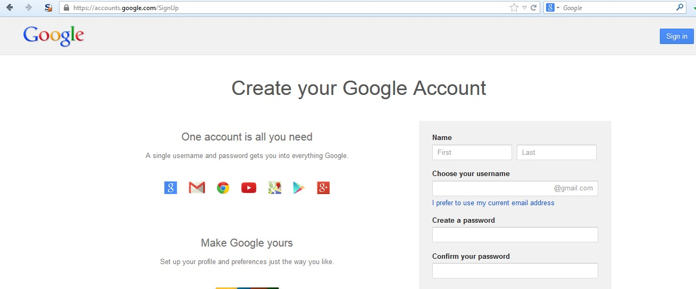

---

layout: col-document
title: WSTG - Latest
tags: WSTG

---


# Тестирование процесса регистрации пользователя

|ID          |
|------------|
|WSTG-IDNT-02|

## Обзор

На некоторых web-сайтах процесс регистрации пользователя полностью или частично автоматизирует предоставление пользователям доступа к системе. Требования к идентификации для доступа варьируются от положительной идентификации до полного её отсутствия, в зависимости от требований к защите системы. Многие общедоступные приложения полностью автоматизируют процесс регистрации пользователей и предоставления доступа, поскольку масштаб аудитории не позволяет им управлять ею вручную. Однако многие корпоративные приложения предоставляют пользователям доступ вручную, поэтому данный сценарий тестирования может быть неприменим.

## Задачи тестирования

- Убедиться, что требования к идентификации при регистрации пользователей соответствуют бизнес-требованиям и требованиям безопасности.
- Убедиться в безопасность процесса регистрации пользователей.

## Как тестировать

Убедитесь, что требования к идентификации для регистрации пользователей соответствуют бизнес-требованиям и требованиям безопасности:

1. Кто может зарегистрироваться для доступа к системе?
2. Проверяется ли кем-то регистрация учётной записи до предоставления доступа, или при соблюдении определённых критериев он предоставляется автоматически?
3. Может ли одно и то же лицо зарегистрироваться несколько раз?
4. Могут ли пользователи зарегистрировать несколько учётных записей для разных ролей или разрешений?
5. Какое удостоверение личности требуется для успешной регистрации?
6. [Верифицируются](https://cbr.ru/Press/event/?id=6383) ли зарегистрированные учётные записи?

Подтвердите безопасность процесса регистрации пользователей:

1. Легко ли сфальсифицировать учётные данные?
2. Можно ли манипулировать обменом информацией об учётной записи во время регистрации?

### Пример

В приведённом ниже примере WordPress единственным требованием для идентификации является адрес электронной почты, доступный владельцу учётной записи.

\
*Рисунок 4.3.2-1: Страница регистрации в WordPress*

В отличие от WordPress, у Google требования к идентификации включают имя, дату рождения, страну, номер мобильного телефона, адрес электронной почты и ответ на CAPTCHA. Хотя проверить можно только два из них (адрес электронной почты и номер мобильного телефона), требования к идентификации более строгие, чем у WordPress.

\
*Рисунок 4.3.2-2: Страница регистрации в Google*

## Меры защиты

Выполнять требования к идентификации и верификации, соответствующие категории информации, защищаемой учётными данными.

## Инструменты

Для тестирования данной меры защиты полезным инструментом может быть HTTP-прокси.

## Ссылки

[User Registration Design (archive)](https://mashable.com/2011/06/09/user-registration-design/)
