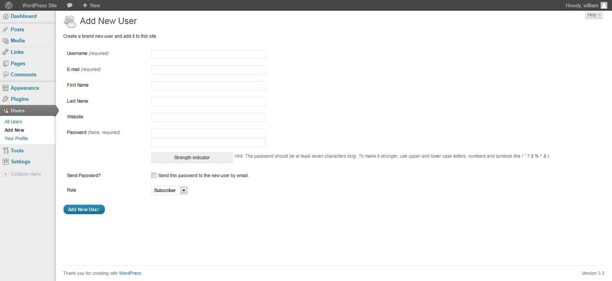

---

layout: col-document
title: WSTG - Latest
tags: WSTG

---


# Тестирование процесса создания учётных записей

|ID          |
|------------|
|WSTG-IDNT-03|

## Обзор

Создание учётных записей даёт злоумышленнику возможность получить действительную учётную запись без надлежащей идентификации и авторизации.

## Задача тестирования

- Проанализировать, какие пользователи могут создавать учётные записи для других и какого типа.

## Как тестировать

Определите, какие роли могут создавать пользователей и какие учётные записи они могут предоставлять.

- Проводится ли какая-либо верификация, утверждение и авторизация запросов на предоставление ресурсов?
- Проводится ли какая-либо верификация, утверждение и авторизация запросов на блокировку?
- Может ли администратор создавать учётные записи другим администраторам или только обычным пользователям?
- Может ли администратор или другой пользователь предоставить учётным записям права, превышающие их собственные?
- Может ли администратор или пользователь сам себя заблокировать?
- Кто владеет файлами или ресурсами, принадлежащими заблокированным пользователям? Они удаляются? Делегируется ли доступ?

### Пример

В WordPress для создания учётной записи требуется только имя пользователя и адрес электронной почты, как показано ниже:

\
*Рисунок 4.3.3-1: Добавление пользователя в WordPress*

Для блокировки пользователей администратор должен выбрать учётную запись, которую нужно заблокировать, выбрать «Удалить» в раскрывающемся меню (обведено красным), а затем применить это действие. Затем администратору выдаётся диалоговое окно с вопросом, что делать с сообщениями пользователя (удалить или перенести их).

\
*Рисунок 4.3.3-2: Аутентификация и пользователи в WordPress*

## Инструменты

Хотя наиболее тщательный и точный подход к этому тесту заключается в его проведении вручную, также могут быть полезны инструменты HTTP-прокси.
