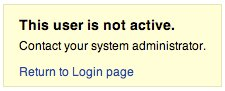

---

layout: col-document
title: WSTG - Latest
tags: WSTG

---


# Перебор и угадывание учётных записей пользователей

|ID          |
|------------|
|WSTG-IDNT-04|

## Обзор

Цель этого теста — подтвердить, возможно ли получить набор действующих учётных записей, взаимодействуя с механизмом аутентификации приложения. Этот тест будет полезен для тестирования перебором, в котором проверяется, можно ли подобрать соответствующий пароль с учётом имеющегося имени пользователя.

Часто web-приложения выдают существование имени пользователя в результате некорректной настройки или архитектурного решения. Например, иногда, когда мы вводим неправильные учётные данные, мы получаем сообщение, в котором говорится, что либо такое имя пользователя присутствует в системе, либо, что предоставленный пароль неверен. Полученная информация может быть использована злоумышленником для получения списка пользователей в системе. Эта информация может быть использована для атаки на web-приложение, например, с помощью перебора или атаки с использованием имени пользователя и пароля по умолчанию.

Тестировщик должен взаимодействовать с механизмом аутентификации приложения, чтобы оценить, приводит ли отправка тех или иных запросов к тому, что приложение отвечает по-разному. Эта проблема существует из-за того, что информация, передаваемая web-приложением или web-сервером, после ввода действительного имени пользователя, отличается от таковой, если ввести недопустимое имя пользователя.

В некоторых случаях выдаётся сообщение, в котором указывается, что предоставленные учётные данные неверны, поскольку было использовано неверное имя пользователя или неверный пароль. Иногда тестировщики могут перебрать существующих пользователей, передавая имя пользователя и пустой пароль.

## Задачи тестирования

- Проанализировать процессы, относящиеся к идентификации пользователя (*например*, регистрация пользователя, вход в систему и т.д.).
- Где это возможно, найти учётные записи пользователей, анализируя ответы.

## Как тестировать

При тестировании методом «чёрного ящика» тестировщик ничего не знает о конкретном приложении, имени пользователя, логике приложения, сообщениях об ошибках на странице входа или средствах восстановления пароля. Если приложение уязвимо, тестировщик получает ответное сообщение, прямо или косвенно раскрывающее некоторую информацию, полезную для инвентаризации учётных записей пользователей.

### Сообщения в HTTP-ответах

#### Тестирование действительных учётных данных

Запишите ответ сервера при отправке действительного идентификатора пользователя и действительного пароля.

> Используя web-прокси, обратите внимание на информацию, полученную в результате этой успешной аутентификации (ответ HTTP 200, длина ответа).

#### Тестирование действительного пользователя с неправильным паролем

Теперь тестировщик должен попытаться ввести действительный идентификатор пользователя и неправильный пароль и записать сообщение об ошибке, выданное приложением.

> Браузер должен отобразить сообщение, похожее на:
>
> \
> *Рисунок 4.3.4-1: Ошибка аутентификации*
>
> А не сообщения, которое раскрывает наличие пользователя, вроде:
>
> `Login for User foo: invalid password`
>
> Используя web-прокси, обратите внимание на информацию, полученную в результате этой неудачной попытки аутентификации (ответ HTTP 200, длина ответа).

#### Тестирование несуществующего имени пользователя

Теперь тестировщик должен попытаться ввести недопустимый идентификатор пользователя и неправильный пароль и записать ответ сервера (тестировщик должен быть уверен, что такое имя пользователя отсутствует в приложении). Запишите сообщение об ошибке и ответ сервера.

> Если тестировщик вводит несуществующий идентификатор пользователя, он может получить сообщение, вроде:
>
> \
> *Рисунок 4.3.4-3: Этот пользователь не активен*
>
> или такое:
>
> `Login failed for User foo: invalid Account`
>
> Вообще, на разные некорректные запросы приложение должно отвечать сообщением об ошибке с одним и тем же текстом и длиной. Если ответы не совпадают, тестировщик должен это исследовать и найти то, что создаёт разницу между ответами. Например:
>
> 1. Запрос клиента: Действительный пользователь/неправильный пароль
> 2. Ответ сервера: Пароль неверный
> 3. Запрос клиента: Неверный пользователь/неверный пароль
> 4. Ответ сервера: Пользователь не распознан
>
> Приведённые выше ответы позволяют клиенту понять, что для первого запроса у него есть действительное имя пользователя. Таким образом, он может взаимодействовать с приложением, запрашивая набор возможных идентификаторов пользователей и наблюдая за ответом.
>
> Глядя на второй ответ сервера, тестировщик точно так же понимает, что у него нет действительного имени пользователя. Таким образом, он может взаимодействовать таким же образом и создавать список действительных идентификаторов пользователей, просматривая ответы сервера.

### Другие способы перебора учётных записей

Тестировщики могут находить пользователей несколькими способами, например:

#### Анализ кода ошибки, полученного на страницах входа

Некоторые web-приложения выдают определённый код ошибки или сообщение, которое мы можем проанализировать.

#### Анализ URL-адресов и перенаправлений

Например:

- `http://www.foo.com/err.jsp?User=baduser&Error=0`
- `http://www.foo.com/err.jsp?User=gooduser&Error=2`

Как показано выше, когда тестировщик вводит идентификатор пользователя и пароль в web-приложение, он видит сообщение, указывающее на то, что в URL произошла ошибка. В первом случае он ввёл неверный идентификатор пользователя и неверный пароль. Во втором — действительный идентификатор пользователя и неправильный пароль, чтобы выявить действителен ли идентификатор пользователя.

#### Зондирование URI

Иногда web-сервер по-разному реагирует на запросы в зависимости от того, существует или нет каталог. Например, на некоторых порталах каждый пользователь связан с каталогом. Если тестировщик попытается получить доступ к существующему каталогу, он может получить сообщение об ошибке web-сервера.

Некоторые из распространенных кодов ошибок, получаемых от web-серверов:

- 403 Forbidden
- 404 Not found

Пример:

- `http://www.foo.com/account1` — от web-сервера приходит 403 Forbidden
- `http://www.foo.com/account2` — приходит 404 file Not Found

В первом случае пользователь существует, но тестировщик не может просмотреть web-страницу, а во втором случае пользователя account2 нет. Собирая эту информацию тестировщики могут проинвентаризировать учётные записи.

#### Анализ заголовков web-страниц

Тестировщики могут извлечь полезную информацию из заголовке web-страницы, где они могут увидеть конкретный код ошибки или сообщения, которые показывают, связаны ли проблемы с именем пользователя или паролем.

Например, если пользователь не может пройти аутентификацию в приложении он получает web-страницу с заголовком, вроде:

- `Invalid user` (Недопустимый пользователь)
- `Invalid authentication` (Ошибка аутентификации)

#### Анализ сообщения, полученного при восстановлении

Когда мы используем средство восстановления (т.е. функцию забытого пароля), уязвимое приложение может выдавать сообщение, которое указывает, существует имя пользователя или нет.

Например, сообщения, подобные таким:

- Неверное имя пользователя: `адрес электронной почты недействителен или указанный пользователь не найден.`
- Действительное имя пользователя: `Ваш пароль был успешно отправлен на адрес электронной почты, который Вы указали при регистрации.`

#### Дружелюбное сообщение об ошибке 404

Когда мы запрашиваем пользователя в несуществующем каталоге, мы не всегда получаем код ошибки 404. Вместо этого мы можем получить `200 OK` в виде изображения, в этом случае мы можем предположить, что когда мы получаем такое изображение, пользователя не существует. Эта логика может применяться и к другим ответам web-сервера; нюанс заключается в тщательном анализе сообщений web-сервера и web-приложения.

#### Анализ времени отклика

Помимо анализа содержания ответов, следует также учитывать время, затрачиваемое на их получение. В частности, когда запрос вызывает взаимодействие с внешним сервисом (например, отправка электронного письма с забытым паролем), это может добавить к ответу несколько сотен миллисекунд, что можно использовать для определения того, является ли запрошенный пользователь действительным.

### Угадывание имён пользователей

В некоторых случаях идентификаторы пользователей создаются в соответствии с определёнными политиками администратора или компании. Например, мы можем обнаружить пользователей с идентификаторами, формирующимися последовательно:

```text
CN000100
CN000101
...
```

Иногда имена пользователей создаются с псевдонимом REALM и порядковыми номерами:

- R1001 – пользователь 001 для REALM1
- R2001 – пользователь 001 для REALM2

В приведённом выше примере можно написать простые shell-скрипты, которые будут составлять идентификаторы пользователей и отправлять запросы с помощью такого инструмента, как wget с целью автоматизации web-запросов на выяснение действительных идентификаторов пользователей. Для написания скрипта также можно использовать Perl или curl.

Другими возможностями являются:

- идентификаторы пользователей, связанные с номерами кредитных карт, или в общем случае номера с шаблоном;
- идентификаторы пользователей, связанные с реальными именами, например: если у Фредди Меркьюри идентификатор пользователя fmercury, то можно предположить, что у Роджера Тейлора идентификатор пользователя rtaylor.

Опять же, мы можем угадать имя пользователя по информации, полученной из запроса LDAP или, запрашивая информацию в Google, например, из определённого домена. Google может помочь найти пользователей домена с помощью специальных запросов или с помощью простого shell-скрипта или инструмента.

> Перебирая учётные записи пользователей, вы рискуете заблокировать их после определённого количества неудачных попыток (в соответствии с правилами приложения). Кроме того, иногда ваш IP-адрес может быть заблокирован динамическими правилами WAF или системы предотвращения вторжений (IPS).

### Тестирование методом серого ящика

#### Тестирование сообщений об ошибках аутентификации

Убедитесь, что на каждый запрос клиента, который приводит к ошибке аутентификации, приложение отвечает одинаково. Для этой проблемы тестирование методами чёрного и серого ящика использует один и тот же подход, основанный на анализе сообщений или кодов ошибок, полученных от web-приложения.

> Приложение должно отвечать одинаковым образом на каждую неудачную попытку аутентификации.
>
> Например: *Предоставленные учётные данные недействительны*

## Меры защиты

Убедитесь, что приложение выдаёт логически правильные, но неконкретные сообщения об ошибках в ответ на неверное имя учётной записи, пароль или другие учётные данные пользователя, введённые в процессе входа в систему.

Перед запуском системы в эксплуатацию (или её подключением к недоверенной сети) убедитесь, что удалены все тестовые и системные учётные записи по умолчанию.

## Инструменты

- [OWASP Zed Attack Proxy (ZAP)](https://www.zaproxy.org)
- [curl](https://curl.haxx.se/)
- [PERL](https://www.perl.org)

## Ссылки

- [Уязвимости перебора учётных записей](https://www.gnucitizen.org/blog/username-enumeration-vulnerabilities/)
- [Предотвращение перебора учётных записей пользователей в WordPress](https://www.jinsonvarghese.com/prevent-wordpress-username-enumeration/)
- [Marco Mella, Перебор учётных записей в Sun Java System Access Manager](https://www.exploit-db.com/exploits/32762)
