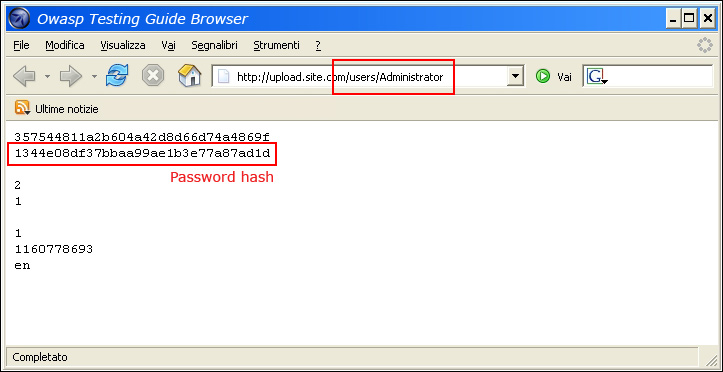
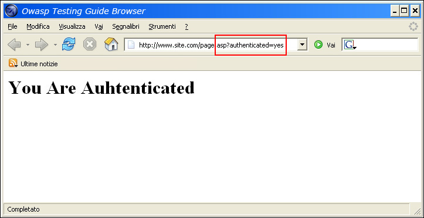
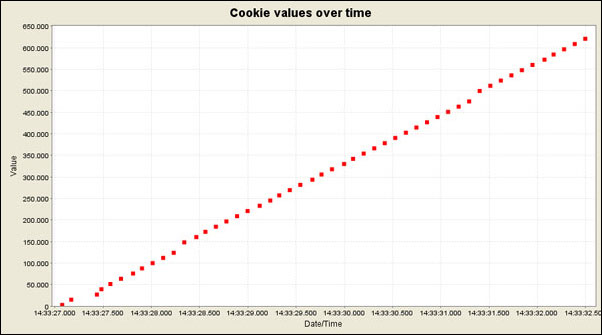

---

layout: col-document
title: WSTG - Latest
tags: WSTG

---


# Тестирование обхода схемы аутентификации

|ID          |
|------------|
|WSTG-ATHN-04|

## Обзор

В компьютерной безопасности аутентификация — это процесс верификации цифрового удостоверения личности отправителя сообщения. Типичным примером такого процесса является процесс входа в систему. Тестирование схемы аутентификации означает понимание того, как работает процесс аутентификации, и использование этой информации для обхода механизма аутентификации.

Хотя большинству приложений аутентификация требуется для получения доступа к персональным данным или для рабочих задач, не каждый метод аутентификации способен обеспечить надлежащую защиту. Небрежность, незнание или просто недооценка угроз часто приводят к схемам аутентификации, которые можно обойти, просто пропустив страницу входа в систему и напрямую вызвав внутреннюю страницу, доступ к которой предполагается только после аутентификации.

Кроме того, часто можно обойти меры аутентификации, подделав запросы и обманув приложение, заставив его думать, что пользователь уже аутентифицирован. Этого можно добиться, изменяя заданный параметр URL, манипулируя формой или фальсифицируя сессии.

Проблемы, связанные со схемой аутентификации, можно обнаружить на разных этапах жизненного цикла разработки программного обеспечения (SDLC), таких как этапы проектирования, разработки и развёртывания:

- Ошибки на этапе проектирования могут включать неправильное определение компонентов приложения, подлежащих защите, выбор в пользу нестойких протоколов шифрования для защиты передачи учётных данных и многое другое.
- На этапе разработки ошибки могут включать в себя неправильную реализацию функций контроля входных данных или несоблюдение рекомендаций по безопасной разработке для конкретного языка программирования.
- На этапе развёртывания приложения могут возникнуть проблемы во время настройки (установка и конфигурирование приложения) из-за отсутствия необходимых технических навыков или надлежащей документации.

## Задача тестирования

- Убедиться, что аутентификация применяется ко всем службам, которым она требуется.

## Как тестировать

Существует несколько способов обхода схемы аутентификации, используемой web-приложением:

- Прямой запрос к странице через [принудительный просмотр](https://owasp.org/www-community/attacks/Forced_browsing)
- Изменение параметров
- Предсказуемые идентификаторы сессии
- SQL-инъекция

### Прямой запрос к странице

Если web-приложение реализует контроль доступа только на странице входа, схему аутентификации можно обойти. Например, если пользователь напрямую запрашивает другую страницу через принудительный просмотр, эта страница может не проверять учётные данные пользователя перед предоставлением доступа. Попытайтесь получить прямой доступ к защищённой странице через адресную строку браузера, чтобы протестировать этот метод.

\
*Рисунок 4.4.4-1: Прямой запрос к защищённой странице*

### Изменение параметров

Другая проблема, связанная с дизайном аутентификации, возникает, когда приложение проверяет успешный вход в систему на основе параметров с фиксированным значением. Пользователь может изменить эти параметры, чтобы получить доступ к защищённым областям без предоставления действительных учётных данных. В приведённом ниже примере параметр "authenticated" меняется на значение "yes", что позволяет пользователю получить доступ. В этом примере параметр находится в URL-адресе, но для изменения параметра также можно использовать прокси, особенно когда параметры отправляются в элементах формы в запросе POST или когда параметры сохраняются в файле cookie.

```http
http://www.site.com/page.asp?authenticated=no

raven@blackbox /home $nc www.site.com 80
GET /page.asp?authenticated=yes HTTP/1.0

HTTP/1.1 200 OK
Date: Sat, 11 Nov 2006 10:22:44 GMT
Server: Apache
Connection: close
Content-Type: text/html; charset=iso-8859-1

<!DOCTYPE HTML PUBLIC "-//IETF//DTD HTML 2.0//EN">
<HTML><HEAD>
</HEAD><BODY>
<H1>You Are Authenticated</H1>
</BODY></HTML>
```

\
*Рисунок 4.4.4-2: Запрос на изменение параметра*

### Предсказуемые идентификаторы сессии

Многие web-приложения управляют аутентификацией с помощью идентификаторов сессии (Session ID). Следовательно, если идентификатор сессии предсказуем, злоумышленник может угадать действительный Session ID и получить несанкционированный доступ к приложению, выдавая себя за ранее аутентифицированного пользователя.

На следующем рисунке значения внутри файлов cookie растут линейно, поэтому злоумышленнику может быть легко угадать действительный идентификатор сессии.

\
*Рисунок 4.4.4-3: Значения Session ID в cookie с течением времени*

На следующем рисунке значения в cookie меняются лишь частично, поэтому можно ограничить атаку перебором определёнными полями, показанными ниже.

\
*Рисунок 4.4.4-4: Частично меняющиеся значения в cookie*

### SQL-инъекция (аутентификация в HTML-форме)

SQL-инъекция — широко известный метод атаки. В этом разделе не будет подробно описываться этот метод, т.к. в данном руководстве есть несколько разделов, в которых объясняются методы SQL-инъекций, выходящие за рамки этого раздела.

\
*Рисунок 4.4.4-5: SQL-инъекция*

На следующем рисунке показано, что с помощью простой атаки SQL-инъекцией иногда можно обойти форму аутентификации.

\
*Рисунок 4.4.4-6: Простая атака SQL-инъекции*

### Вольное сравнение в PHP

Если злоумышленник смог получить исходный код приложения, используя ранее обнаруженную уязвимость (например, обход каталога) или из web-репозитория (приложения с открытым исходным кодом), может оказаться возможным провести более изощрённые атаки на реализацию процесса аутентификации.

В следующем примере (PHPBB 2.0.12 — уязвимость обхода аутентификации) во второй строке функция `unserialize()` разбирает предоставленный пользователем файл cookie и устанавливает значения внутри массива `$sessiondata`. В строке 7 MD5-хэш пароля пользователя, хранящийся во внутренней базе данных (`$auto_login_key`) сравнивается с хэшем, предоставленным пользователем (`$sessiondata['autologinid']`).

```php
1. if (isset($HTTP_COOKIE_VARS[$cookiename . '_sid'])) {
2.     $sessiondata = isset($HTTP_COOKIE_VARS[$cookiename . '_data']) ? unserialize(stripslashes($HTTP_COOKIE_VARS[$cookiename . '_data'])) : array();
3.     $sessionmethod = SESSION_METHOD_COOKIE;
4. }
5. $auto_login_key = $userdata['user_password'];
6. // Мы должны войти в систему автомагически
7. if( $sessiondata['autologinid'] == $auto_login_key )
8. {
9.     // autologinid соответствует паролю
10.     $login = 1;
11.     $enable_autologin = 1;
12. }

```

В PHP сравнение между любым строковым значением и булевым `true` всегда `true` (поскольку строка содержит значение), поэтому, указав показанную ниже строку в функцию `unserialize()`, можно обойти контроль аутентификации и войти в систему как администратор, чей `userid` равен 2:

```php
a:2:{s:11:"autologinid";b:1;s:6:"userid";s:1:"2";}  // исходное значение: a:2:{s:11:"autologinid";s:32:"8b8e9715d12e4ca12c4c3eb4865aaf6a";s:6:"userid";s:4:"1337";}
```

Давайте разберём, что мы сделали в этой строке:

1. `autologinid` теперь является булевым, установленным в `true`: это можно увидеть в изменении значения MD5-хэша пароля (`s:32:"8b8e9715d12e4ca12c4c3eb4865aaf6a"`) на `b:1`
2. `userid` теперь установлен на идентификатор администратора: это можно увидеть в последней части строки, где мы заменили наш идентификатор обычного пользователя (`s:4:"1337"`) на `s:1:"2"`

## Инструменты

- [WebGoat](https://owasp.org/www-project-webgoat/)
- [OWASP Zed Attack Proxy (ZAP)](https://www.zaproxy.org)

## Ссылки

- [Niels Teusink: Обход аутентификации в phpBB 2.0.12](http://blog.teusink.net/2008/12/classic-bug-phpbb-2012-authentication.html)
- [David Endler: Методы перебора и прогнозирования Session ID"](https://www.cgisecurity.com/lib/SessionIDs.pdf)
