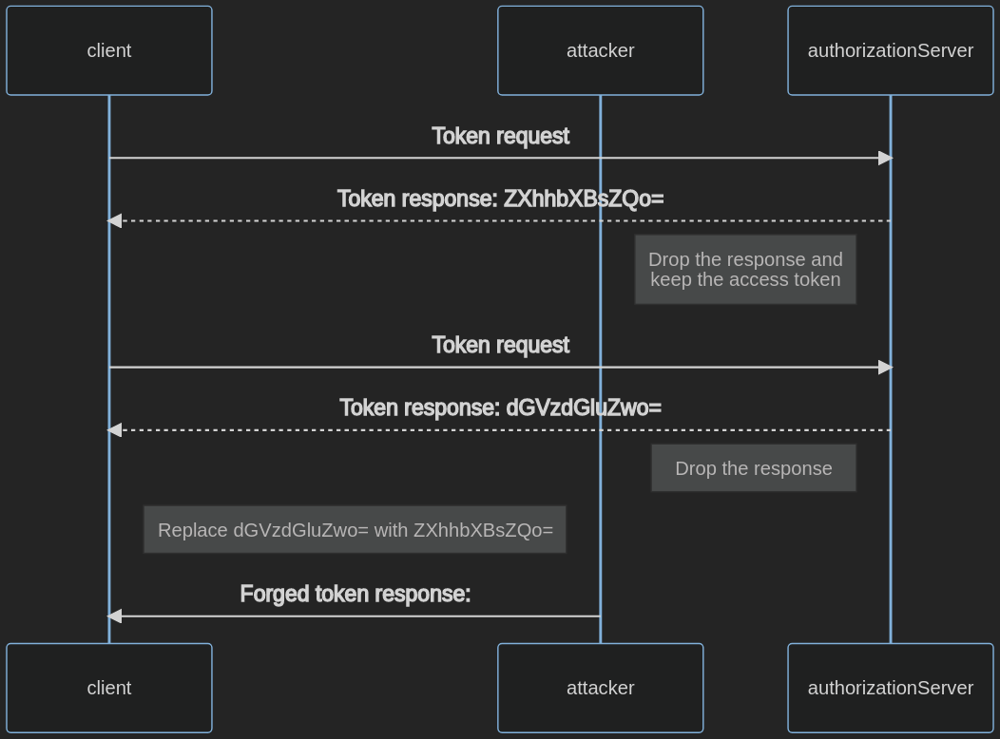

---

layout: col-document
title: WSTG - Latest
tags: WSTG

---


# Тестирование уязвимостей клиента OAuth

## Обзор

OAuth предоставляет клиентам права доступа к ресурсам. Это позволяет им действовать от имени владельца ресурса. Клиент получает код авторизации и токен обновления при обмене токенами и сохраняет их.

Неспособность защитить обмен токенами и учётные данные может привести к несанкционированному доступу к ресурсам и повышению привилегий.

## Задачи тестирования

- Найти уязвимости клиента OAuth.

## Как тестировать

Чтобы протестировать клиентское приложение на уязвимости:

1. Извлеките учётные данные, используемые для авторизации.
2. Предоставьте себе доступ к произвольным ресурсам с помощью принудительного просмотра.
3. Обойдите авторизацию.

### Тестирование на раскрытие секрета клиента

Секрет клиента используется для аутентификации клиента на сервере авторизации (AS), чтобы доказать, что клиент является доверенным источником.

Публичные клиенты, как правило, не могут хранить секрет клиента в тайне.

Чтобы идентифицировать секрет клиента в коде на стороне клиента, проведите анализ кода на стороне клиента.

1. Зайдите в приложение.
2. Откройте Инструменты разработчика браузера (DevTools).
3. Перейдите на вкладку Отладчик.
4. Нажмите Ctrl+Shift+F, чтобы открыть Поиск.
5. Ищите термины, похожие на `client-secret`.

Если ничего не нашлось, вы также можете:

1. Пройти процедуру авторизации с помощью перехватывающего HTTP-прокси, например, OWASP ZAP.
2. Извлечь секрет клиента из URI в параметре `client-secret`.
3. Замените поисковый запрос в приведённом выше поиске значением секрета и выясните, раскрывается ли он в запросах.

### Тестирование на предмет неправильного хранения токенов

Клиент получает токены доступа и в идеале хранит их в таком месте, где эти токены могут быть защищены от злоумышленников.

Конфиденциальные клиенты должны хранить токены в оперативной памяти, чтобы предотвратить доступ с помощью других атак, таких как включение локальных файлов (теми, у кого есть доступ к среде) или за счёт атаки с использованием SQL-инъекций.

Публичные клиенты, такие как одностраничные приложения, не имеют возможности хранить токены ы тайне. Например, атака с использованием межсайтового скриптинга позволяет злоумышленникам получить доступ к учётным данным, хранящимся в браузере.

Публичные клиенты могут хранить токены в сессионном хранилище браузера или в cookie, но не в локальном хранилище. Чтобы определить, правильно ли хранятся токены:

1. Зайдите в приложение.
2. Извлеките токена доступа.
3. Откройте в браузере Инструменты разработчика.
4. Перейдите на вкладку Хранилище.
5. Найдите Локальное хранилище и посмотрите что там хранится.
6. Посмотрите что хранится в Сессионном хранилище.
7. Посмотрите что хранится в хранилище куки.

### Тестирование инъекции токена доступа

Эта атака возможна только в том случае, если клиент использует тип ответа, который напрямую выдаёт клиенту токен доступа. Это так для потока неявных разрешений, потока с предоставлением клиенту пароля (ROPC), и в межсистемных потоках. Подробнее см. в разделе [Тестирование на наличие уязвимостей в OAuth](05-Testing_for_OAuth_Weaknesses.md).

Инъекция токена доступа считается успешной, если злоумышленник крадёт токен, а затем использует его для аутентификации на легитимном клиенте.

Чтобы проверить инъекцию токена доступа, выполните следующие действия. В этом примере происходит угон токена `ZXhhbXBsZQo=`.

1. Перехватите трафик между клиентом и сервером авторизации.
2. Запустите поток OAuth с клиентом, используя неявный тип.
3. Вставьте украденный токен доступа:
    - Отправьте клиенту фальсифицированный ответ на авторизацию с украденным токеном доступа (`ZXhhbXBsZQo=`).
    - Перехватите действительный ответ на авторизацию и замените токен доступа (`dGVzdGluZwo=`) на украденный (`ZXhhbXBsZQo=`).

\
*Рисунок 4.5.5.2-: Поток инъекции токена доступа*

## Связанные сценарии тестирования

- [Тестирование на подделку межсайтовых запросов](../06-Session_Management_Testing/05-Testing_for_Cross_Site_Request_Forgery.md)
- [Тестирование перенаправления URL на стороне клиента](../11-Client-side_Testing/04-Testing_for_Client-side_URL_Redirect.md)
- [Тестирование JWT](../06-Session_Management_Testing/10-Testing_JSON_Web_Tokens.md)
- [Тестирование на перехват клика](../11-Client-side_Testing/09-Testing_for_Clickjacking.md)
- [Тестирование Cross Origin Resource Sharing](../11-Client-side_Testing/07-Testing_Cross_Origin_Resource_Sharing.md)

## Меры защиты

- Используйте секрет клиента только в том случае, если у клиента есть возможность хранить его в тайне.
- Следуйте рекомендациям по безопасному хранению токенов. Обращайтесь с токенами так же, как и с другими учётными данными.
- Избегайте устаревших типов разрешений. Подробнее см. в разделе [Тестирование на наличие уязвимостей в OAuth](05-Testing_for_OAuth_Weaknesses.md).

## Инструменты

- [BurpSuite](https://portswigger.net/burp/releases)
- [EsPReSSO (расширение для Burp)](https://github.com/portswigger/espresso)
- [OWASP ZAP](https://www.zaproxy.org/)

## Ссылки

- [Аутентификация пользователей в OAuth 2.0](https://oauth.net/articles/authentication/)
- [Фреймворк авторизации OAuth 2.0](https://datatracker.ietf.org/doc/html/rfc6749)
- [Фреймворк авторизации OAuth 2.0: Использование токена на предъявителя](https://datatracker.ietf.org/doc/html/rfc6750)
- [Модель угроз OAuth 2.0 и соображения безопасности](https://datatracker.ietf.org/doc/html/rfc6819)
- [Рекомендации по безопасности OAuth 2.0](https://datatracker.ietf.org/doc/html/draft-ietf-oauth-security-topics-20)
- [Поток кода авторизации с ключом подтверждения для обмена кодами (PKCE)](https://auth0.com/docs/authorization/flows/authorization-code-flow-with-proof-key-for-code-exchange-pkce)
