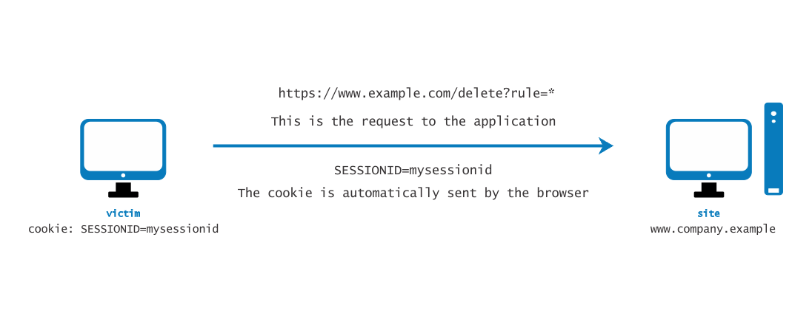
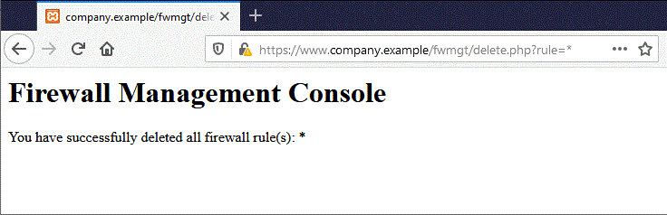

---

layout: col-document
title: WSTG - Latest
tags: WSTG

---


# Тестирование подделки межсайтовых запросов (CSRF)

|ID          |
|------------|
|WSTG-SESS-05|

## Обзор

Подделка межсайтовых запросов (англ.: [Cross Site Request Forgery, CSRF](https://owasp.org/www-community/attacks/csrf)) — это атака, которая заставляет аутентифицированного пользователя выполнять действия в web-приложении, которые он делать не собирался. С небольшой помощью социальной инженерии (например, отправив ссылку по электронной почте или в чат) злоумышленник может заставить пользователей web-приложения неосознанно делать то, что он задумал. Если CSRF нацелен на обычного пользователя, его успешная эксплуатация может поставить под угрозу информацию и действия этого пользователя. Если целью является учётная запись администратора, атака CSRF может поставить под угрозу всё web-приложение.

CSRF опирается на:

1. Поведение web-браузера в отношении обработки информации, связанной с сессией, например, cookie и данные HTTP-аутентификации.
2. Знание злоумышленником допустимых URL web-приложений, запросов или функций.
3. Управление сессией приложения, основанном только на информации, известной браузеру.
4. Существование HTML-тегов, присутствие которых вызывает немедленный доступ к ресурсу по HTTP[S]; например, тег изображения `img`.

Пункты 1, 2 и 3 необходимы для наличия уязвимости, а пункт 4 облегчает фактическую эксплуатацию, но не является обязательным.

1. Браузеры автоматически отправляют информацию, используемую для идентификации сессии пользователя. Предположим, *сайт* — это сайт, на котором размещено web-приложение, и пользователь *жертва* только что прошёл аутентификацию на *сайте*. В ответ *сайт* отправляет *жертве* cookie, который идентифицирует запросы, отправленные *жертвой*, как относящиеся к аутентифицированной сессии *жертвы*. Как только браузер получает cookie, установленный *сайтом*, он автоматически отправляет его вместе с дальнейшими запросами, направленными на *сайт*.
2. Если приложения не использует информацию о сессиях в URL-адресах, то можно найти URL приложений, их параметры и допустимые значения, анализируя код, или при доступе к приложению, обращая внимание на формы и URL, указанные в HTML или JavaScript.
3. Под «известной браузеру» имеется ввиду такая информация, как cookie или данные HTTP-аутентификации (речь о Basic-аутентификации, а не на основе форм), которые сохраняются браузером и впоследствии присутствуют в каждом запросе, направляемом в область приложения, запрашивающую аутентификацию. Обсуждаемые далее уязвимости относятся к приложениям, которые полностью полагаются на такого рода информацию для идентификации сессии пользователя.

Для простоты рассмотрим URL, доступные для GET (хотя обсуждение применимо и к запросам POST). Если *жертва* уже аутентифицировалась, отправка следующего запроса приводит к автоматической отправке cookie вместе с ним. На рисунке ниже показано, как пользователь получает доступ к приложению на `www.example.com`.

\
*Рисунок 4.6.5-1: Верхом на сессии (CSRF)*

Запрос GET может быть отправлен пользователем несколькими способами:

- Используя web-приложение
- Вводя URL в браузере
- Перейдя по внешней ссылке, указывающей на URL

Эти вызовы неразличимы приложением. В частности, третий может быть довольно опасным. Существует ряд методов и уязвимостей, которые могут скрыть реальные свойства ссылки. Ссылка может быть встроена в email-сообщение, отображаться на вредоносном сайте, на который заманивается пользователь, или отображаться в содержимом, размещённом третьей стороной (например, на другом сайте или в электронном письме в формате HTML), и указывать на ресурсы приложения. Если пользователь переходит по ссылке, то поскольку он уже аутентифицирован web-приложением на *сайте*, браузер отправит web-приложению запрос GET, сопровождаемый данными аутентификации (cookie с Session ID). Это приводит к тому, что в web-приложении выполняется допустимая операция, которую пользователь не ожидает; например, перевод средств в приложении online-банкинга.

При использовании тега `img`, как указано в пункте 4 выше, даже не обязательно, чтобы пользователь переходил по определённой ссылке. Предположим, злоумышленник отправляет пользователю электронное письмо, побуждающее его перейти по URL, ссылающемуся на страницу, содержащую следующий (упрощённый) HTML-код.

```html
<html>
    <body>
...

...
    </body>
</html>
```

Когда браузер отображает эту страницу, он также попытается отобразить указанное изображение с нулевым размером (т.е. невидимое) из `https://www.company.example`. Это приводит к тому, что запрос автоматически отправляется в web-приложение, размещённое на *сайте*. Неважно, что URL изображения не ведёт к нужному изображению, т.к. его присутствие в любом случае вызовет `action` запроса, указанное в `src`.  Это происходит при условии, что в браузере не отключена загрузка изображений. В большинстве браузеров загрузка изображений не отключена, поскольку это нанесло бы вред большинству web-приложений, не говоря об удобстве использования.

Эта проблема является следствием того, что:

- HTML-теги на странице, приводят к автоматическому выполнению HTTP-запроса (`img` — один из них).
- Браузер не имеет возможности определить, что ресурс, на который ссылается `img`, не является нормальным изображением.
- Загрузка изображения, которая происходит независимо от местоположения предполагаемого источника, т.е. форма и само изображение не обязательно должны находиться на одном хосте или даже в одном домене.

Тот факт, что HTML-контент, не относящийся к web-приложению, может ссылаться на компоненты приложения, и тот факт, что браузер автоматически формирует допустимый запрос к приложению, делает возможными такого рода атаки. Нет никакого способа запретить такое поведение, если только не сделать невозможным для злоумышленника взаимодействие с функциями приложения.

В интегрированных средах почты/браузера простое отображение сообщения электронной почты, содержащего ссылку на изображение, приведёт к выполнению запроса к web-приложению с соответствующим cookie браузера. Сообщения электронной почты могут ссылаться на кажущиеся допустимыми URL-адреса изображений, например:

```html

```

В этом примере `[attacker]` — это сайт, контролируемый злоумышленником. Используя механизм перенаправления, вредоносный сайт может использовать `http://[attacker]/picture.gif`, чтобы перенаправить жертву на `http://[thirdparty]/action` и вызвать `action`.

Cookie — не единственный пример уязвимости такого рода. Web-приложения, информация о сессии которых полностью предоставляется браузером, также уязвимы. Сюда входят приложения, полагающиеся только на механизмы HTTP-аутентификации, поскольку информация об аутентификации известна браузеру и отправляется автоматически при каждом запросе. Сюда не входит аутентификация на основе форм, которая выполняется только один раз и формирует информацию о сессии, обычно в виде cookie.

Предположим, что жертва входит в web-консоль управления межсетевым экраном (МСЭ). Чтобы войти, пользователь должен аутентифицироваться, а информация о сессии сохраняется в cookie.

Предположим, что в этой консоли есть функция, которая позволяет аутентифицированному пользователю удалить правило, указанное по его числовому идентификатору, или все правила в конфигурации, если пользователь укажет `*` (на самом деле это опасная функция, но с ней пример интереснее). Далее отображается страница удаления. Предположим, что форма — для простоты — делает запрос GET. Чтобы удалить правило номер один:

```text
https://[target]/fwmgt/delete?rule=1
```

Чтобы удалить все правила:

```text
https://[target]/fwmgt/delete?rule=*
```

Этот пример намеренно наивен, но в упрощённом виде показывает опасности CSRF.

\
*Рисунок 4.6.5-2: CSRF в консоли управления МСЭ*

В форме, изображенной на рисунке выше, введите значение `*` и нажмите кнопку Удалить, чтобы отправить следующий запрос GET:

```text
https://www.company.example/fwmgt/delete?rule=*
```

Он удалит все правила МСЭ.

\
*Рисунок 4.6.5-3: CSRF в консоли управления МСЭ - 2*

Пользователь мог бы добиться тех же результатов, направляя URL вручную:

```text
https://[target]/fwmgt/delete?rule=*
```

Или перейдя по ссылке, указывающей, напрямую или через перенаправление, на вышеуказанный URL. Или, опять же, путем доступа к HTML-странице, имеющей тег `img`, указывающий на тот же URL.

Во всех этих случаях, если пользователь в данный момент вошёл в приложение управления МСЭ, запрос будет выполнен успешно и изменит его конфигурацию. Можно представить себе атаки, нацеленные на чувствительные приложения и делающие автоматические ставки на аукционах, денежные переводы, заказы, изменение конфигурации критически важных программных компонентов и т.д.

Интересно то, что эти уязвимости могут быть реализованы за МСЭ; т.е. достаточно, чтобы атакованная ссылка была доступна жертве, а не непосредственно злоумышленнику. В частности, это может быть любой web-сервер интрасети; например, в упомянутом ранее сценарии управления МСЭ, который вряд ли будет доступен для Интернета.

Самоуязвимые приложения, т.е. те, которые используются как в качестве вектора атаки, так и в качестве цели (например, приложения web-почты), усугубляют ситуацию. Поскольку пользователи входят в систему, когда читают свои email-сообщения, уязвимое приложение данного типа может позволить злоумышленникам выполнять такие действия, как удаление сообщений или отправка сообщений, которые, со стороны выглядят, как исходящие от жертвы.

## Задачи тестирования

- Определить, можно ли инициировать запросы от имени пользователя, которые не были инициированы этим пользователем.

## Как тестировать

Проведите аудит приложения, чтобы убедиться, что его управление сессиями уязвимо. Если управление сессиями опирается только на значения на стороне клиента (информация, доступная браузеру), то приложение уязвимо. Браузеру доступны cookie и учётные данные HTTP-аутентификации (Basic- и т.п.), но не доступны данные аутентификации на основе форм, которая выполняется на уровне приложения.

Ресурсы, доступные через HTTP-запросы GET, легко уязвимы, хотя запросы POST могут быть автоматизированы с помощью JavaScript и также уязвимы; следовательно, одного использования POST недостаточно для устранения уязвимостей CSRF.

В случае POST можно использовать следующий пример:

1. Создайте HTML-страницу, подобную той, что показана ниже.
2. Разместите HTML на вредоносном или стороннем сайте.
3. Отправьте ссылку на страницу жертве (жертвам) и побудите их перейти по ней.

```html
<html>
<body onload='document.CSRF.submit()'>

<form action='http://targetWebsite/Authenticate.jsp' method='POST' name='CSRF'>
    <input type='hidden' name='name' value='Hacked'>
    <input type='hidden' name='password' value='Hacked'>
</form>

</body>
</html>
```

В случае web-приложений, в которых разработчики используют JSON для связи между браузером и сервером, может возникнуть проблема из-за отсутствия параметров запроса в формате JSON, которые необходимы для форм с автоотправкой данных. Чтобы обойти этот случай, мы можем использовать форму для автоотправки полезной нагрузки в JSON, включая скрытый ввод для эксплуатации CSRF. Нам придется изменить тип кодировки (`enctype`) на `text/plain`, чтобы обеспечить доставку нагрузки как есть. Код эксплойта будет выглядеть следующим образом:

```html
<html>
 <body>
  <script>history.pushState('', '', '/')</script>
   <form action='http://victimsite.com' method='POST' enctype='text/plain'>
     <input type='hidden' name='{"name":"hacked","password":"hacked","padding":"'value='something"}' />
     <input type='submit' value='Submit request' />
   </form>
 </body>
</html>
```

Запрос POST будет выглядеть следующим образом:

```http
POST / HTTP/1.1
Host: victimsite.com
Content-Type: text/plain

{"name":"hacked","password":"hacked","padding":"=something"}
```

Когда эти данные отправляются в виде POST-запроса, сервер с радостью примет поля имени и пароля и проигнорирует поле padding, поскольку оно ему не нужно.

## Меры защиты

- См. в [Памятке OWASP по предотвращению CSRF](https://cheatsheetseries.owasp.org/cheatsheets/Cross-Site_Request_Forgery_Prevention_Cheat_Sheet.html).

## Инструменты

- [OWASP ZAP](https://www.zaproxy.org/)
- [CSRF Tester](https://wiki.owasp.org/index.php/Category:OWASP_CSRFTester_Project)
- [Pinata-csrf-tool](https://code.google.com/archive/p/pinata-csrf-tool/)

## Ссылки

- [Peter W: "Cross-Site Request Forgeries"](https://web.archive.org/web/20160303230910/http://www.tux.org/~peterw/csrf.txt)
- [Thomas Schreiber: "Session Riding"](https://web.archive.org/web/20160304001446/http://www.securenet.de/papers/Session_Riding.pdf)
- [Самый старое из известных сообщение о CSRF](https://web.archive.org/web/20000622042229/http://www.zope.org/Members/jim/ZopeSecurity/ClientSideTrojan)
- [Cross-site Request Forgery FAQ](https://www.cgisecurity.com/csrf-faq.html)
- [A Most-Neglected Fact About Cross Site Request Forgery (CSRF)](http://yehg.net/lab/pr0js/view.php/A_Most-Neglected_Fact_About_CSRF.pdf)
- [Multi-POST CSRF](https://www.lanmaster53.com/2013/07/17/multi-post-csrf/)
- [SANS Pen Test Webcast: Complete Application pwnage via Multi POST XSRF](https://www.youtube.com/watch?v=EOs5PZiiwug)
