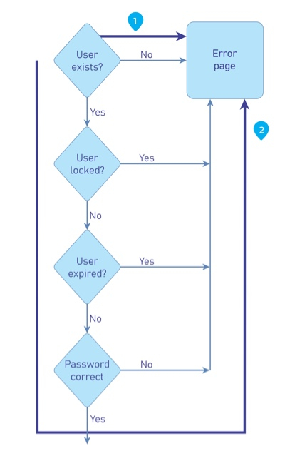

---

layout: col-document
title: WSTG - Latest
tags: WSTG

---


# Тестирование времени обработки

|ID          |
|------------|
|WSTG-BUSL-04|

## Обзор

Вполне возможно, что злоумышленники могут собирать информацию о приложении, отслеживая время, необходимое для выполнения задачи или предоставления ответа. Кроме того, они могут манипулировать информационными потоками бизнес-процессов и нарушать их, просто оставляя сессии открытыми, и не передавая свои транзакции в «ожидаемые» сроки.

Уязвимости логики синхронизации процесса уникальны тем, что эти случаи неправильного использования должны создаваться вручную с учётом времени выполнения и транзакций, которые зависят от конкретного приложения/системы.

Время обработки может раскрыть информацию о том, что делается в фоновых процессах приложения/системы. Если приложение позволяет пользователям угадывать, каким будет следующий результат, обрабатывая задержки во времени, пользователи смогут соответствующим образом корректировать и изменять своё поведение на основе ожиданий и «играть с системой».

### Пример 1

Видеоиграм/игровым автоматам может требоваться немного больше времени для обработки транзакции с крупным выигрышем. Проницательные игроки используют это, чтобы ставить минимальные суммы, пока они не заметят более длительное время обработки, которое побудит их сделать максимальную ставку.

### Пример 2

Многие процессы входа в систему запрашивают имя пользователя и пароль. Если вы присмотритесь повнимательнее, то, возможно, заметите, что ввод неверного имени пользователя и неверного пароля занимает больше времени для выдачи ошибки, чем ввод допустимого имени и неверного пароля. Это даёт возможность злоумышленнику узнать, существует ли в системе такое имя пользователя, и уже не нужно полагаться на сообщение графического интерфейса пользователя.

\
*Рисунок 4.10.4-1: Пример потока управления для формы входа в систему*

### Пример 3

У большинства стадионов или туристических агентств есть приложения для продажи билетов, которые позволяют пользователям приобретать билеты и резервировать места. Когда пользователь запрашивает билеты, места блокируются или резервируются в ожидании оплаты. Что, если злоумышленник продолжает бронировать места не расплачиваясь? Места будут освобождаться или билеты на них уже не продаются? Некоторые продавцы теперь дают только 5 минут на проведение оплаты, в противном случае транзакция будет признана несостоявшейся.

### Пример 4

Предположим, что сайт для торговли драгоценными металлами позволяет пользователям совершать покупки по цене рыночной котировки на момент входа в систему. Что, если злоумышленник войдёт в систему и разместит заявку, но не завершит транзакцию до тех пор, пока позже в тот же день цена не вырастет? Получит ли злоумышленник первоначальную (т.е. более низкую) цену?

## Задачи тестирования

- Проанализировать проектную документацию на предмет функциональности системы, на которую может влиять время.
- Придумать и реализовать примеры неправильного использования.

## Как тестировать

Тестировщик должен определить, какие процессы зависят от времени, будь то «окно» для завершения задачи или время выполнения между двумя процессами, которое могло позволить обойти определённые меры контроля.

Для этого лучше всего автоматизировать запросы, которые будут «использовать не по назначению» обнаруженные выше процессы, поскольку инструменты лучше подходят для анализа времени и являются более точными, чем ручное тестирование. Если это невозможно, то придётся тестировать вручную.

Тестировщик должен нарисовать схему того, как протекает процесс, точки для инъекции и заранее подготовить запросы для запуска их в уязвимых процессах. После этого необходимо провести тщательный анализ, чтобы выявить различия в выполнении процесса и определить, не нарушает ли процесс согласованную бизнес-логику.

## Связанные сценарии тестирования

- [Тестирование атрибутов Cookie](../06-Session_Management_Testing/02-Testing_for_Cookies_Attributes.md)
- [Тестирование тайм-аута сессии](../06-Session_Management_Testing/07-Testing_Session_Timeout.md)

## Меры защиты

Разрабатывайте приложения с учётом времени обработки. Если злоумышленники могут получить какое-то преимущество, зная различия во времени обработки и получаемых результатах, добавьте дополнительные шаги или такую обработку, чтобы независимо от результатов они предоставлялись в одном и том же временном интервале.

Кроме того, в приложении/системе должен быть предусмотрен механизм, не позволяющий злоумышленникам продлевать транзакции в течение «приемлемого» периода времени. Это можно сделать путем отмены или сброса транзакций по прошествии определённого времени, как это сейчас делают некоторые продавцы билетов.
