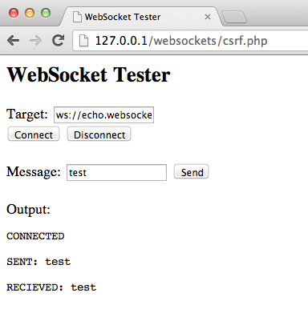

---

layout: col-document
title: WSTG - Latest
tags: WSTG

---


# Тестирование WebSockets

|ID          |
|------------|
|WSTG-CLNT-10|

## Обзор

Обычно протокол HTTP допускает только один запрос/ответ на каждое TCP-соединение. Асинхронный JavaScript и XML (AJAX) позволяет клиентам отправлять и получать данные асинхронно (в фоновом режиме без обновления страницы) на сервер, однако AJAX требует, чтобы клиент инициировал запросы и ожидал ответов сервера (полудуплексный режим).

Протокол [WebSockets](https://websockets.spec.whatwg.org/) позволяет клиенту или серверу создавать «полнодуплексный» (двусторонний) канал обмена, позволяя клиенту и серверу общаться действительно асинхронно. WebSockets проводит первоначальное рукопожатие через HTTP, где предлагает сменить протокол (*upgrade*), и с этого момента весь обмен осуществляется по каналам TCP с использованием текстовых или бинарных фреймов. Дополнительную информацию см. в [RFC 6455](https://tools.ietf.org/html/rfc6455).

### Origin

Сервер несёт ответственность за проверку заголовка [`Origin`](https://developer.mozilla.org/ru/docs/Web/HTTP/Headers/Origin) при первоначальном HTTP-рукопожатии протокола WebSocket. Если он его не проверит, то может принимать соединения из любого источника. Это может позволить злоумышленникам взаимодействовать с сервером WebSocket из разных доменов, что создаёт проблемы, подобные CSRF. См. также [OWASP Top 10 A01:2021 – Нарушения контроля доступа](https://owasp.org/Top10/A01_2021-Broken_Access_Control/).

### Конфиденциальность и целостность

WebSockets можно использовать по незашифрованному протоколу TCP или по зашифрованному протоколу TLS. Для незашифрованных WebSockets используется URI-схема `ws://` (80-й порт по умолчанию), для зашифрованных (TLS) URI-схема `wss://` (443-й порт по умолчанию). См. также [Top 10 A02:2021 – Cryptographic Failures](https://owasp.org/Top10/A02_2021-Cryptographic_Failures/).

### Нейтрализация входных данных

Как и в случае с любыми данными, полученными из недоверенных источников, эти данные должны быть надлежащим образом нейтрализованы и закодированы. См. также [Top 10 A03:2021 – Injection](https://owasp.org/Top10/A03_2021-Injection/) и [Top 10-2017 A7-Cross-Site Scripting (XSS)](https://owasp.org/www-project-top-ten/2017/A7_2017-Cross-Site_Scripting_(XSS)).

## Задачи тестирования

- Определить использование WebSockets.
- Оценить реализацию протокола, используя те же тесты, что и на обычных HTTP-каналах.

## Как тестировать

### Тестирование методом чёрного ящика

1. Определите, что приложение использует WebSockets:
   - В исходном коде на стороне клиента найдите URI-схему `ws://` или `wss://`.
   - Используйте фильтр WS на вкладке Сеть в Инструментах разработчика браузера для просмотра сетевого соединения WebSocket.
   - Используйте закладку WebSocket в [ZAP](https://www.zaproxy.org).
2. Origin:
   - С помощью клиента WebSocket (его можно найти в разделе [Инструменты](#инструменты) ниже) попытайтесь подключиться к удалённому серверу WebSocket. Если соединение установлено, убедитесь проверяет ли сервер заголовок origin при рукопожатии WebSocket.
3. Конфиденциальность и целостность:
   - Убедитесь, что подключение к WebSocket использует TLS для передачи конфиденциальной информации `wss://`.
   - Проверьте реализацию TLS на наличие проблем безопасности (действительный сертификат, BEAST, CRIME, RC4 и т.д.). Обратитесь к разделу [Тестирование безопасности транспортного уровня](../09-Testing_for_Weak_Cryptography/01-Testing_for_Weak_Transport_Layer_Security.md).
4. Аутентификация:
   - WebSockets не обеспечивает аутентификацию, следует провести обычные тесты аутентификации методом чёрного ящика. Обратитесь к разделу [Тестирование аутентификации](../04-Authentication_Testing/README.md).
5. Авторизация:
   - WebSockets не обеспечивает авторизацию, следует провести обычные тесты авторизации методом чёрного ящика. Обратитесь к разделу [Тестирование авторизации](../05-Authorization_Testing/README.md).
6. Нейтрализация ввода:
   - На закладке WebSocket в [ZAP](https://www.zaproxy.org) следует провести фаззинг запросов и ответов WebSocket. Обратитесь к разделу [Тестирование контроля входных данных](../07-Input_Validation_Testing/README.md).

#### Пример 1

Как только мы определим, что приложение использует WebSockets (как описано выше), мы можем использовать [OWASP ZAP](https://www.zaproxy.org) для перехвата запросов и ответов. Затем ZAP можно применять для воспроизведения и фаззинга запросов/ответов WebSocket.

\
*Рисунок 4.11.10-1: ZAP WebSockets*

#### Пример 2

Используя клиент WebSocket (его можно найти в разделе [Инструменты](#инструменты) ниже), попытайтесь подключиться к удалённому серверу WebSocket. Если соединение разрешено, сервер WebSocket может не проверять заголовок origin рукопожатия WebSocket. Попытайтесь воспроизвести ранее перехваченные запросы, чтобы убедиться, что возможен обмен по WebSocket между разными доменами.

\
*Рисунок 4.11.10-2: Клиент WebSocket*

### Тестирование методом серого ящика

Тестирование методом серого ящика похоже на тестирование методом черного. При этом пентестер частично знает приложение. Единственная разница здесь в том, что у вас может быть документация по API для тестируемого приложения, которая включает ожидаемые запросы и ответы WebSocket.

## Инструменты

- [OWASP Zed Attack Proxy (ZAP)](https://www.zaproxy.org)
- [Клиент WebSocket](https://github.com/ethicalhack3r/scripts/blob/master/WebSockets.html)
- [Google Chrome Simple WebSocket Client](https://chrome.google.com/webstore/detail/simple-websocket-client/pfdhoblngboilpfeibdedpjgfnlcodoo)

## Ссылки

- [web.dev - Introducing WebSockets: Bringing Sockets to the Web](https://web.dev/websockets-basics/)
- [WHATWG - The WebSocket API](https://websockets.spec.whatwg.org/#websocket)
- [IETF - The WebSocket Protocol](https://tools.ietf.org/html/rfc6455)
- [Christian Schneider - Cross-Site WebSocket Hijacking (CSWSH)](http://www.christian-schneider.net/CrossSiteWebSocketHijacking.html)
- [Robert Koch- On WebSockets in Penetration Testing](http://www.ub.tuwien.ac.at/dipl/2013/AC07815487.pdf)
- [DigiNinja - OWASP ZAP and Web Sockets](http://www.digininja.org/blog/zap_web_sockets.php)
- [Протокол WebSocket](https://learn.javascript.ru/websocket)