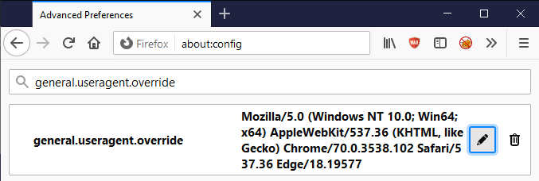
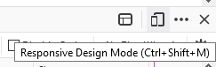

---

layout: col-document
title: WSTG - Latest
tags: WSTG

---


# Использование инструментов разработчика в браузере

В этом приложении описаны различные сведения об использовании функций инструментов разработчика в браузере для помощи в тестировании безопасности.

Очевидно, что встроенный функционал браузера не заменит инструментов DAST (динамическое тестирование безопасности приложений), SAST (статическое тестирование) или опыт тестировщика, однако его можно использовать для некоторых действий по тестированию и задач, связанных с созданием отчётов.

## Доступ к инструментам разработчика

Открыть инструменты разработчика можно несколькими способами:

1. С помощью клавиши `F12`.
2. С помощью сочетания клавиш `ctrl` + `shift` + `i` в Windows.
3. С помощью сочетания клавиш `cmd` + `option` + `i` на Mac.
4. Щёлкнуть правой кнопкой мыши на web-странице, а затем выбрать в контекстном меню `Inspect` (`Просмотреть код`) в Google Chrome.
5. Щёлкнуть правой кнопкой мыши на web-странице, а затем выбрать в контекстном меню `Inspect Element` (`Исследовать`) в Mozilla Firefox.
6. Через меню с тремя вертикально расположенными точками («кебаб») в Google Chrome, выбрав `More Tools` (`Дополнительные инструменты`), а затем `Developer Tools` (`Инструменты разработчика`).
7. Через меню с тремя линиями («гамбургер» или «блины») в Mozilla Firefox, выбрав пункт `Инструменты веб-разработчика` (`см`) в меню `Toggle Tools` (`Другие инструменты`).
8. Через меню с тремя горизонтально расположенными точками в Edge/IE, выбрав `Другие инструменты`, а затем `Developer Tools` (`Средства разработчика`).
9. На компьютере Mac выберите в меню `Safari` > `Settings` (`Настройки`), нажмите `Advanced` (`Дополнения`), затем установите флажок `Show Develop menu in menu bar` (`Показывать меню “Разработка”`).

> ПРИМЕЧАНИЕ: в большинстве приведённых ниже инструкций предполагается, что Инструменты разработчика уже открыты или активны.

## Возможности

| Функциональность         | Chrome* | Firefox | Edge/IE | Safari |
|-----------------------|:-------:|:-------:|:-------:|:------:|
| Переключение агента пользователя  | +      | +       | +     | +  |
| Редактирование/переотправка запросов  | +    | +    | -   | -   |
| Редактирование Cookie       | +       | +       | +       | -      |
| Редактирование локального хранилища | +      | +   | +     | -      |
| Отключение CSS              | +       | +       | +       | +      |
| Отключение JavaScript       | +       | +       | -       | +      |
| Просмотр HTTP-заголовков    | +       | +       | +       | +      |
| Копия экрана                | +       | +       | +       | -      |
| Автономный режим            | +       | +       | -       | -      |
| Кодирование и декодирование | +       | +       | +       | +      |
| Режим адаптивного дизайна   | +       | +       | +       | +      |

`*` Всё, что относится к Google Chrome, должно быть применимо ко всем приложениям на основе Chromium (включая перелицованный Microsoft Edge в 2019/2020 гг., а также Яндекс.Браузер и т.п.).

## Переключение агента пользователя

### Связанный сценарий тестирования

- [Тестирование уязвимостей кэша браузера](../4-Web_Application_Security_Testing/04-Authentication_Testing/06-Testing_for_Browser_Cache_Weaknesses.md)

### Google Chrome

1. Щёлкнув по меню «кебаб» с тремя точками в правой части панели «Инструменты разработчика», выберите `More tools` (`Другие инструменты`), затем `Network conditions` (`Условия работы сети`).
2. Снимите выбор с флажка `Select automatically` (`Использовать настройки браузера по умолчанию`).
3. Выберите агента пользователя из выпадающего меню или укажите собственное значение.

\
*Рисунок 6.F-1: Функциональность переключения агента пользователя в Google Chrome*

### Mozilla Firefox

1. Перейдите к странице `about:config` в Firefox и нажмите `I accept the risk!` (`Принять риск и продолжить`).
2. Введите в строку поиска `general.useragent.override`.
3. Найдите `general.useragent.override`, если вы не видите эту настройку, найдите ту, что показывает набор переключателей `Boolean, Number, String` (`Логическое, Число, Строка`), выберите `String`(`Строка`), затем нажмите на знак плюс кнопки `Add` (`Добавить`) на странице `about:config`.
4. Установите значение `general.useragent.override` на [агент пользователя](https://developers.whatismybrowser.com/useragents/explore/), который вам нужен.

\
*Рисунок 6.F-2: Функциональность переключения агента пользователя в Mozilla Firefox*

Потом нажмите на кнопку `Delete` (`Удалить`) с корзиной для мусора справа от настройки `general.useragent.override` , чтобы отменить переопределение и вернуться к агенту пользователя по умолчанию.

## Редактирование/переотправка запросов

### Связанные сценарии тестирования

- [Тестирование аутентификации](../4-Web_Application_Security_Testing/04-Authentication_Testing/README.md)
- [Тестирование авторизации](../4-Web_Application_Security_Testing/05-Authorization_Testing/README.md)
- [Тестирование управления сессиями](../4-Web_Application_Security_Testing/06-Session_Management_Testing/README.md)
- [Контроль входных данных](../4-Web_Application_Security_Testing/07-Input_Validation_Testing/README.md)
- [Тестирование бизнес-логики](../4-Web_Application_Security_Testing/10-Business_Logic_Testing/README.md)

### Mozilla Firefox

1. Перейдите на вкладку `Network` (`Сеть`).
2. Выполните какое-нибудь действие в web-приложении.
3. Щёлкните правой кнопкой мыши на HTTP-запросе из списка и выберите `Edit and Resend` (`Изменить и снова отправить`).
4. Внесите необходимые изменения и нажмите на кнопку `Send` (`Отправить`).
5. Щёлкните правой кнопкой мыши на изменённом запросе и выберите `Open in New Tab` (`Открыть в новой вкладке`).

### Google Chrome

1. Перейдите на вкладку `Network` (`Сеть`).
2. Выполните какое-нибудь действие в web-приложении.
3. Щёлкните правой кнопкой мыши на HTTP-запросе из списка и выберите `Copy > Copy as fetch` (`Копировать > Копировать как fetch`).
4. Вставьте полученный код JavaScript на вкладку `Console` (`Консоль`).
5. Внесите необходимые изменения, а затем нажмите Enter, чтобы отправить запрос.

## Редактирование Cookie

### Связанные сценарии тестирования

- [Тестирование аутентификации](../4-Web_Application_Security_Testing/04-Authentication_Testing/README.md)
- [Тестирование авторизации](../4-Web_Application_Security_Testing/05-Authorization_Testing/README.md)
- [Тестирование управления сессиями](../4-Web_Application_Security_Testing/06-Session_Management_Testing/README.md)
- [Тестирование атрибутов Cookie](../4-Web_Application_Security_Testing/06-Session_Management_Testing/02-Testing_for_Cookies_Attributes.md)

### Google Chrome

1. Перейдите на вкладку `Application` (`Приложение`).
2. Раскройте пункт `Cookies` (`Файлы cookie`) в разделе `Storage` (`Хранилище`).
3. Выберите соответствующее имя домена (`Domain`).
4. Дважды щёлкните по выбранной строке в столбце `Value`, чтобы отредактировать значение cookie.

> Примечание: Можно удалить выбранный cookie, нажав клавишу `Delete`, или в контекстном меню, вызываемом правой кнопкой мыши.

### Mozilla Firefox

1. Перейдите на вкладку `Storage` (`Хранилище`).
2. Раскройте раздел `Cookies` (`Куки`).
3. Выберите соответствующее имя домена (`Domain`).
4. Дважды щёлкните по выбранной строке в столбце `Value`, чтобы отредактировать значение cookie.

> Примечание: Можно удалить выбранный cookie, нажав клавишу `Delete`, или, или с помощью опций контекстного меню, вызываемого правой кнопкой мыши.

\
*Рисунок 6.F-3: Функциональность редактирования Cookie в Mozilla Firefox*

## Редактирование локального хранилища

### Связанный сценарий тестирования

- [Тестирование хранилищ браузера](../4-Web_Application_Security_Testing/11-Client-side_Testing/12-Testing_Browser_Storage.md)

### Google Chrome

1. Перейдите на вкладку `Application` (`Приложение`).
2. Раскройте пункт `Local Storage` (`Локальное хранилище`) в разделе `Storage` (`Хранилище`).
3. Выберите соответствующее имя домена (`Domain`).
4. Дважды щёлкните по выбранной строке, чтобы отредактировать значения `Key` (`Ключ`) или `Value` (`Значение`).

> Примечание: редактирование `Session Storage` (`Хранилище сеанса`) или `IndexedDB` выполняется практически в той же последовательности.
>
> Примечание: можно добавлять или удалять элементы хранилища с помощью контекстного меню, вызываемого правой кнопкой мыши.

### Mozilla Firefox

1. Перейдите на вкладку `Storage` (`Хранилище`).
2. Раскройте раздел `Local Storage` (`Локальное хранилище`).
3. Выберите соответствующее имя домена (`Domain`).
4. Дважды щёлкните по выбранной строке, чтобы отредактировать значения `Key` (`Ключ`) или `Value` (`Значение`).

> Примечание: редактирование `Session Storage` (`Хранилище сеанса`) или `Indexed DB` выполняется практически в той же последовательности.
>
> Примечание: можно добавлять или удалять элементы хранилища с помощью контекстного меню, вызываемого правой кнопкой мыши.

## Отключение CSS

### Связанный сценарий тестирования

- [Тестирование манипулирования ресурсами на стороне клиента](../4-Web_Application_Security_Testing/11-Client-side_Testing/06-Testing_for_Client-side_Resource_Manipulation.md)

### Общее

Все основные браузеры поддерживают управление CSS с использованием консоли Инструментов разработчика и функциональности JavaScript:

- Чтобы удалить все внешние таблицы стилей: `$('style,link[rel="stylesheet"]').remove();`
- Чтобы удалить все внутренние таблицы стилей: `$('style').remove();`
- Чтобы удалить все встроенные стили: `Array.prototype.forEach.call(document.querySelectorAll('*'),function(el){el.removeAttribute('style');});`
- Чтобы удалить всё из тега head: `$('head').remove();`

## Отключение JavaScript

### Google Chrome

1. В строке поиска введите `chrome://settings/content/javascript`.
2. Установите переключатель в положение `Disable JavaScript` (`Запретить сайтам использовать JavaScript`).

### Mozilla Firefox

1. На вкладке `Debugger`(`Отладчик`) нажмите кнопку настроек с шестерёнкой в правом верхнем углу панели Инструментов разработчика.
2. Отметьте `Disable JavaScript` (`Отключить JavaScript`) в выпадающем списке (если JavaScript отключен, этот пункт отмечен галочкой).

## Просмотр HTTP-заголовков

### Связанный сценарий тестирования

- [Сбор информации](../4-Web_Application_Security_Testing/01-Information_Gathering/README.md)

### Google Chrome

1. На вкладке `Networking` (`Сеть`) и выберите любой URL или запрос.
2. В нижней правой панели выберите вкладку `Headers` (`Заголовки`).

\
*Рисунок 6.F-4: Просмотр заголовков в Google Chrome*

### Mozilla Firefox

1. На вкладке `Networking` (`Сеть`) и выберите любой URL или запрос.
2. В нижней правой панели выберите вкладку `Headers` (`Заголовки`).

\
*Рисунок 6.F-5: Просмотр заголовков в Mozilla Firefox*

## Копии экрана

### Связанный сценарий тестирования

- [Отчётность](../5-Reporting/README.md)

### Google Chrome

1. Нажмите на кнопку `Toggle Device Toolbar` (`Показать или скрыть панель инструментов устройства`) или сочетание клавиш `Ctrl` + `Shift` + `M`.
2. Щёлкните по меню «кебаб» с тремя точками на Панели инструментов устройства.
3. Выберите `Capture screenshot` (`Сделать скриншот`) или `Capture full size screenshot` (`Сделать полноразмерный скриншот`).

### Mozilla Firefox

1. Щёлкните правой кнопкой мыши на пустой части страницы и выберите `Take a Screenshot` (`Сделать скриншот`). 
2. В качестве альтернативы есть сочетание клавиш `Ctrl` + `Shift` + `S`.

## Автономный режим

### Google Chrome

1. Перейдите на вкладку `Network` (`Сеть`).
2. В раскрывающемся списке `Throttle` (`Ограничение`) выберите `Offline` (`Офлайн`).

\
*Рисунок 6.F-6: Офлайн-режим в Google Chrome*

### Mozilla Firefox

1. Пункт `Work Offline` (`Работать автономно`) в меню `File` (`Файл`). Чтобы временно отобразить скрытую строку меню можно нажать клавишу `Alt` или `F10`.

\
*Рисунок 6.F-7: Автономный режим в Mozilla Firefox (теперь в меню `File`)*

## Кодирование и декодирование

### Связанные сценарии тестирования

- Многие (возможно, даже большинство) видов [тестирования безопасности web-приложений](../4-Web_Application_Security_Testing/README.md) могут выиграть от различных типов кодирования.

### Общее

Все основные браузеры поддерживают кодирование и декодирование строк различными способами, используя консоль Инструментов разработчика и функции JavaScript:

- Кодирование Base64: `btoa("string-to-encode")`
- Декодирование Base64: `atob("string-to-decode")`
- Кодирование URL: `encodeURIComponent("string-to-encode")`
- Декодирование URL: `decodeURIComponent("string-to-decode")`
- Кодирование HTML: `escape("string-to-encode")`
- Декодирование HTML: `unescape("string-to-decode")`

## Режим адаптивного дизайна

### Связанные сценарии тестирования

- [Тестирование уязвимостей кэша браузера](../4-Web_Application_Security_Testing/04-Authentication_Testing/06-Testing_for_Browser_Cache_Weaknesses.md)
- [Тестирование аутентификации в альтернативных каналах](../4-Web_Application_Security_Testing/04-Authentication_Testing/10-Testing_for_Weaker_Authentication_in_Alternative_Channel.md)
- [Тестирование перехвата клика](../4-Web_Application_Security_Testing/11-Client-side_Testing/09-Testing_for_Clickjacking.md)

### Google Chrome

1. Нажмите на кнопку `Toggle Device Toolbar` (`Показать или скрыть панель инструментов устройства`) или сочетание клавиш `Ctrl` + `Shift` + `M`.

\
*Рисунок 6.F-8: Режим `Отзывчивое устройство` в Google Chrome*

### Mozilla Firefox

1. Нажмите кнопку `Responsive Design Mode` (`Режим адаптивного дизайна`) или сочетание клавиш `Ctrl` + `Shift` + `M`.

\
*Рисунок 6.F-9: Режим адаптивного дизайна в Mozilla Firefox*

## Ссылки

- [Web App Security Testing with Browsers](https://getmantra.com/web-app-security-testing-with-browsers/)
- [Black Hills Information Security - Webcast: Free Tools! How to Use Developer Tools and JavaScript in Webapp Pentests](https://youtu.be/3W65ji1gc8c)
- [Greg Malcolm - Chrome Developer Tools: Raiding the Armory](https://github.com/gregmalcolm/wacky-wandas-wicked-weapons-frontend/blob/fix-it/README.md)
- [List of UserAgent Strings](http://user-agent-string.info/list-of-ua)
